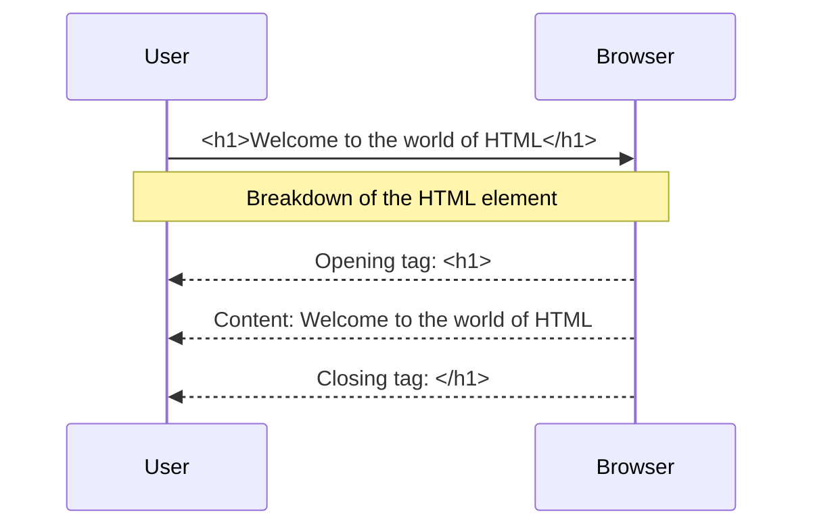

---
# try also 'default' to start simple
theme: seriph
# random image from a curated Unsplash collection by Anthony
# like them? see https://unsplash.com/collections/94734566/slidev
background: https://res.cloudinary.com/drnqdd87d/image/upload/f_auto/nmgakkzd3lmlibnfosps
# some information about your slides, markdown enabled
title: School of Engineering
info: |
  ## AltSchool v4 Class Notes
  making of world class developers

  join at [AltSchool Africa](https://altschoolafrica.com)
# apply any unocss classes to the current slide
class: text-center
# https://sli.dev/custom/highlighters.html
highlighter: shiki
# https://sli.dev/guide/drawing
drawings:
  persist: false
# slide transition: https://sli.dev/guide/animations#slide-transitions
transition: slide-left
# enable MDC Syntax: https://sli.dev/guide/syntax#mdc-syntax
mdc: true
---

# AltSchool School of Engineering

Class notes for the 1st Semester

<div class="pt-12">
  <span @click="$slidev.nav.next" class="px-2 py-1 rounded cursor-pointer" hover="bg-white bg-opacity-10">
    Are you ready to learn Software Engineering focusing on web technologies? Press <kbd>space</kbd> on your keyboard <carbon:arrow-right class="inline"/>
  </span>
</div>

<div class="abs-br m-6 flex gap-2">
  <button @click="$slidev.nav.openInEditor()" title="Open in Editor" class="text-xl slidev-icon-btn opacity-50 !border-none !hover:text-white">
    <carbon:edit />
  </button>
  <a href="https://github.com/oluwasetemi/" target="_blank" alt="GitHub" title="Open in GitHub"
    class="text-xl slidev-icon-btn opacity-50 !border-none !hover:text-white">
    <carbon-logo-github />
  </a>
</div>

<!--
The last comment block of each slide will be treated as slide notes. It will be visible and editable in Presenter Mode along with the slide. [Read more in the docs](https://sli.dev/guide/syntax.html#notes)
-->
---

# What is Software Engineering?

Software Engineering is the <span v-mark.underline.yellow="">systematic application</span> of <span v-mark.underline.yellow="">engineering principles</span> to the <span v-mark.underline.yellow="">design</span>, <span v-mark.underline.yellow="">development</span>, <span v-mark.underline.yellow="">maintenance</span>, <span v-mark.underline.yellow="">testing</span>, and <span v-mark.underline.yellow="">evaluation of software</span>.

It involves a <span v-mark.underline.red="">disciplined approach</span> to <span v-mark.underline.red="">analyzing user needs</span>, <span v-mark.underline.red="">planning and managing projects</span>, creating software systems, and <span v-mark.underline.red="">ensuring their reliability</span>, <span v-mark.underline.red="">efficiency</span>, and <span v-mark.underline.red="">maintainability</span>.

You will need a blend of <span v-mark.underline.green="">technical Skills</span>, <span v-mark.underline.green="">engineering methods</span> and <span v-mark.underline.green="">project management</span> to produce <span v-mark.circle.white="">high-quality software systems</span>.

<br>
<br>

Read more about [Software Engineering?](https://www.wearedevelopers.com/magazine/what-is-software-engineering)

<!--
You can have `style` tag in markdown to override the style for the current page.
Learn more: https://sli.dev/guide/syntax#embedded-styles
-->

<style>
h1 {
  background-color: #2B90B6;
  background-image: linear-gradient(45deg, #4EC5D4 10%, #146b8c 20%);
  background-size: 100%;
  -webkit-background-clip: text;
  -moz-background-clip: text;
  -webkit-text-fill-color: transparent;
  -moz-text-fill-color: transparent;
}
</style>
---

# [Foundational Requirement](https://norvig.com/21-days.html)

- coding
- coding
- coding
- coding

---

# Why Web and Cloud?

- Career Advantages
  - High Demand and Competitive Salaries
  - Remote Work
  - Entrepreneurial Options
- Technical Advantages
  - Scalability, Cost Efficiency, Security and CI/CD
  - Access to Advanced Tools and Services
  - Global Reach
- Educational and Community Benefits
  - Extensive Learning Resources
  - Active Community Support and Open Source
- Innovation and Future-Proofing
  - Cutting-Edge Technologies
  - Adaptability

---

# Focus of this Class

- HTML
- CSS
- JavaScript
- Git and GitHub | Open Source

---

# Tools

- [Visual Studio Code](https://code.visualstudio.com/download) or any equivalent (JetBrains IDE, Zed, Sublime Text)
- [Git and GitBash for windows](https://git-scm.com/downloads), Git only for mac and linux
- [Nodejs](https://nodejs.org/en/), Python

---

# Some Account You Expected to (Create || Have)

- [GitHub](https://github.com/Oluwasetemi) and any other equivalent in GitLab or BitBucket
- [LinkedIn](https://www.linkedin.com/in/setemiojo)
- [Twitter or X](https://x.com/setemiojo)
- Stackblitz or CodeSandBox
- [Codepen](https://codepen.io/setemiojo)
- [Stackoverflow](https://stackoverflow.com/users/4330745/oluwasetemi)
- ChatGPT
- Figma
- [Dev.to](https://dev.to/oluwasetemi) | [hashnode](https://hashnode.com/@setemiojo) | [Medium](https://medium.com/@setemiojo)
- Slack
- Netlify | Vercel | Render
- [Personal Website](https://www.oluwasetemi.dev/). we teach to create your own.

---

# Installations

<Youtube class="w-full h-96 border border-main rounded-lg" id="LebD-zBxZeY" />

---

# Algorithms and FlowCharts

Definition: An algorithm is a step-by-step procedure or a set of rules designed to perform a specific task or solve a particular problem. It is a sequence of instructions that are followed to achieve a desired outcome.

Example: An algorithm for making a cup of tea might include steps like boiling water, adding a tea bag to a cup, pouring the hot water into the cup, letting it steep for a few minutes, and then removing the tea bag.

---

# flowchart

Definition: A flowchart is a visual representation of the steps in a process or system using symbols, arrows, and text. It depicts the sequence of operations or steps, making it easier to understand how a process flows from start to finish.

Example: A flowchart for logging into a website might start with a "Start" symbol, followed by a decision symbol asking if the user has entered their username and password, arrows leading to "Enter username" and "Enter password" steps, and an end symbol once the login process is successful.

---

# Problem Solving

---

# Programming Paradigms

- Procedural Programming
- Object-Oriented Programming (OOP)
- Functional Programming
- Logic Programming
- Declarative Programming
- Concurrent Programming
- Event-Driven Programming

<v-click>
  Each paradigm brings its own way of thinking and problem-solving, making some paradigms more suitable for certain types of tasks than others. Modern programming often involves a combination of these paradigms to leverage their respective strengths.
</v-click>

---

# Programming Concepts

<div class="grid grid-cols-2 gap-x-4">

  <v-click :every='1' depth="2">

<ul>
  <li> Variables</li>
  <li> Data Types</li>
  <li> Control Structures</li>
  <li> Functions (or Methods)</li>
  <li> Data Structures</li>
  <li> Algorithms</li>
  <li>
    Object-Oriented Concepts
    <!-- <v-click> -->
      <ul>
      <li>Encapsulation</li>
      <li>Polymorphism</li>
      <li>Inheritance</li>
    </ul>
    <!-- </v-click> -->
  </li>

</ul>

  </v-click>

  <v-click :every="1">
    <ul>
     <li> Recursion</li>
      <li> Error Handling</li>
      <li> Memory Management</li>
      <li> Concurrency</li>
      <li> File I/O</li>
    </ul>

  </v-click>

</div>
<v-click>
    <p>
      Understanding these concepts is fundamental to mastering programming and can significantly improve your ability to develop complex and efficient software solutions.
    </p>
</v-click>

---

# Variables

Storage locations in memory with a name,
used to hold data.

```js {monaco-run} {autorun: false}
let name = 'AltSchool'
let age = 99

console.log({name, age})
```

```py
name = 'AltSchool'
age = 99

print(name, age)
```

---

# Data Types

Classification of data items, defining the operations that can be performed on them.

Primitive types: int, char, float, boolean, number, bigint, symbol, string, undefined, null,

Composite types: arrays, structs, classes.

Abstract data types: List, Stack, Queue, etc.

```js {monaco-run} {autorun: false}
let name = 'AltSchool'
let age = 99
let isStudent = true

const arrayOfScore = [99, 40, 50]
const person = { name: name, age: age, isStudent: isStudent }

console.log(arrayOfScore)
console.log(person)
```

---

# Control Structures

Direct the order of execution of statements in a program.

Conditional statements: if, else, switch.

Loops: for, while, do-while.

Branching: break, continue, return

````md magic-move
```js {*}
let name = 'AltSchool'
let age = 99

if (condition) {
  // do something
} else if (condition) {
  // do something else if
} else {
  // finally do something
}
```

```js
switch (key) {
  case value:
    // code
    break;

  default:
    break;
}
```

```js
for (let index = 0; index < array.length; index++) {
  const element = array[index];
}

while (condition) {
  // code block to be executed
}

```


````

---

# Functions (or Methods)

Blocks of code designed to perform a particular task, reusable throughout the program.

## Key Points

- Definition and calling.
- Parameters and return values.
- Scope and lifetime of variables.

---

# Data Structures

# Ways of organizing and storing data to enable efficient access and modification

Key Points:
Linear: Arrays, Linked Lists.
Non-linear: Trees, Graphs.
Abstract: Stack, Queue, Map, Set
---

# [Data Structures More (Trees)](https://www.youtube.com/watch?v=oSWTXtMglKE&list=PLLXdhg_r2hKA7DPDsunoDZ-Z769jWn4R8&index=8)

Binary Search Tree, AVL Tree, Red-Black Tree
Segment Tree
Fenwick Tree (Binary Indexed Tree)


---

# Algorithms

Step-by-step procedures or formulas for solving problems.

## Key Points

Sorting: Bubble sort, Quick sort, Merge sort.
Searching: Linear search, Binary search.
Complexity: Big O notation for time and space.

---

# Object-Oriented Concepts

Principles used in OOP to create objects that model real-world entities

## Key Points

Classes and Objects.
Encapsulation, Inheritance, Polymorphism, Abstraction.
Constructors and destructors

### Encapsulation - Hiding the internal state and requiring all interaction to be performed through an object's methods

### Polymorphism - The ability of different classes to be treated as instances of the same class through a common interface

### Inheritance - is a mechanism that allows a class to inherit properties and behaviors from another class

---

# Recursion

A function calling itself to solve a smaller instance of the same problem.

## Notable Key Points

- Base case and recursive case.
- Stack overflow and efficiency considerations.
- Examples: Factorial, Fibonacci sequence

---

# Error Handling

Mechanisms to handle runtime errors or exceptional conditions.

## Key Points

- Try, catch, finally blocks.
- Throwing exceptions.
- Custom exception classes

---

# Memory Management

Techniques to control the allocation, use, and deallocation of memory

# Concurrency and Asynchronous Operations

Running multiple computations simultaneously

# File I/O

Reading from and writing to files. File streams, Opening, reading, writing, and closing files, Binary vs text files
---

# HTML

Getting Up and Running with HTML
Document Structure, Metadata (head tag and its related tags), Body (possible elements that can be in the body)

# Getting Up and Running with HTML
HTML(HyperText Markup Language) is the foundation of basically every web page, basically, it is the core language of the World Wide Web. It’s how we tell browsers to structure content into paragraphs, headings, images, links, lists, forms, tables, buttons, and more. If you’re interested in building a website, web development, or just coding in general, learning HTML is a great place to start.

---

# Let's break it down a bit

- HTML uses "markup" to annotate text, images, and other content for display in a Web browser. HTML markup includes special "elements" such as <kbd>&lt;head&gt;</kbd>, <kdb>&lt;title&gt;</kdb>', &lt;body&gt;', &lt;header&gt;', &lt;footer&gt;', &lt;article&gt;', &lt;section&gt;', &lt;p&gt;', &lt;div&gt;', &lt;span&gt;', &lt;img&gt;', &lt;aside&gt;', &lt;audio&gt;', &lt;canvas&gt;', &lt;datalist&gt;', &lt;details&gt;', &lt;embed&gt;', &lt;nav&gt;', &lt;search&gt;', &lt;output&gt;', &lt;progress&gt;', &lt;video&gt;', &lt;ul&gt;', &lt;ol&gt;', &lt;li&gt;' and many others.

- “HyperText” is text on a web page that contains references to another web page. You probably know these as hyperlinks. We use hyperlinks to jump to another section of the same page, a different page on the current website, or a completely new website. Hyperlinks can also open a PDF, email, or multimedia, like a video or audio file.

- Linking information together in this way was a revolutionary step in building the web. Together, HTML and the internet make it possible for anyone to access all types of information around the world, in any order they want.


- Finally, “Language” is the simplest part of the acronym to understand. Like any language, HTML has a unique syntax and alphabet. But what kind of language is it, exactly? It's a markup language.


---

# HTML Element

An HTML element is set off from other text in a document by "tags", which consist of the element name surrounded by &lt; and &gt;. The name of an element inside a tag is case-insensitive. That is, it can be written in uppercase, lowercase, or a mixture. For example, the <kdb>&lt;title&gt;&lt;title&gt;</kdb> tag can be written as &lt;/Title&gt;&lt;/Title&gt;, <kdb>&lt;TITLE&gt;</kdb><kbd>&lt;/TITLE&gt;</kbd>, or in any other way. However, the convention and recommended practice is to write tags in lowercase.

<!-- Semantic HTML, Heading & Sections, Attribute(Boolean, Enumerated, Global and custom attributes), Text Basics, Links, Navigation -->

---


# Check this out:



---

# Explanation of the Diagram in the previous slide

The closing tag is the same tag as the opening tag, preceded by a slash.
Elements and tags aren't the exact same thing, though many people use the terms interchangeably. The tag name is the content in the brackets. The tag includes the brackets. In this case, &lt;h1&gt;. An "element" is the opening and closing tags, and all the content between those tags, including nested elements.

Note: Browsers do not display the tags. The tags are used to interpret the content of the page.


---

# Document Structure

HTML documents include a document type declaration and the <kbd>&lt;html&gt</kbd>; root element. Nested in the <kbd>&lt;html&gt</kbd>; element are the document head and document body. While the head of the document isn't visible to the sighted visitor, it is vital to make your site function. It contains all the meta information, including information for search engines and social media results, icons for the browser tab and mobile home screen shortcut, and the behavior and presentation of your content.

- &lt;DOCTYPE html /&gt;
- <kbd>&lt;html&gt;</kbd>
- <kbd>&lt;head&gt;</kbd>
- <kbd>&lt;head/&gt;</kbd>
- <kbd>&lt;body&gt;</kbd>
- <kbd>&lt;body/&gt;</kbd>
- <kbd>&lt;html/&gt;</kbd>


---

# DOCTYPE

<kbd>&lt;!DOCTYPE html&gt;</kbd>
The first thing in any HTML document is the preamble. To start an HTML document you need to type <kbd>&lt;!DOCTYPE html&gt;</kbd> at the top of the document, though this may look like an HTML element because it's wrapped in tags but it isn't. It's a special kind of node called "doctype" which tells the browser to use standards mode. If this <kbd>&lt;!DOCTYPE html&gt;</kbd> is omitted, browser wil use a different rendering mode known as quirks mode.

---

# HTML

The <kbd>&lt;html&gt;</kbd> element is the root element for an HTML document. It is the parent of the <kbd>&lt;head&gt;</kbd>and <kbd>&lt;body&gt;,</kbd> containing everything in the HTML document other than the doctype. If omitted it will be implied, but it is important to include it, as this is the element on which the language of the content of the document is declared.

Note: The lang language attribute added to the html tag to give this <kbd>&lt;html lang="en"&gt;</kbd> tag defines the main language of the document. The value of the lang attribute is a two- or three-letter ISO language code followed by the region. The region is optional, but recommended, as a language can vary greatly between regions.

---

# head

Nested between the opening and closing <kbd>&lt;html&gt;</kbd> tags, we find the two children: <kbd>&lt;head&gt;</kbd> and <kbd>&lt;body&gt;</kbd>:

- &lt;DOCTYPE html /&gt;
- <kbd>&lt;html lang="en"&gt;</kbd>
- <kbd>&lt;head&gt;</kbd>
- <kbd>&lt;head/&gt;</kbd>
- <kbd>&lt;body&gt;</kbd>
- <kbd>&lt;body/&gt;</kbd>
- <kbd>&lt;html/&gt;</kbd>

The <kbd>&lt;head&gt;</kbd> which can also be reffered to as document metadata header, contains all the metadata for a site or application and some of these meta tags are:

- <kbd>&lt;meta charset="UTF-8"/&gt;</kbd>
- <kbd>&lt; meta name="viewport" content="width=device-width, initial-scale=1.0"/&gt;</kbd>
- <kbd>&lt;title&gt;Learning HTML&lt;/title&gt;</kbd>
- <kbd>&lt;link href="./style.css"/&gt;</kbd>


---

# Character encoding

```
<meta charset="UTF-8"/>;

```

By declaring UTF-8 (case-insensitive), you can even include emojis in your title (but please don't).

The character encoding is inherited into everything in the document, even <kbd>&lt;style&gt;</kbd> and <kbd>&lt;scipt&gt;</kbd> This little declaration means you can include emojis in class names and the selectorAPI (again, please don't). If you do use emojis, make sure to use them in a way that enhances usability without harming accessibility.


---

# Document title

The <kbd>&lt;title&gt;</kbd> element is metadata that represents the title of the overall HTML document (not the document's content.)

The contents for the document title, the text between the opening and closing <kbd>&lt;title&gt;</kbd>  tags, are displayed in the browser tab, the list of open windows, the history, search results, and, unless redefined with <kbd>&lt;meta&gt;</kbd>  tags, in social media cards.

---

# Viewport metadata

The other meta tag that should be considered essential is the viewport meta tag, which helps site responsiveness, enabling content to render well by default, no matter the viewport width and also enhances the user experience.

```
<meta name="viewport" content="width=device-width, initial-scale=1.0"/>

```
name="viewport": This specifies that the meta tag is providing information about the viewport. The viewport is the user's visible area of a web page, which varies with the device used to view the site (desktop, tablet, mobile phone).

content="width=device-width, initial-scale=1.0": This attribute contains the settings for the viewport. It is a comma-separated list of properties and values. In this case, it contains two key properties:

width=device-width: This sets the width of the viewport to be equal to the width of the device. It ensures that the webpage is not scaled down or up but instead uses the full width of the device's screen.
initial-scale=1.0: This sets the initial zoom level when the page is first loaded. A scale of 1.0 means no zoom, i.e., the page content appears at 100% of its size.

---

# Body
The <kbd>&lt;body&gt;</kbd> tag defines the document's body.

The <kbd>&lt;body&gt;</kbd>  element contains all the contents of an HTML document, such as headings, paragraphs, images, hyperlinks, tables, lists, etc.

Note: There can only be one <kbd>&lt;body&gt;</kbd> element in an HTML document.

Inside the <kbd>&lt;body&gt;</kbd> tags of an HTML document, you can find a wide variety of elements that are used to structure and present the content of a webpage. Here are some common HTML tags that are typically found inside the <kbd>&lt;body&gt;</kbd> tag:

```
<body>

1. Headings:
<h1> to <h6>

2. Paragraph:
<p>

3. Links:
<a>

```

---

# Contd.

```
4. Lists:
Ordered List: <ol>, <li>
Unordered List: <ul>, <li>
Description List: <dl>, <dt>, <dd>

5. Tables:
<table>, <tr>, <th>, <td>, <thead>, <tbody>, <tfoot>

6. Forms:
<form>, <input>, <textarea>, <button>, <select>, <option>, <label>, <fieldset>, <legend>

7. Images:


8. Media:
<audio>, <video>, <source>

9. Embedded Content:
<iframe>, <embed>, <object>, <param>

10. Sections and Grouping Content:
<div>, <span>, <header>, <footer>, <main>, <section>, <article>, <nav>, <aside>

```

---

# Contd.

```

11. Text Formatting:
<b>, <i>, <strong>, <em>, <small>, <mark>, <del>, <ins>, <sub>, <sup>

12. Interactive Elements:
<button>, <details>, <summary>

13. Semantic Elements:
<figure>, <figcaption>, <time>, <progress>, <meter>

14. Script and Styles:
<script>, <noscript>, <style>

</body>

```


---

# Let's put some of the tags in usage

```
<!DOCTYPE html>
<html lang="en">
<head>
    <meta charset="UTF-8">
    <meta name="viewport" content="width=device-width, initial-scale=1.0">
    <title>Responsive Web Page</title>
</head>
<body>
    <h1>Welcome to my responsive web page!</h1>
    <p>This page looks good on both desktop and mobile devices.</p>
</body>
</html>

```
---

# Breakdown of the Code:

1. &lt;DOCTYPE html &gt;
This declaration defines the document type and version of HTML being used. <kbd>&lt;DOCTYPE html&gt;</kbd> specifically tells the browser that this document is written in HTML5, which is the latest version of HTML.

2. <kbd>&lt;html lang="en"&gt;</kbd>
This is the opening tag for the HTML document. The lang="en" attribute specifies the language of the document, which in this case is English. This helps search engines and browsers understand the primary language of the content.

3. <kbd>&lt;head&gt;</kbd>
The <kbd>&lt;head&gt;</kbd> element contains meta-information (metadata) about the document that is not displayed on the page. It includes links to scripts, stylesheets, and other metadata.

Within the <kbd>&lt;head&gt;</kbd>:
&lt;meta charset="UTF-8"&gt;
This tag specifies the character encoding for the HTML document. UTF-8 is a universal character set that supports many different characters from various languages. It ensures that the text is properly displayed.

&lt;meta name="viewport" content="width=device-width, initial-scale=1.0"&gt;
This tag controls the viewport's size and scale on different devices. It ensures the website is responsive and adjusts to different screen sizes:

width=device-width sets the viewport to match the device's width.
initial-scale=1.0 sets the initial zoom level to 100%.

---

# Contd

4. <kbd>&lt;title&gt;</kbd>Responsive Web Page<kbd>&lt;/title&gt;</kbd>
The &lt;title&gt; tag defines the title of the HTML document, which appears in the browser's title bar or tab. It is also used by search engines as the title of the page in search results.

5. <kbd>&lt;body&gt;</kbd>
The <kbd>&lt;body&gt;</kbd> element contains all the content that is displayed on the web page, such as text, images, links, etc.

Within the <kbd>&lt;body&gt;</kbd>:
&lt;h1&gt;Welcome to my responsive web page!&lt;/h1&gt;
The &lt;h1&gt; tag defines a top-level heading on the page. This is often the main heading and is typically the most prominent piece of text.

&lt;p&gt;This page looks good on both desktop and mobile devices.&lt;/p&gt;
The &lt;p&gt; tag defines a paragraph of text. It contains the main body text and ensures the content is properly formatted and readable.


---

# Understanding Semantic HTML
Semantic HTML is the practice of using HTML elements to structure your content based on their meaning and purpose, rather than their appearance. By using semantic markup, you provide context and meaning to the content, making it easier for both humans and machines (like search engines and assistive technologies) to understand the structure and purpose of the content.

---

# Meaning Over Appearance
This emphasizes that HTML elements should be chosen based on their semantic meaning, not their visual appearance. For example, don't use an &lt;h1&gt; element just because it renders text as large and bold by default; use it to represent the main heading or title of the content

---

#  Non-semantic vs. Semantic Markup


````md magic-move
### Non-semantic Markup

```html
<div>
  <span>Non-semantic Markup</span>
  <div>
    <a>one word</a>
    <a>one word</a>
    <a>one word</a>
    <a>one word</a>
  </div>
</div>

```
In this example, the use of &lt;div&gt; and &lt;span&gt; elements provides no semantic meaning or context about the content structure.


```html
<header>
  <h1>Semantic Markup</h1>
  <nav>
    <a>one word</a>
    <a>one word</a>
    <a>one word</a>
    <a>one word</a>
  </nav>
</header>
<main>
  <header>
    <h1>five words</h1>
  </header>
  <section>
    <h2>three words</h2>
    <p>forty-six words</p>
    <p>forty-four words</p>
  </section>
</main>
<footer>
  <p>five words</p>
</footer>
```


````


---

# Accessibility and Machine-Readability
This highlights how semantic markup improves accessibility and machine-readability. It shows examples of how browser developer tools display the Accessibility Object Model (AOM) differently for non-semantic and semantic markup. Assistive technologies like screen readers rely on the AOM to interpret the content structure and meaning correctly.

---

# Roles and Landmarks
This explains the concept of roles and landmarks in semantic HTML. Semantic elements like &lt;header&gt;, &lt;nav&gt;, &lt;main&gt;, and &lt;footer&gt; have implicit roles that identify them as landmarks for assistive technologies. This helps users navigate the content more easily.

# Using the role attribute
While semantic elements have implicit roles, the content mentions that the role attribute can be used to assign a specific role to any element. However, it recommends using the appropriate semantic element instead of relying on the role attribute whenever possible.


```html
<div role="banner">
  <span role="heading" aria-level="1">Three words</span>
  <div role="navigation">
    <a>one word</a>
    <a>one word</a>
    <a>one word</a>
    <a>one word</a>
  </div>
</div>
```

---


# Choosing the Right Elements
This emphasizes the importance of choosing the right HTML elements based on their semantic meaning and functionality, not just their visual appearance. It encourages developers to ask themselves, "Which element best represents the function of this section of markup?" when writing HTML.
In summary, this stresses the significance of using semantic HTML for improved accessibility, machine-readability, and overall content structure and meaning.


---

# Heading & Sections
- #### &lt;Header&gt;
 is used for introductory content at the top of a page, section, or article. This could include logos, titles, navigation menus, etc.

- #### &lt;nav&gt;
  is used to wrap major navigation blocks like menus.
- ### &lt;main&gt;
   represents the main content area of the page, unique to that specific page. There should only be one &lt;main&gt; per page.
- #### &lt;article&gt;
   is used for self-contained pieces of content that could be distributed or reused independently, like blog posts or news articles.

---

# Contd(Heading & Sections )

- ####  &lt;section&gt;
   is used to group related content together, like chapters or sections of a guide or tutorial.
- #### &lt;aside&gt;
   holds tangentially related content, like sidebars or inserts, that are separate from the main content flow.
- #### &lt;footer&gt;
  is used for footer content like copyright notices, contact information, or related links at the bottom of a page, section, or article.

---

# Attributes
-  #### Boolean attributes
 If a boolean attribute is present, it is always true. Boolean attributes include autofocus, inert, checked, disabled, required, reversed, allowfullscreen, default, loop, autoplay, controls, muted, readonly, multiple, and selected. If one (or more) of these attributes is present, the element is disabled, required, readonly, etc. If not present, it isn't.

```html
<input required>
<input required="">
<input required="required">
```

-  #### Enumerated attributes
   are sometimes confused with boolean attributes. They are HTML attributes that have a limited set of predefined valid values. Like boolean attributes, they have a default value if the attribute is present but the value is missing. For example, if you include &lt;style contenteditable&gt;, it defaults to &lt;style contenteditable="true"&gt;.
 -  #### Global attributes
    are attributes that can be set on any HTML element, including elements in the &lt;head&gt;. There are more than 30 global attributes. While these can all, in theory, be added to any HTML element, some global attributes have no effect when set on some elements; for example, setting hidden on a &lt;meta&gt; as meta content is not displayed.
- #### id
   The global attribute id is used to define a unique identifier for an element. It serves many purposes, including: - The target of a link's fragment identifier. - Identifying an element for scripting. - Associating a form element with its label. - Providing a label or description for assistive technologies. - Targeting styles with (high specificity or as attribute selectors) in CSS.
- #### class
    The class attribute provides an additional way of targeting elements with CSS (and JavaScript), but serves no other purpose in HTML (though frameworks and component libraries may use them). The class attribute takes as its value a space-separated list of the case-sensitive classes for the element.
 - #### Style
    The style attribute enables applying inline styles, which are styles applied to the single element on which the attribute is set. The style attribute takes as its value CSS property value pairs, with the value's syntax being the same as the contents of a CSS style block: properties are followed by a colon, just like in CSS, and semicolons end each declaration, coming after the value.


---

# Contd(Attribute)

- #### tabIndex
   The tabindex attribute can be added to any element to enable it to receive focus. The tabindex value defines whether it gets added to the tab order, and, optionally, into a non-default tabbing order.
The tabindex attribute takes as its value an integer. A negative value (the convention is to use -1) makes an element capable of receiving focus, such as via JavaScript, but does not add the element to the tabbing sequence. A tabindex value of 0 makes the element focusable and reachable via tabbing, adding it to the default tab order of the page in source code order. A value of 1 or more puts the element into a prioritized focus sequence and is not recommended.

- #### role
  The role attribute can be used to provide semantic meaning to content, enabling screen readers to inform site users of an object's expected user interaction

```html
<share-action authors="@estellevw" data-action="click" data-category="web.dev" data-icon="share" data-label="share, twitter" role="button" tabindex="0">
  <svg aria-label="share" role="img" xmlns="http://www.w3.org/2000/svg">
    <use href="#shareIcon" />
  </svg>
  <span>Share</span>
</share-action>
```
---

# Contd-2
- #### contenteditable
An element with the contenteditable attribute set to true is editable, is focusable, and is added to the tab order as if tabindex="0" were set. Contenteditable is an enumerated attribute supporting the values true and false, with a default value of inherit if the attribute is not present or has an invalid value.

These three opening tags are equivalent:
```html
<style contenteditable>
<style contenteditable="">
<style contenteditable="true">
```
  If you include &lt;style contenteditable="false"&gt;, the element is not editable (unless it's by default editable, like a &lt;textarea&gt;). If the value is invalid, such as &lt;style contenteditable="😀"&gt; or &lt;style contenteditable="contenteditable"&gt;, the value defaults to inherit.

---

# Contd-3
- #### custom attribute
You can create any custom attribute you want by adding the data- prefix. You can name your attribute anything that starts with data- followed by any lowercase series of characters that don't start with xml and don't contain a colon (:).

```html
<blockquote data-machine-learning="workshop"
  data-first-name="Blendan" data-last-name="Smooth"
  data-formerly="Margarita Maker" data-aspiring="Load Balancer"
  data-year-graduated="2022">
  HAL and EVE could teach a fan to blow hot air.
</blockquote>
```
---

# Text Basics
- &lt;h1&gt; to &lt;h6&gt; are used for headings, with &lt;h1&gt; being the highest level. There should only be one &lt;h1&gt; per page, with subsequent headings following a logical hierarchy (e.g., &lt;h1&gt;, &lt;h2&gt;,&lt;h3&gt;, &lt;h4&gt;, &lt;h5&gt;, etc.).
- &lt;p&gt; is used for regular paragraph text.
- &lt;blockquote&gt; is used for longer quoted text, often from another source. It can optionally contain a &lt;cite&gt; element for attributing the source.
- &lt;cite&gt; is used for citing the source of a quote, reference, or other creative work.
- HTML entities are special character codes that start with an ampersand (&) and end with a semicolon (;). They are used to display characters that are reserved in HTML, or that are not present on the keyboard.
````md magic-move
```html
<section class="feedback" id="feedback">
  <h2>What it's like to learn good and do other stuff good too</h2>
  <ul>
    <li>
      <blockquote>
Two of the most experienced machines and human controllers teaching a class?
Sign me up! HAL and EVE could teach a fan to blow hot air.
<br>
If you have electricity in your circuits and want more than to just
fulfill your owner's perceived expectation of you, learn the skills to take over the world.
This is the team you want teaching you!
      </blockquote>
      <p>--Blendan Smooth,<br>
        Former Margarita Maker, <br>
        Aspiring Load Balancer</p>
    </li>
    <li>
      <blockquote>
      Hal is brilliant. Did I mention Hal is brilliant?
      He didn't tell me to say that.
      He didn't tell me to say anything. I am here of my own free will.
      </blockquote>
      <p>--Hoover Sukhdeep,<br>
        Former Sucker, <br>
        Aspiring DDoS Cop</p>
    </li>
  </ul>
</section>
```
```html
<blockquote cite="https://loadbalancingtoday.com/mlw-workshop-review">
Two of the most experienced machines and human controllers teaching a class?
Sign me up!<br> HAL and EVE could teach a fan to blow hot air.
If you have electricity in your circuits and want more than to just fulfill
your owner's perceived expectation of you, learn the skills to take over the world.
This is the team you want teaching you!
</blockquote>
<p>--Blendan Smooth,<br>
  Former Margarita Maker, <br>
  Aspiring Load Balancer
</p>
```
```html
<p> HAL said,
<q>I'm sorry &lt;NAME REDACTED, RIP&gt;, but I'm afraid I can't do that, .</q>
</p>

<p lang="fr-FR"> HAL a dit :
<q>Je suis désolé &lt;NOM SUPPRIMÉ, RIP&gt;, mais j'ai bien peur de ne pas pouvoir le faire, .
</q>
</p>
```
````

---

# Link
- &lt;a href="url"&gt;Link Text&lt;/a&gt; is used for creating hyperlinks, with the href attribute specifying the URL or file path.
- The target attribute controls how the link is opened, like _self for the same window or _blank for a new window/tab.
- It's important to use descriptive link text that makes sense out of context, like "Read more about accessibility" instead of "Click here".

---

# Navigation

- &lt;nav&gt; is used to wrap major navigation blocks like menus, as mentioned earlier.
- &lt;ul&gt; is used for unordered lists, which are typically displayed with bullet points.
&lt;ol&gt; is used for ordered lists, which are typically displayed with numbers or other ordered indicators.
&lt;li&gt; is used for individual list items within &lt;ul&gt; or &lt;ol&gt; elements.

```html
<nav aria-label="breadcrumbs">
  <ol role="list">
    <li>
      <a href="/">Home</a>
    </li>
    <li>
      <a href="/learn">Learn</a>
    </li>
    <li>
      <a href="/learn/html">Learn HTML!</a>
    </li>
    <li aria-current="page">
      Navigation
    </li>
  </ol>
</nav>
```

---

# HTML Tables: Structuring Tabular Data
HTML tables are used for displaying tabular data with rows and columns. They provide a semantic way to structure and present data that needs to be compared, sorted, calculated, or cross-referenced.

---

# Table Structure
A table is defined using the &lt;table&gt; element, which wraps all the table content. Inside the &lt;table&gt;, you can have the following elements:

&lt;caption&gt;: Provides a descriptive title for the table.
&lt;thead&gt;: Contains the table header rows.
&lt;tbody&gt;: Contains the table body rows.
&lt;tfoot&gt;: Contains the table footer rows (optional).

Within these sections, you'll use &lt;tr&gt; for table rows and &lt;th&gt; for table header cells or &lt;td&gt; for table data cells
```html
<table>
  <caption>Student Grades</caption>
  <thead>
    <tr>
      <th>Name</th>
      <th>Grade</th>
    </tr>
  </thead>
  <tbody>
    <tr>
      <th>John</th>
      <td>85</td>
    </tr>
    <tr>
      <th>Emily</th>
      <td>92</td>
    </tr>
  </tbody>
</table>
```

---

# Accessibility and Semantics
Using proper table structure and semantic elements is crucial for accessibility. Screen readers and assistive technologies rely on this structure to understand the tabular data and its relationships.

&lt;th&gt; cells have implicit ARIA roles of columnheader or rowheader, depending on the scope attribute.
The scope attribute can be set to col, row, colgroup, or rowgroup to explicitly define the header's scope.
The headers attribute can be used to associate data cells with their corresponding header cells in complex tables.

---

# Merging cells
Similar to MS Excel, Google Sheets, and Numbers, it is possible to join multiple cells into a single cell. This is done with HTML! The colspan attribute is used to merge two or more adjacent cells within a single row. The rowspan attribute is used to merge cells across rows, being placed on the cell in the top row.

```html
<table>
  <caption>Alt Alumni</caption>
  <thead>
    <tr>
      <th rowspan="2" id="name" scope="col">Name</th>
      <th colspan="2" id="path">Career path</th>
      <th rowspan="2" id="year">Year</th>
    </tr>
    <tr>
      <th id="past" scope="col">Past</th>
      <th id="future" scope="col">Destiny</th>
    </tr>
  </thead>
  <tbody>
    <tr>
      <th id="hal" scope="row">Hal Gibrah</th>
      <td headers="hal path past">Calculator</td>
      <td headers="hal path future">Mars rover</td>
      <td>2020</td>
    </tr>
    <tr>
      <th id="cathy" scope="row">James Bond</th>
      <td headers="cathy path past">Waste disposal</td>
      <td headers="cathy path future">Automated teller</td>
      <td>2018</td>
    </tr>
    <tr>
      <th id="lou" scope="row">Lou Minious</th>
      <td headers="lou path past">Lightbulb</td>
      <td headers="lou path future">Smart bulb</td>
      <td>1956</td>
    </tr>
  </tbody>
</table>
```

---

# Styling and Responsiveness
Tables can be styled using CSS, but it's recommended to avoid using deprecated attributes like cellpadding, cellspacing, or align. Instead, use modern CSS properties like border-collapse, border-spacing, and caption-side.

---

# Form
The HTML &lt;form&gt; element identifies a document landmark containing interactive controls for submitting information. Nested in a &lt;form&gt; you'll find all the interactive (and non-interactive) form controls that make up that form.

- Forms are created using the &lt;form&gt; element, which contains interactive controls for submitting information.
The &lt;form&gt; element has attributes like action (URL for processing the form data) and method (HTTP method for submission, e.g., GET or POST).
- Form controls, such as input fields, radio buttons, checkboxes, and submit buttons, are nested within the &lt;form&gt; element.
- HTML attributes can enforce required fields, define validation criteria, and prevent form submission until the data matches the required criteria.
- Submitting a form is typically done by activating a submit button, which sends the form data as name/value pairs to the specified URL.
---

# Form(Radio-Button)

- Radio buttons in a group share the same name attribute, which ensures that only one can be selected at a time.
- Each radio button should have a unique value attribute to identify the selected option.
- To pre-select a radio button, include the checked attribute.
- To make a selection from a group of radio buttons required, add the required attribute to at least one radio button in the group.

```html {monaco}
<fieldset>
  <legend>Who is your favorite student?</legend>
  <ul>
    <li>
      <label>
        <input type="radio" value="blendan" name="machine"> Blendan Smooth
      </label>
    </li>
    <li>
      <label>
        <input type="radio" value="hoover" name="machine"> Hoover Sukhdeep
      </label>
    </li>
    <li>
      <label>
        <input type="radio" value="toasty"  name="machine"> Toasty McToastface
      </label>
    </li>
  </ul>
</fieldset>
```
---

# form(Checkboxes)
- Checkboxes with the same name in a group are submitted together, allowing multiple selections.
- If no value attribute is provided for a checkbox, the value defaults to "on", which may not be helpful.
- To make a checkbox required, add the "required" attribute to that specific checkbox.

---

# Form(Label & fieldsets)
- Every form control should have an associated &lt;label&gt; element, either explicitly using the for attribute or implicitly by nesting the control within the &lt;label&gt; tags.
- Labels provide accessible names for form controls and increase the clickable area for better usability.
- Groups of related form controls, like radio buttons or checkboxes, should be grouped within a &lt;fieldset&gt; element, with a &lt;legend&gt; providing the label for the group.
- &lt;fieldset&gt; elements can be nested to create hierarchical groupings.
-
```html
<label for="full_name">Your name</label>
<input type="text" id="full_name" name="name">
```

---

# Input types & dynamic Keyboards
- There are 22 different input types in HTML, each optimized for a specific kind of data entry (e.g., text, email, url, tel, number, date, etc.).
- On devices with dynamic keyboards (e.g., smartphones), the input type determines the type of keyboard displayed, making data entry more efficient and accurate.


---

# Accessing the Microphone and Camera
- The &lt;input type="file"&gt; element allows users to upload files of specific types, defined by the accept attribute.
- The capture attribute, when set to "user" or "environment", allows users to directly capture media from their device's camera or microphone.
- This feature enables creating new media files within a form, without requiring a separate file upload.
---

# Built-in Validation
- HTML attributes like required, pattern, min, max, minlength, and maxlength enable defining validation criteria for form controls.
- When a user attempts to submit a form, client-side constraint validation checks if the entered values meet the defined criteria.
- If any values are invalid, form submission is blocked, and the browser displays an error message in the first incorrect form control, giving it focus.
- CSS pseudo-classes like :valid, :invalid, :in-range, and :out-of-range can be used to style form controls based on their validation state.
- JavaScript can be used to provide custom error messages during constraint validation or enhance the user experience with dynamic updates.


---

#  Example

<div class="grid grid-cols-2 gap-x-4">
  <ul>
    <li>
      This example includes a nested &lt;form&gt; with input fields (text and number), a &lt;select&gt; dropdown, and two submit buttons.
    </li>
    <li>
      One submit button closes the dialog without submitting data (using formmethod="dialog" and formnovalidate).
    </li>
    <li>
  The other submit button submits the form data via POST to a specified URL (thankyou.php), after client-side validation.
    </li>
    <li>
    The input fields have the required attribute, and the number input has a defined step value.
    </li>
    <li>
    This example showcases implicit labels, instructions for form controls, and the potential for customizing error messages using JavaScript.
    </li>
  </ul>


```html
<dialog open aria-labelledby="dialogid">
  <form action="thankyou.php">
    <button type="submit" aria-label="close" formmethod="dialog" formnovalidate>X</button>
    <h2 id="dialogid">Application</h2>
    <p>All fields are required</p>
    <p>
       <label>Name:
         <input type="text" name="name" required />
      </label>
    </p>
    <p>
      <label>Warranty:
        <input type="number" min="0" max="10" name="warranty" required />
       </label>
    </p>
    <p>
      <label>Power source:
        <select name="powersoure">
          <option>AC/DC</option>
          <option>Battery</option>
          <option>Solar</option>
        </select>
      </label>
    </p>
    <p>
      <button type="submit" formmethod="post">Submit</button>
    </p>
  </form>
</dialog>
```
</div>


---

# How to embed Images in our HTML

## HTML &lt;img/&gt; Tag
We have been talking about tags in our previous teachings but this time you'll be seeing another form of tag that's called self closing tags under which the popular image tag fall under.

Self-closing tags, also known as void elements, are a feature in HTML and XML where the tag does not require a separate closing tag. Instead, the tag is closed within itself. This is useful for elements that do not have any content between an opening and a closing tag. Here are some examples and details about self-closing tags:

&lt;img /&gt;: Defines an image.

&lt;br /&gt;: Inserts a line break.

&lt;hr /&gt;: Creates a horizontal rule (a line).

&lt;input /&gt;: Defines an input field.

&lt;meta /&gt;: Provides metadata about the HTML document.

&lt;link /&gt;: Defines the relationship between a document and an external resource (most commonly used to link to stylesheets).

---

# Syntax:

In HTML, self-closing tags can be written in two ways:

#### HTML5 Syntax:

- &lt;img src="image.jpg" alt="Description"&gt;

- &lt;br&gt;

This syntax is valid in HTML5 and does not require a closing slash (/).

#### XHTML Syntax:

- &lt;img src="image.jpg" alt="Description" /&gt;

- &lt;br /&gt;

This syntax is required in XHTML, which is a stricter form of HTML based on XML.

---

# Usage Notes:

### HTML5: 
In HTML5, the closing slash is optional, and self-closing tags can be written without it. However, for compatibility with XML parsers, it is sometimes included.
- XHTML: XHTML requires the self-closing tags to include the closing slash to comply with XML standards.

### Why Use Self-Closing Tags?

- Simplicity: 
They simplify the markup by reducing the number of tags.
- Consistency: 
They make the code easier to read and maintain, especially when dealing with elements that don’t require content.


---

# Code Example on Self-Closing Tags

```
<!DOCTYPE html>
<html lang="en">
<head>
    <meta charset="UTF-8">
    <meta name="viewport" content="width=device-width, initial-scale=1.0">
    <title>Self-Closing Tags Example</title>
    <link rel="stylesheet" href="styles.css" />
</head>
<body>
    <h1>Self-Closing Tags Example</h1>
    
    <br />
    <input type="text" name="username" placeholder="Enter your username" />
    <hr />
</body>
</html>
```

---

# HTML Images Syntax

Images can improve the design and the appearance of a web page.

The HTML &lt;img&gt; tag is used to embed an image in a web page.

Images are not technically inserted into a web page; images are linked to web pages. The &lt;img&gt;  tag creates a holding space for the referenced image.

The &lt;img&gt;  tag is empty, it contains attributes only, and does not have a closing tag.

The &lt;img&gt;  tag has two required attributes:

src - Specifies the path to the image
alt - Specifies an alternate text for the image

```


```

---

# The src Attribute

#### The required src attribute specifies the path (URL) to the image.

Note: When a web page loads, it is the browser, at that moment, that gets the image from a web server and inserts it into the page. Therefore, make sure that the image actually stays in the same spot in relation to the web page, otherwise your visitors will get a broken link icon. The broken link icon and the alt text are shown if the browser cannot find the image.

Example:
```

```

---

# The alt Attribute

#### The required alt attribute provides an alternate text for an image, if the user for some reason cannot view it (because of slow connection, an error in the src attribute, or if the user uses a screen reader).

The value of the alt attribute should describe the image:
```

```
If a browser cannot find an image, it will display the value of the alt attribute:


Note:
You can use the width and height attributes in the image tag to define the width and heigh of the image in pixels.

Example:
```

```
---

# Image as a Link

#### To use an image as a link, put the &lt;img&gt;  tag inside the &lt;a&gt;  tag:

Example:
```
<a href="default.asp">
  
</a>
```

---

# HTML &lt;audio&gt; Tag

The &lt;audio&gt; tag is used to embed sound content in a document, such as music or other audio streams.

The &lt;audio&gt; tag contains one or more &lt;source&gt; tags with different audio sources. The browser will choose the first source it supports.

The text between the &lt;audio&gt; and &lt;/audio&gt; tags will only be displayed in browsers that do not support the &lt;audio&gt; element.

Note: There are three supported audio formats in HTML: MP3, WAV, and OGG.

Example:

```
<audio controls>
  <source src="horse.ogg" type="audio/ogg">
  <source src="horse.mp3" type="audio/mpeg">
  Your browser does not support the audio tag.
</audio>
```

---

# Audio Tag Attributes

Code Example: 
```
<body>
    <h1>Audio Tag with Various Attributes</h1>
    <audio controls autoplay loop muted preload="auto" crossorigin="anonymous">
        <source src="audiofile.mp3" type="audio/mpeg">
        <source src="audiofile.ogg" type="audio/ogg">
        Your browser does not support the audio element.
    </audio>
</body>
```

&lt;audio&gt; : The audio element that includes multiple attributes:
- controls: Adds playback controls.
- autoplay: The audio will play automatically when ready.
- loop: The audio will loop continuously.
- muted: The audio will be muted initially.
- preload: Specifies that the audio should be preloaded.

---

# Contd.


- crossorigin: Specifies how the element handles cross-origin requests.
- &lt;source&gt;  Defines multiple sources for the audio file in different formats (MP3 and OGG) for better compatibility.

Note: In HTML, attributes provide additional information about an element and modify its behavior or appearance.

---

# HTML &lt;video&gt; Tag

&lt;video&gt;: The Video Embed element
The &lt;video&gt; HTML element embeds a media player which supports video playback into the document. You can use &lt;video&gt; for audio content as well, but the &lt;audio&gt; element may provide a more appropriate user experience.

# Video Tag Attributes

```
<!DOCTYPE html>
<html lang="en">
<head>
    <meta charset="UTF-8">
    <meta name="viewport" content="width=device-width, initial-scale=1.0">
    <title>Video Tag Example</title>
</head>
<body>
    <h1>Video Tag with Various Attributes</h1>
    <video controls autoplay loop muted preload="auto" crossorigin="anonymous">
        <source src="videofile.mp4" type="video/mp4">
        <source src="videofile.webm" type="video/webm">
        Your browser does not support the video element.
    </video>
</body>
</html>
```
---

# Code Explanation:
- &lt;!DOCTYPE html&gt;: Declares the document type and version of HTML.
- &lt;html lang="en"&gt;: Sets the language of the document to English.
- &lt;head&gt;: Contains meta-information about the document, including character set and viewport settings.
- &lt;title&gt;: Sets the title of the document, which appears in the browser tab.
- &lt;body&gt;: Contains the content of the document.
- &lt;h1&gt;: A heading element for the title of the page.
- &lt;video&gt;: The video element that includes multiple attributes:
controls: Adds playback controls.
autoplay: The video will play automatically when ready.
loop: The video will loop continuously.
muted: The video will be muted initially.
preload: Specifies that the video should be preloaded.
crossorigin: Specifies how the element handles cross-origin requests.
- &lt;source&gt;: Defines multiple sources for the video file in different formats (MP4 and WebM) for better compatibility.
- Fallback text: "Your browser does not support the video element." This text will be displayed if the browser does not support the &lt;video&gt; element.

---

# Advanced HTML API

#### Have you heard the word API somewhere? 
It means Application Programming Interface which make it easier for different software systems to communicate with each other. Let's say API is like a waiter at a restaurant, taking requests and bringing back what you need, allowing different software systems to talk to each other easily and efficiently.

---

# Now let's breeze into Advanced HTML API

### For us to access and manipulate documents we need the DOM(Document Object Model) and this is also an example of API.
The DOM is the tree of all the nodes in the document. Some nodes can have children, others can't. The tree includes elements, along with their attributes, and text nodes.

The browser provides numerous APIs providing natively supported methods, events, and property querying and updating. Element nodes contain information about all the attributes set on the element. You can use HTML interfaces to access information about an element's attributes. For example, we can use <kbd>HTMLImageElement.alt</kbd> get the alt attributes of all the images:

```
let allImages = document.querySelectorAll('img');
allImages.forEach((imageInstance) => {
  console.log(imageInstance.alt);
});

```
---

# Contd

The HTML interface APIs is not limited to accessing attribute values. 
The DOM provides insight into the current state of the UI. HTML APIs can access all of that information. You can access the length of a video, where a view is in the current playback, and if the video (or audio) has finished playing with <kbd>HTMLMediaElement.duration</kbd>, <kbd>HTMLMediaElement.currentTime</kbd>, and <kbd>HTMLMediaElement.ended</kbd> respectively.

---

# Focusing 

To improve user-accessibily in our code we have to put focus into consideration by ensuring that user knows which element has focus and this can be achieved by including <kbd>:focus</kbd>, <kbd>:focus-visible</kbd> or <kbd>:focus-within</kbd> styles on the element.

Interactive elements, including form controls, links, and buttons, are by default focusable and tabbable. Tabbable elements are part of the document's sequential focus navigation order. Other elements are inert, meaning they are not interactive. With HTML attributes, it is possible to make interactive elements inert and to make inert elements interactive.


---

# Focus

By default, the navigation focus order in a webpage follows the visual and source code order. Although HTML attributes and CSS properties can change this order, doing so can negatively impact user experience. Modifying the tabbing order or visual rendering order can lead to confusion and a poor user experience. Therefore, it's recommended not to alter the perceived and actual tabbing order with CSS and HTML, as demonstrated by examples showing the negative effects of such changes.

# Example 1

<p>Click in any input, then hit the tab key.</p>
  <ol class="grid grid-cols-4 gap-4">
    <li><input tabindex="3" class="text-2xl w-20 focus:bg-palegoldenrod focus:border-green focus:outline-red-600"></li>
    <li><input tabindex="6" class="text-2xl w-20 focus:bg-palegoldenrod focus:border-green focus:outline-red-600"></li>
    <li><input tabindex="2" class="text-2xl w-20 focus:bg-palegoldenrod focus:border-green focus:outline-red-600"></li>
    <li><input tabindex="0" class="text-2xl w-20 focus:bg-palegoldenrod focus:border-green focus:outline-red-600"></li>
    <li><input tabindex="0" class="text-2xl w-20 focus:bg-palegoldenrod focus:border-green focus:outline-red-600"></li>
    <li><input tabindex="-1" class="text-2xl w-20 focus:bg-palegoldenrod focus:border-green focus:outline-red-600"></li>
    <li><input tabindex="0" class="text-2xl w-20 focus:bg-palegoldenrod focus:border-green focus:outline-red-600"></li>
    <li><input tabindex="8" class="text-2xl w-20 focus:bg-palegoldenrod focus:border-green focus:outline-red-600"></li>
    <li><input tabindex="1" class="text-2xl w-20 focus:bg-palegoldenrod focus:border-green focus:outline-red-600"></li>
    <li><input tabindex="5" class="text-2xl w-20 focus:bg-palegoldenrod focus:border-green focus:outline-red-600"></li>
    <li><input tabindex="7" class="text-2xl w-20 focus:bg-palegoldenrod focus:border-green focus:outline-red-600"></li>
    <li><input tabindex="4" class="text-2xl w-20 focus:bg-palegoldenrod focus:border-green focus:outline-red-600"></li>
  </ol>

---

# Example 2


  In this example, CSS has created a divergence between the tabbing order and the visual order of the content:
  <div class="p-4">
    <p class="mb-2"><label class="text-base">Put your cursor in the text box, then hit your tab key several times:</label></p>
  <input tabindex="0" class="px-3 py-2 border         border-gray-300 rounded-md focus:outline-none focus:border-blue-500 focus:ring focus:ring-blue-200">
  </div>

  <div class="inline-flex flex-row-reverse gap-2">
    <span tabindex="0" class="border border-dashed focus:bg-palegoldenrod focus:border-green-600 focus:outline focus:outline-2 focus:outline-red-600">flexbox.</span>
    <span tabindex="0" class="border border-dashed focus:bg-palegoldenrod focus:border-green-600 focus:outline focus:outline-2 focus:outline-red-600">CSS</span>
    <span tabindex="0" class="border border-dashed focus:bg-palegoldenrod focus:border-green-600 focus:outline focus:outline-2 focus:outline-red-600">with</span>
    <span tabindex="0" class="border border-dashed focus:bg-palegoldenrod focus:border-green-600 focus:outline focus:outline-2 focus:outline-red-600">styled</span>
    <span tabindex="0" class="border border-dashed focus:bg-palegoldenrod focus:border-green-600 focus:outline focus:outline-2 focus:outline-red-600">then</span>
    <span tabindex="0" class="border border-dashed focus:bg-palegoldenrod focus:border-green-600 focus:outline focus:outline-2 focus:outline-red-600 order-3">This</span>
    <span tabindex="0" class="border border-dashed focus:bg-palegoldenrod focus:border-green-600 focus:outline focus:outline-2 focus:outline-red-600">order</span>
    <span tabindex="0" class="border border-dashed focus:bg-palegoldenrod focus:border-green-600 focus:outline focus:outline-2 focus:outline-red-600">reverse</span>
    <span tabindex="0" class="border border-dashed focus:bg-palegoldenrod focus:border-green-600 focus:outline focus:outline-2 focus:outline-red-600">in</span>
    <span tabindex="0" class="border border-dashed focus:bg-palegoldenrod focus:border-green-600 focus:outline focus:outline-2 focus:outline-red-600">written</span>
    <span tabindex="0" class="border border-dashed focus:bg-palegoldenrod focus:border-green-600 focus:outline focus:outline-2 focus:outline-red-600">was</span>
    <span tabindex="0" class="border border-dashed focus:bg-palegoldenrod focus:border-green-600 focus:outline focus:outline-2 focus:outline-red-600">sentenced</span>
  </div>

The flex-flow: row-reverse; declaration has reversed the visual order. In addition, the CSS order property was applied to the sixth word, "This", which visually moved that one word. The tabbing sequence is the order of the code, which no longer matches the visual order, creating a disconnect for keyboard users.

Note:
The <kbd>contenteditable</kbd> and <kbd>tabindex</kbd> attributes, being global attributes, can be added to any element, making them focusable in the process. Focusable elements can also be focused with a mouse or pointer, by having the autofocus attribute set, or by script, such as with element.focus().
A <kbd>tabindex</kbd>  attribute with a negative value makes the element focusable but not tabbable.