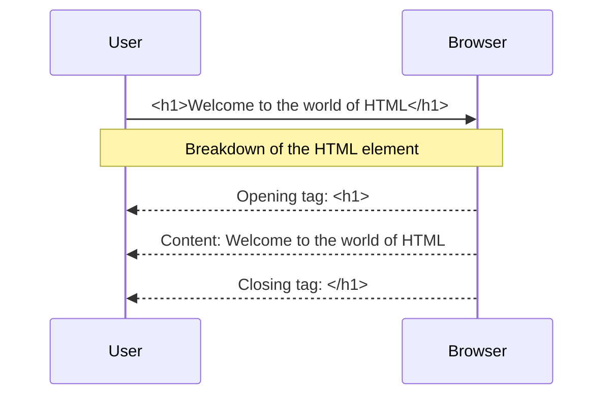

---
# try also 'default' to start simple
theme: seriph
# random image from a curated Unsplash collection by Anthony
# like them? see https://unsplash.com/collections/94734566/slidev
background: https://res.cloudinary.com/drnqdd87d/image/upload/f_auto/nmgakkzd3lmlibnfosps
# some information about your slides, markdown enabled
title: School of Engineering
info: |
  ## AltSchool v4 Class Notes
  making of world class developers

  join at [AltSchool Africa](https://altschoolafrica.com)
# apply any unocss classes to the current slide
class: text-center
# https://sli.dev/custom/highlighters.html
highlighter: shiki
# https://sli.dev/guide/drawing
drawings:
  persist: false
# slide transition: https://sli.dev/guide/animations#slide-transitions
transition: slide-left
# enable MDC Syntax: https://sli.dev/guide/syntax#mdc-syntax
mdc: true
---

# AltSchool School of Engineering

Class notes for the 1st Semester

<div class="pt-12">
  <span @click="$slidev.nav.next" class="px-2 py-1 rounded cursor-pointer" hover="bg-white bg-opacity-10">
    Are you ready to learn Software Engineering focusing on web technologies? Press <kbd>space</kbd> on your keyboard <carbon:arrow-right class="inline"/>
  </span>
</div>

<div class="abs-br m-6 flex gap-2">
  <button @click="$slidev.nav.openInEditor()" title="Open in Editor" class="text-xl slidev-icon-btn opacity-50 !border-none !hover:text-white">
    <carbon:edit />
  </button>
  <a href="https://github.com/oluwasetemi/" target="_blank" alt="GitHub" title="Open in GitHub"
    class="text-xl slidev-icon-btn opacity-50 !border-none !hover:text-white">
    <carbon-logo-github />
  </a>
</div>

<!--
The last comment block of each slide will be treated as slide notes. It will be visible and editable in Presenter Mode along with the slide. [Read more in the docs](https://sli.dev/guide/syntax.html#notes)
-->
---

# What is Software Engineering?

Software Engineering is the <span v-mark.underline.yellow="">systematic application</span> of <span v-mark.underline.yellow="">engineering principles</span> to the <span v-mark.underline.yellow="">design</span>, <span v-mark.underline.yellow="">development</span>, <span v-mark.underline.yellow="">maintenance</span>, <span v-mark.underline.yellow="">testing</span>, and <span v-mark.underline.yellow="">evaluation of software</span>.

It involves a <span v-mark.underline.red="">disciplined approach</span> to <span v-mark.underline.red="">analyzing user needs</span>, <span v-mark.underline.red="">planning and managing projects</span>, creating software systems, and <span v-mark.underline.red="">ensuring their reliability</span>, <span v-mark.underline.red="">efficiency</span>, and <span v-mark.underline.red="">maintainability</span>.

You will need a blend of <span v-mark.underline.green="">technical Skills</span>, <span v-mark.underline.green="">engineering methods</span> and <span v-mark.underline.green="">project management</span> to produce <span v-mark.circle.white="">high-quality software systems</span>.

<br>
<br>

Read more about [Software Engineering?](https://www.wearedevelopers.com/magazine/what-is-software-engineering)

<!--
You can have `style` tag in markdown to override the style for the current page.
Learn more: https://sli.dev/guide/syntax#embedded-styles
-->

<style>
h1 {
  background-color: #2B90B6;
  background-image: linear-gradient(45deg, #4EC5D4 10%, #146b8c 20%);
  background-size: 100%;
  -webkit-background-clip: text;
  -moz-background-clip: text;
  -webkit-text-fill-color: transparent;
  -moz-text-fill-color: transparent;
}
</style>
---

# [Foundational Requirement](https://norvig.com/21-days.html)

- coding
- coding
- coding
- coding

---

# Why Web and Cloud?

- Career Advantages
  - High Demand and Competitive Salaries
  - Remote Work
  - Entrepreneurial Options
- Technical Advantages
  - Scalability, Cost Efficiency, Security and CI/CD
  - Access to Advanced Tools and Services
  - Global Reach
- Educational and Community Benefits
  - Extensive Learning Resources
  - Active Community Support and Open Source
- Innovation and Future-Proofing
  - Cutting-Edge Technologies
  - Adaptability

---

# Focus of this Class

- HTML
- CSS
- JavaScript
- Git and GitHub | Open Source

---

# Tools

- [Visual Studio Code](https://code.visualstudio.com/download) or any equivalent (JetBrains IDE, Zed, Sublime Text)
- [Git and GitBash for windows](https://git-scm.com/downloads), Git only for mac and linux
- [Nodejs](https://nodejs.org/en/), Python

---

# Some Account You Expected to (Create || Have)

- [GitHub](https://github.com/Oluwasetemi) and any other equivalent in GitLab or BitBucket
- [LinkedIn](https://www.linkedin.com/in/setemiojo)
- [Twitter or X](https://x.com/setemiojo)
- Stackblitz or CodeSandBox
- [Codepen](https://codepen.io/setemiojo)
- [Stackoverflow](https://stackoverflow.com/users/4330745/oluwasetemi)
- ChatGPT
- Figma
- [Dev.to](https://dev.to/oluwasetemi) | [hashnode](https://hashnode.com/@setemiojo) | [Medium](https://medium.com/@setemiojo)
- Slack
- Netlify | Vercel | Render
- [Personal Website](https://www.oluwasetemi.dev/). we teach to create your own.

---

# Installations

<Youtube class="w-full h-96 border border-main rounded-lg" id="LebD-zBxZeY" />

---

# Algorithms and FlowCharts

Definition: An algorithm is a step-by-step procedure or a set of rules designed to perform a specific task or solve a particular problem. It is a sequence of instructions that are followed to achieve a desired outcome.

Example: An algorithm for making a cup of tea might include steps like boiling water, adding a tea bag to a cup, pouring the hot water into the cup, letting it steep for a few minutes, and then removing the tea bag.

---

# flowchart

Definition: A flowchart is a visual representation of the steps in a process or system using symbols, arrows, and text. It depicts the sequence of operations or steps, making it easier to understand how a process flows from start to finish.

Example: A flowchart for logging into a website might start with a "Start" symbol, followed by a decision symbol asking if the user has entered their username and password, arrows leading to "Enter username" and "Enter password" steps, and an end symbol once the login process is successful.

---

# Problem Solving

---

# Programming Paradigms

- Procedural Programming
- Object-Oriented Programming (OOP)
- Functional Programming
- Logic Programming
- Declarative Programming
- Concurrent Programming
- Event-Driven Programming

<v-click>
  Each paradigm brings its own way of thinking and problem-solving, making some paradigms more suitable for certain types of tasks than others. Modern programming often involves a combination of these paradigms to leverage their respective strengths.
</v-click>

---

# Programming Concepts

<div class="grid grid-cols-2 gap-x-4">

  <v-click :every='1' depth="2">

<ul>
  <li> Variables</li>
  <li> Data Types</li>
  <li> Control Structures</li>
  <li> Functions (or Methods)</li>
  <li> Data Structures</li>
  <li> Algorithms</li>
  <li>
    Object-Oriented Concepts
    <!-- <v-click> -->
      <ul>
      <li>Encapsulation</li>
      <li>Polymorphism</li>
      <li>Inheritance</li>
    </ul>
    <!-- </v-click> -->
  </li>

</ul>

  </v-click>

  <v-click :every="1">
    <ul>
     <li> Recursion</li>
      <li> Error Handling</li>
      <li> Memory Management</li>
      <li> Concurrency</li>
      <li> File I/O</li>
    </ul>

  </v-click>

</div>
<v-click>
    <p>
      Understanding these concepts is fundamental to mastering programming and can significantly improve your ability to develop complex and efficient software solutions.
    </p>
</v-click>

---

# Variables

Storage locations in memory with a name,
used to hold data.

```js {monaco-run} {autorun: false}
let name = 'AltSchool'
let age = 99

console.log({name, age})
```

```py
name = 'AltSchool'
age = 99

print(name, age)
```

---

# Data Types

Classification of data items, defining the operations that can be performed on them.

Primitive types: int, char, float, boolean, number, bigint, symbol, string, undefined, null,

Composite types: arrays, structs, classes.

Abstract data types: List, Stack, Queue, etc.

```js {monaco-run} {autorun: false}
let name = 'AltSchool'
let age = 99
let isStudent = true

const arrayOfScore = [99, 40, 50]
const person = { name: name, age: age, isStudent: isStudent }

console.log(arrayOfScore)
console.log(person)
```

---

# Control Structures

Direct the order of execution of statements in a program.

Conditional statements: if, else, switch.

Loops: for, while, do-while.

Branching: break, continue, return

````md magic-move
```js {*}
let name = 'AltSchool'
let age = 99

if (condition) {
  // do something
} else if (condition) {
  // do something else if
} else {
  // finally do something
}
```

```js
switch (key) {
  case value:
    // code
    break;

  default:
    break;
}
```

```js
for (let index = 0; index < array.length; index++) {
  const element = array[index];
}

while (condition) {
  // code block to be executed
}

```


````

---

# Functions (or Methods)

Blocks of code designed to perform a particular task, reusable throughout the program.

## Key Points

- Definition and calling.
- Parameters and return values.
- Scope and lifetime of variables.

---

# Data Structures

# Ways of organizing and storing data to enable efficient access and modification

Key Points:
Linear: Arrays, Linked Lists.
Non-linear: Trees, Graphs.
Abstract: Stack, Queue, Map, Set
---

# [Data Structures More (Trees)](https://www.youtube.com/watch?v=oSWTXtMglKE&list=PLLXdhg_r2hKA7DPDsunoDZ-Z769jWn4R8&index=8)

Binary Search Tree, AVL Tree, Red-Black Tree
Segment Tree
Fenwick Tree (Binary Indexed Tree)


---

# Algorithms

Step-by-step procedures or formulas for solving problems.

## Key Points

Sorting: Bubble sort, Quick sort, Merge sort.
Searching: Linear search, Binary search.
Complexity: Big O notation for time and space.

---

# Object-Oriented Concepts

Principles used in OOP to create objects that model real-world entities

## Key Points

Classes and Objects.
Encapsulation, Inheritance, Polymorphism, Abstraction.
Constructors and destructors

### Encapsulation - Hiding the internal state and requiring all interaction to be performed through an object's methods

### Polymorphism - The ability of different classes to be treated as instances of the same class through a common interface

### Inheritance - is a mechanism that allows a class to inherit properties and behaviors from another class

---

# Recursion

A function calling itself to solve a smaller instance of the same problem.

## Notable Key Points

- Base case and recursive case.
- Stack overflow and efficiency considerations.
- Examples: Factorial, Fibonacci sequence

---

# Error Handling

Mechanisms to handle runtime errors or exceptional conditions.

## Key Points

- Try, catch, finally blocks.
- Throwing exceptions.
- Custom exception classes

---

# Memory Management

Techniques to control the allocation, use, and deallocation of memory

# Concurrency and Asynchronous Operations

Running multiple computations simultaneously

# File I/O

Reading from and writing to files. File streams, Opening, reading, writing, and closing files, Binary vs text files
---

# HTML

Getting Up and Running with HTML
Document Structure, Metadata (head tag and its related tags), Body (possible elements that can be in the body)

# Getting Up and Running with HTML
HTML(HyperText Markup Language) is the foundation of basically every web page, basically, it is the core language of the World Wide Web. It’s how we tell browsers to structure content into paragraphs, headings, images, links, lists, forms, tables, buttons, and more. If you’re interested in building a website, web development, or just coding in general, learning HTML is a great place to start.

---

# Let's break it down a bit

- HTML uses "markup" to annotate text, images, and other content for display in a Web browser. HTML markup includes special "elements" such as <kbd>&lt;head&gt;</kbd>, <kdb>&lt;title&gt;</kdb>', &lt;body&gt;', &lt;header&gt;', &lt;footer&gt;', &lt;article&gt;', &lt;section&gt;', &lt;p&gt;', &lt;div&gt;', &lt;span&gt;', &lt;img&gt;', &lt;aside&gt;', &lt;audio&gt;', &lt;canvas&gt;', &lt;datalist&gt;', &lt;details&gt;', &lt;embed&gt;', &lt;nav&gt;', &lt;search&gt;', &lt;output&gt;', &lt;progress&gt;', &lt;video&gt;', &lt;ul&gt;', &lt;ol&gt;', &lt;li&gt;' and many others.

- “HyperText” is text on a web page that contains references to another web page. You probably know these as hyperlinks. We use hyperlinks to jump to another section of the same page, a different page on the current website, or a completely new website. Hyperlinks can also open a PDF, email, or multimedia, like a video or audio file.

- Linking information together in this way was a revolutionary step in building the web. Together, HTML and the internet make it possible for anyone to access all types of information around the world, in any order they want.


- Finally, “Language” is the simplest part of the acronym to understand. Like any language, HTML has a unique syntax and alphabet. But what kind of language is it, exactly? It's a markup language.


---
 
# HTML Element

An HTML element is set off from other text in a document by "tags", which consist of the element name surrounded by &lt; and &gt;. The name of an element inside a tag is case-insensitive. That is, it can be written in uppercase, lowercase, or a mixture. For example, the <kdb>&lt;title&gt;&lt;title&gt;</kdb> tag can be written as &lt;/Title&gt;&lt;/Title&gt;, <kdb>&lt;TITLE&gt;</kdb><kbd>&lt;/TITLE&gt;</kbd>, or in any other way. However, the convention and recommended practice is to write tags in lowercase.

---

# Check this out:



---

# Explanation of the Diagram in the previous slide

The closing tag is the same tag as the opening tag, preceded by a slash.
Elements and tags aren't the exact same thing, though many people use the terms interchangeably. The tag name is the content in the brackets. The tag includes the brackets. In this case, &lt;h1&gt;. An "element" is the opening and closing tags, and all the content between those tags, including nested elements.

Note: Browsers do not display the tags. The tags are used to interpret the content of the page.


---

# Document Structure

HTML documents include a document type declaration and the <kbd>&lt;html&gt</kbd>; root element. Nested in the <kbd>&lt;html&gt</kbd>; element are the document head and document body. While the head of the document isn't visible to the sighted visitor, it is vital to make your site function. It contains all the meta information, including information for search engines and social media results, icons for the browser tab and mobile home screen shortcut, and the behavior and presentation of your content. 

- &lt;DOCTYPE html /&gt;
- <kbd>&lt;html&gt;</kbd>
- <kbd>&lt;head&gt;</kbd>
- <kbd>&lt;head/&gt;</kbd>
- <kbd>&lt;body&gt;</kbd>
- <kbd>&lt;body/&gt;</kbd>
- <kbd>&lt;html/&gt;</kbd>


---

# DOCTYPE

<kbd>&lt;!DOCTYPE html&gt;</kbd>
The first thing in any HTML document is the preamble. To start an HTML document you need to type <kbd>&lt;!DOCTYPE html&gt;</kbd> at the top of the document, though this may look like an HTML element because it's wrapped in tags but it isn't. It's a special kind of node called "doctype" which tells the browser to use standards mode. If this <kbd>&lt;!DOCTYPE html&gt;</kbd> is omitted, browser wil use a different rendering mode known as quirks mode.

---

# HTML

The <kbd>&lt;html&gt;</kbd> element is the root element for an HTML document. It is the parent of the <kbd>&lt;head&gt;</kbd>and <kbd>&lt;body&gt;,</kbd> containing everything in the HTML document other than the doctype. If omitted it will be implied, but it is important to include it, as this is the element on which the language of the content of the document is declared.

Note: The lang language attribute added to the html tag to give this <kbd>&lt;html lang="en"&gt;</kbd> tag defines the main language of the document. The value of the lang attribute is a two- or three-letter ISO language code followed by the region. The region is optional, but recommended, as a language can vary greatly between regions.

---

# head

Nested between the opening and closing <kbd>&lt;html&gt;</kbd> tags, we find the two children: <kbd>&lt;head&gt;</kbd> and <kbd>&lt;body&gt;</kbd>:

- &lt;DOCTYPE html /&gt;
- <kbd>&lt;html lang="en"&gt;</kbd>
- <kbd>&lt;head&gt;</kbd>
- <kbd>&lt;head/&gt;</kbd>
- <kbd>&lt;body&gt;</kbd>
- <kbd>&lt;body/&gt;</kbd>
- <kbd>&lt;html/&gt;</kbd>

The <kbd>&lt;head&gt;</kbd> which can also be reffered to as document metadata header, contains all the metadata for a site or application and some of these meta tags are:

- <kbd>&lt;meta charset="UTF-8"/&gt;</kbd>
- <kbd>&lt; meta name="viewport" content="width=device-width, initial-scale=1.0"/&gt;</kbd>
- <kbd>&lt;title&gt;Learning HTML&lt;/title&gt;</kbd>
- <kbd>&lt;link href="./style.css"/&gt;</kbd>
    


--- 

# Character encoding

```
<meta charset="UTF-8"/>;

```

By declaring UTF-8 (case-insensitive), you can even include emojis in your title (but please don't).

The character encoding is inherited into everything in the document, even <kbd>&lt;style&gt;</kbd> and <kbd>&lt;scipt&gt;</kbd> This little declaration means you can include emojis in class names and the selectorAPI (again, please don't). If you do use emojis, make sure to use them in a way that enhances usability without harming accessibility.


---

# Document title

The <kbd>&lt;title&gt;</kbd> element is metadata that represents the title of the overall HTML document (not the document's content.)

The contents for the document title, the text between the opening and closing <kbd>&lt;title&gt;</kbd>  tags, are displayed in the browser tab, the list of open windows, the history, search results, and, unless redefined with <kbd>&lt;meta&gt;</kbd>  tags, in social media cards.

---

# Viewport metadata

The other meta tag that should be considered essential is the viewport meta tag, which helps site responsiveness, enabling content to render well by default, no matter the viewport width and also enhances the user experience. 

```
<meta name="viewport" content="width=device-width, initial-scale=1.0"/>

```
name="viewport": This specifies that the meta tag is providing information about the viewport. The viewport is the user's visible area of a web page, which varies with the device used to view the site (desktop, tablet, mobile phone).

content="width=device-width, initial-scale=1.0": This attribute contains the settings for the viewport. It is a comma-separated list of properties and values. In this case, it contains two key properties:

width=device-width: This sets the width of the viewport to be equal to the width of the device. It ensures that the webpage is not scaled down or up but instead uses the full width of the device's screen.
initial-scale=1.0: This sets the initial zoom level when the page is first loaded. A scale of 1.0 means no zoom, i.e., the page content appears at 100% of its size.

---

# Body
The <kbd>&lt;body&gt;</kbd> tag defines the document's body.

The <kbd>&lt;body&gt;</kbd>  element contains all the contents of an HTML document, such as headings, paragraphs, images, hyperlinks, tables, lists, etc.

Note: There can only be one <kbd>&lt;body&gt;</kbd> element in an HTML document.

Inside the <kbd>&lt;body&gt;</kbd> tags of an HTML document, you can find a wide variety of elements that are used to structure and present the content of a webpage. Here are some common HTML tags that are typically found inside the <kbd>&lt;body&gt;</kbd> tag:

```
<body>

1. Headings:
<h1> to <h6>

2. Paragraph:
<p>

3. Links:
<a>

```

---

# Contd.

```
4. Lists:
Ordered List: <ol>, <li>
Unordered List: <ul>, <li>
Description List: <dl>, <dt>, <dd>

5. Tables:
<table>, <tr>, <th>, <td>, <thead>, <tbody>, <tfoot>

6. Forms:
<form>, <input>, <textarea>, <button>, <select>, <option>, <label>, <fieldset>, <legend>

7. Images:


8. Media:
<audio>, <video>, <source>

9. Embedded Content:
<iframe>, <embed>, <object>, <param>

10. Sections and Grouping Content:
<div>, <span>, <header>, <footer>, <main>, <section>, <article>, <nav>, <aside>

```

---

# Contd.

```

11. Text Formatting:
<b>, <i>, <strong>, <em>, <small>, <mark>, <del>, <ins>, <sub>, <sup>

12. Interactive Elements:
<button>, <details>, <summary>

13. Semantic Elements:
<figure>, <figcaption>, <time>, <progress>, <meter>

14. Script and Styles:
<script>, <noscript>, <style>

</body>

```

---

# Let's put some of the tags in usage

```
<!DOCTYPE html>
<html lang="en">
<head>
    <meta charset="UTF-8">
    <meta name="viewport" content="width=device-width, initial-scale=1.0">
    <title>Responsive Web Page</title>
</head>
<body>
    <h1>Welcome to my responsive web page!</h1>
    <p>This page looks good on both desktop and mobile devices.</p>
</body>
</html>

```
---

# Breakdown of the Code:

1. &lt;DOCTYPE html &gt;
This declaration defines the document type and version of HTML being used. <kbd>&lt;DOCTYPE html&gt;</kbd> specifically tells the browser that this document is written in HTML5, which is the latest version of HTML.

2. <kbd>&lt;html lang="en"&gt;</kbd>
This is the opening tag for the HTML document. The lang="en" attribute specifies the language of the document, which in this case is English. This helps search engines and browsers understand the primary language of the content.

3. <kbd>&lt;head&gt;</kbd>
The <kbd>&lt;head&gt;</kbd> element contains meta-information (metadata) about the document that is not displayed on the page. It includes links to scripts, stylesheets, and other metadata.

Within the <kbd>&lt;head&gt;</kbd>:
&lt;meta charset="UTF-8"&gt;
This tag specifies the character encoding for the HTML document. UTF-8 is a universal character set that supports many different characters from various languages. It ensures that the text is properly displayed.

&lt;meta name="viewport" content="width=device-width, initial-scale=1.0"&gt;
This tag controls the viewport's size and scale on different devices. It ensures the website is responsive and adjusts to different screen sizes:

width=device-width sets the viewport to match the device's width.
initial-scale=1.0 sets the initial zoom level to 100%.

---

# Contd

4. <kbd>&lt;title&gt;</kbd>Responsive Web Page<kbd>&lt;/title&gt;</kbd>
The &lt;title&gt; tag defines the title of the HTML document, which appears in the browser's title bar or tab. It is also used by search engines as the title of the page in search results.

5. <kbd>&lt;body&gt;</kbd>
The <kbd>&lt;body&gt;</kbd> element contains all the content that is displayed on the web page, such as text, images, links, etc.

Within the <kbd>&lt;body&gt;</kbd>:
&lt;h1&gt;Welcome to my responsive web page!&lt;/h1&gt;
The &lt;h1&gt; tag defines a top-level heading on the page. This is often the main heading and is typically the most prominent piece of text.

&lt;p&gt;This page looks good on both desktop and mobile devices.&lt;/p&gt;
The &lt;p&gt; tag defines a paragraph of text. It contains the main body text and ensures the content is properly formatted and readable.

---

#