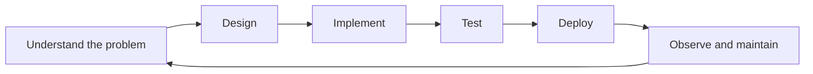
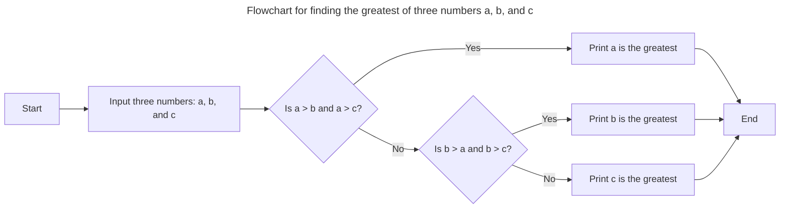
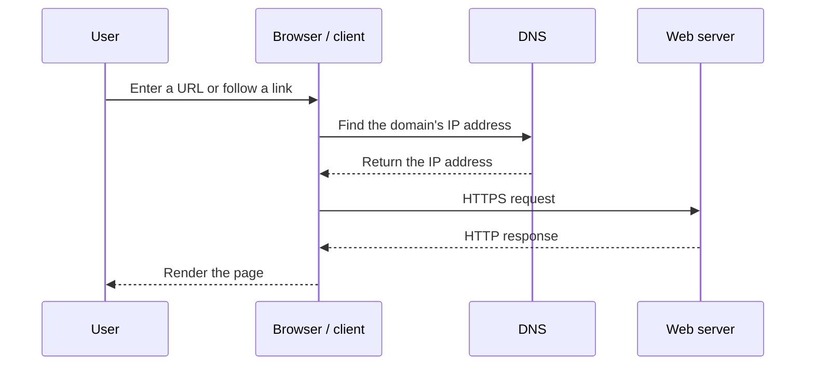
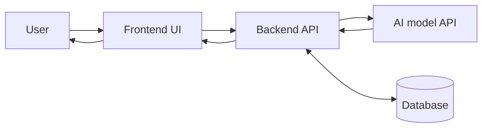
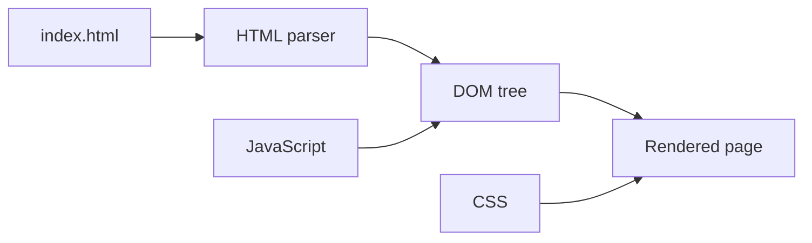
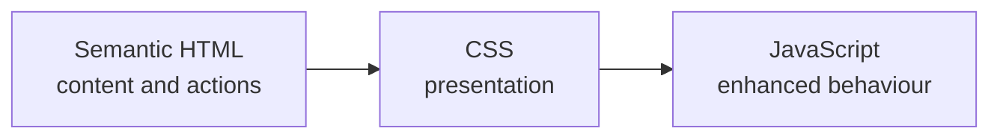
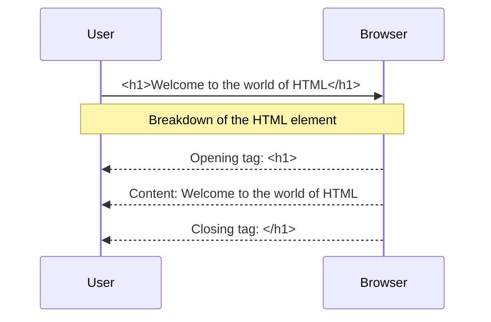

# [HTML Notes]{.font-hand}

Class notes for the 1st Semester

<div class="pt-12">
  <span @click="$slidev.nav.next" class="px-2 py-1 rounded cursor-pointer" hover="bg-white bg-opacity-10">
    Are you ready to learn HTML and web technologies? Press `space` on your keyboard <carbon:arrow-right class="inline"/>
  </span>
</div>

<div class="abs-br m-6 flex gap-2">
  <button @click="$slidev.nav.openInEditor()" title="Open in Editor" class="text-xl slidev-icon-btn opacity-50 !border-none !hover:text-white">
    <carbon:edit />
  </button>
  <a href="https://github.com/oluwasetemi/school_of_engineering_v4" target="_blank" alt="GitHub" title="Open in GitHub"
    class="text-xl slidev-icon-btn opacity-50 !border-none !hover:text-white">
    <carbon-logo-github />
  </a>
  <a href="https://html.oluwasetemi.dev/export" target="_blank" alt="Download" title="Download PDF or PPTX version of the slide"
    class="text-xl slidev-icon-btn opacity-50 !border-none !hover:text-white">
    <carbon-download />
  </a>
</div>

<!--
The last comment block of each slide will be treated as slide notes. It will be visible and editable in Presenter Mode along with the slide. [Read more in the docs](https://sli.dev/guide/syntax.html#notes)
-->
---
hideInToc: true
class: 'text-sm'
---

# Table of contents

<Toc columns="2" minDepth="1" maxDepth="2"></Toc>

<div class="flex gap-3 mt-6">
  <button @click="$router.push('/routes')" class="px-4 py-2 rounded-lg bg-blue-500/10 border border-blue-500/30 text-blue-400 text-sm cursor-pointer hover:bg-blue-500/20 transition-colors flex items-center gap-1.5"><span class="i-mdi-format-list-bulleted inline-block" /> All Sections</button>
  <button @click="$router.push('/html-playground')" class="px-4 py-2 rounded-lg bg-orange-500/10 border border-orange-500/30 text-orange-400 text-sm cursor-pointer hover:bg-orange-500/20 transition-colors flex items-center gap-1.5"><span class="i-mdi-web inline-block" /> HTML Playground</button>
  <button @click="$router.push('/playground')" class="px-4 py-2 rounded-lg bg-green-500/10 border border-green-500/30 text-green-400 text-sm cursor-pointer hover:bg-green-500/20 transition-colors flex items-center gap-1.5"><span class="i-mdi-code-braces inline-block" /> JS/TS Playground</button>
  <button @click="$router.push('/changelog')" class="px-4 py-2 rounded-lg bg-purple-500/10 border border-purple-500/30 text-purple-400 text-sm cursor-pointer hover:bg-purple-500/20 transition-colors flex items-center gap-1.5"><span class="i-mdi-history inline-block" /> Changelog</button>
</div>

---
routeAlias: what-is-software-engineering
title: Software Engineering
---

# What is Software Engineering?
<div></div>
Software Engineering is the <span v-mark.underline.yellow="">systematic application</span> of <span v-mark.underline.yellow="">engineering principles</span> to the <span v-mark.underline.yellow="">design</span>, <span v-mark.underline.yellow="">development</span>, <span v-mark.underline.yellow="">maintenance</span>, <span v-mark.underline.yellow="">testing</span>, and <span v-mark.underline.yellow="">evaluation of software</span>.

It involves a <span v-mark.underline.red="">disciplined approach</span> to <span v-mark.underline.red="">analyzing user needs</span>, <span v-mark.underline.red="">planning and managing projects</span>, creating software systems, and <span v-mark.underline.red="">ensuring their reliability</span>, <span v-mark.underline.red="">efficiency</span>, and <span v-mark.underline.red="">maintainability</span>.

You will need a blend of <span v-mark.underline.green="">technical Skills</span>, <span v-mark.underline.green="">engineering methods</span> and <span v-mark.underline.green="">project management</span> to produce high-quality software systems.

<br>
<br>

Read more about [Software Engineering?](https://www.wearedevelopers.com/magazine/what-is-software-engineering)

<!--
You can have `style` tag in markdown to override the style for the current page.
Learn more: https://sli.dev/guide/syntax#embedded-styles
-->

<style>
h1 {
  background-color: #2B90B6;
  background-image: linear-gradient(45deg, #4EC5D4 10%, #146b8c 20%);
  background-size: 100%;
  -webkit-background-clip: text;
  -moz-background-clip: text;
  -webkit-text-fill-color: transparent;
  -moz-text-fill-color: transparent;
}
</style>
---
hideInToc: true
---

# [Foundational Requirement](https://norvig.com/21-days.html)

- coding

---
hideInToc: true
class: 'text-sm'
routeAlias: software-engineering-is-more-than-coding
title: Engineering Lifecycle
---

# Software Engineering Is More Than Coding

Coding is one part of building software that remains useful, reliable, secure, and understandable over time.


```mermaid {scale: 0.8}
flowchart LR
    A[Understand the problem] --> B[Design]
    B --> C[Implement]
    C --> D[Test]
    D --> E[Deploy]
    E --> F[Observe and maintain]
    F --> A
```

- **Requirements:** What problem are we solving, and for whom?
- **Quality:** Does it work correctly, safely, and accessibly?
- **Collaboration:** Can another engineer understand, review, and improve it?

---
hideInToc: true
class: 'text-sm'
routeAlias: a-practical-engineering-workflow
title: Engineering Workflow
---

# A Practical Engineering Workflow

1. Clarify the user need and define what “done” means.
2. Break the problem into small, testable tasks.
3. Design the simplest suitable solution.
4. Implement and verify one small change at a time.
5. Use Git, code review, tests, and documentation to protect quality.
6. Deploy, observe real usage, fix problems, and improve.

<Tips type="info" fullWidth>
AI can assist at every step, but the engineer remains responsible for the requirements, decisions, verification, and outcome.
</Tips>


---

# Why Web and Cloud?

- Career Advantages
  - High Demand and Competitive Salaries
  - Remote Work
  - Entrepreneurial Options
- Technical Advantages
  - Scalability, Cost Efficiency, Security and CI/CD
  - Access to Advanced Tools and Services
  - Global Reach
- Educational and Community Benefits
  - Extensive Learning Resources
  - Active Community Support and Open Source
- Innovation and Future-Proofing
  - Cutting-Edge Technologies
  - Adaptability

---

# Focus of this Class

- {HTML}
- {CSS}
- {JavaScript} and {TypeScript}
- {Git} and {GitHub} | Open Source | Introduction to basic terminal commands

---

# Tools

- {Visual Studio Code} or any equivalent (JetBrains {Webstorm} IDE, {Zed}, Sublime Text), Cursor
- [Git and GitBash for windows](https://git-scm.com/downloads), {Git} only for mac and linux
- {Nodejs}, {Python}

[Here is a link to watch a video on installation and basic set of vs code, git on windows operating system](https://www.youtube.com/watch?v=LebD-zBxZeY).

---

# Accounts

<div />

Some Account You Expected to (Create || Have)

- {GitHub} and any other equivalent in GitLab or BitBucket
- [LinkedIn](https://www.linkedin.com/in/setemiojo)
- [Twitter or X](https://x.com/setemiojo)
- {Stackblitz} or {Codesandbox}
- {Codepen}
- [Stackoverflow](https://stackoverflow.com/users/4330745/oluwasetemi)
- {ChatGPT}
- {Figma}
- [Dev.to](https://dev.to/oluwasetemi) | [hashnode](https://hashnode.com/@setemiojo) | [Medium](https://medium.com/@setemiojo)
- {Slack} or {Discord}
- {Netlify} | {Vercel} | {Render}
- [Personal Website](https://www.oluwasetemi.dev/). we will teach to create your own.

---

# Installations

<div />

<Youtube class="w-full h-96 border border-main rounded-lg" id="LebD-zBxZeY" />

---
routeAlias: algorithms-and-flow-charts
title: Algorithms & Flowcharts
---

# Algorithms and FlowCharts

<div />

Definition: An algorithm is a step-by-step procedure or a set of rules designed to perform a specific task or solve a particular problem. It is a sequence of instructions that are followed to achieve a desired outcome.

Example: An algorithm for making a cup of tea might include steps like boiling water, adding a tea bag to a cup, pouring the hot water into the cup, letting it steep for a few minutes, and then removing the tea bag.

<div class="text-sm grid grid-cols-2 gap-1">
<Tips type="tip">
<ol>
<li>Patterns Reduce Complexity like two-pointer, sliding window, divide and conquer, dynamic programming, etc.</li>

<li>Optimize Thinking for Efficiency</li>

<li>Develop Transferable Skills</li>

<li>Practice and Apply</li>
</ol>
</Tips>

<Tips type="success">
Building intuition around patterns will significantly improve your problem-solving skills, speed, and confidence in tackling algorithmic challenges.
</Tips>
</div>

---
hideInToc: true
---

# flowchart

<div />

Definition: A flowchart is a visual representation of the steps in a process or system using symbols, arrows, and text. It depicts the sequence of operations or steps, making it easier to understand how a process flows from start to finish.

Example: A flowchart for logging into a website might start with a "Start" symbol, followed by a decision symbol asking if the user has entered their username and password, arrows leading to "Enter username" and "Enter password" steps, and an end symbol once the login process is successful.


```mermaid
---
title: Flowchart for finding the greatest of three numbers a, b, and c
---
flowchart LR
  Start[Start] --> InputNumbers[Input three numbers: a, b, and c]
  InputNumbers --> CheckA{Is a > b and a > c?}

  CheckA -- Yes --> AisGreatest[Print a is the greatest]
  CheckA -- No --> CheckB{Is b > a and b > c?}

  CheckB -- Yes --> BisGreatest[Print b is the greatest]
  CheckB -- No --> CisGreatest[Print c is the greatest]

  AisGreatest --> End[End]
  BisGreatest --> End
  CisGreatest --> End
```

---
hideInToc: true
routeAlias: problem-solving
title: Problem Solving
---

# Problem Solving

<div />

Use {ChatGPT} or Google to research what the key components of problem solving are. Try to use it to solve any problem you have.

---
routeAlias: programming-paradigms
title: Programming Paradigms
---

# Programming Paradigms

- Procedural Programming
- Object-Oriented Programming (OOP)
- Functional Programming
- Logic Programming
- Declarative Programming
- Concurrent Programming
- Event-Driven Programming

<v-click>
  Each paradigm brings its own way of thinking and problem-solving, making some paradigms more suitable for certain types of tasks than others. Modern programming often involves a combination of these paradigms to leverage their respective strengths.
</v-click>

---
hideInToc: true
routeAlias: programming-concepts
title: Programming Concepts
---

# Programming Concepts

<div class="grid grid-cols-2 gap-x-4">

  <v-clicks :every='1' depth="2">

<ul>
  <li> Variables</li>
  <li> Data Types</li>
  <li> Control Structures</li>
  <li> Functions (or Methods)</li>
  <li> Data Structures</li>
  <li> Algorithms</li>
  <li>
    Object-Oriented Concepts
    <!-- <v-click> -->
      <ul>
      <li>Encapsulation</li>
      <li>Polymorphism</li>
      <li>Inheritance</li>
    </ul>
    <!-- </v-click> -->
  </li>

</ul>

  </v-clicks>

  <v-clicks :every="1">
    <ul>
     <li> Recursion</li>
      <li> Error Handling</li>
      <li> Memory Management</li>
      <li> Concurrency</li>
      <li> File I/O</li>
    </ul>

  </v-clicks>

</div>
<v-click>
    <p>
      Understanding these concepts is fundamental to mastering programming and can significantly improve your ability to develop complex and efficient software solutions.
    </p>
</v-click>

---
hideInToc: true
class: text-sm
---

# Helpful resources

Use these ByteByteGo visual guides to review concepts from these notes:

- **Software development lifecycle / workflow:** [How do Companies Ship Code to Production?](https://bytebytego.com/guides/how-do-companies-ship-code-to-production/), [CI/CD Pipeline Explained in Simple Terms](https://bytebytego.com/guides/cicd-pipeline-explained-in-simple-terms/), [DevOps vs NoOps](https://bytebytego.com/guides/devops-vs-noops/)
- **Code quality and engineering habits:** [10 Good Coding Principles to Improve Code Quality](https://bytebytego.com/guides/10-good-coding-principles-to-improve-code-quality/)
- **Programming paradigms:** [Top 8 Programming Paradigms](https://bytebytego.com/guides/top-8-programming-paradigms/), [Imperative vs Functional vs Object-oriented Programming](https://bytebytego.com/guides/imperative-vs-functional-vs-object-oriented-programming/)
- **Object-oriented programming:** [The Fundamental Pillars of Object-Oriented Programming](https://bytebytego.com/guides/the-fundamental-pillars-of-object-oriented-programming/)
- **Data structures and algorithms:** [10 Key Data Structures We Use Every Day](https://bytebytego.com/guides/10-key-data-structures-we-use-every-day/), [The 9 Algorithms That Dominate Our World](https://bytebytego.com/guides/the-9-algorithms-that-dominate-our-world/)
- **Concurrency and memory management:** [Concurrency vs Parallelism](https://bytebytego.com/guides/concurrency-is-not-parallelism/), [How does Garbage Collection work?](https://bytebytego.com/guides/how-does-garbage-collection-work/)
- **Web, DNS, URL, and HTTP:** [How Does DNS Lookup Work?](https://bytebytego.com/guides/how-does-the-domain-name-system-dns-lookup-work/), [URL, URI, URN - Differences Explained](https://bytebytego.com/guides/url-uri-urn-do-you-know-the-differences/), [HTTP Status Codes You Should Know](https://bytebytego.com/guides/http-status-code-you-should-know/), [Top 9 HTTP Request Methods](https://bytebytego.com/guides/top-9-http-request-methods/)
- **Browser and web application basics:** [How Browsers Render Web Pages](https://bytebytego.com/guides/how-does-the-browser-render-a-web-page/), [10 Essential Components of a Production Web Application](https://bytebytego.com/guides/10-essential-components-of-a-production-web-application/)

---
hideInToc: true
routeAlias: variables
title: Variables
---

# Variables

Storage locations in memory with a name,
used to hold data.

```js {monaco-run} {autorun: false}
let name = 'AltSchool'
let age = 99

console.log({name, age})
```

```py
name = 'AltSchool'
age = 99

print(name, age)
```

---
hideInToc: true
routeAlias: data-types
title: Data Types
---
# Data Types

Classification of data items, defining the operations that can be performed on them.

Primitive types: int, char, float, boolean, number, bigint, symbol, string, undefined, null,

Composite types: arrays, structs, classes.

Abstract data types: List, Stack, Queue, etc.

```js {monaco-run} {autorun: false}
let name = 'AltSchool'
let age = 99
let isStudent = true

const arrayOfScore = [99, 40, 50]
const person = { name: name, age: age, isStudent: isStudent }

console.log(arrayOfScore)
console.log(person)
```

---
hideInToc: true
routeAlias: control-structures
title: Control Structures
---

# Control Structures

Direct the order of execution of statements in a program.

Conditional statements: if, else, switch.

Loops: for, while, do-while.

Branching: break, continue, return

````md magic-move
```js {*}
let name = 'AltSchool'
let age = 99

if (condition) {
  // do something
} else if (condition) {
  // do something else if
} else {
  // finally do something
}
```

```js
switch (key) {
  case value:
    // code
    break;

  default:
    break;
}
```

```js
for (let index = 0; index < array.length; index++) {
  const element = array[index];
}

while (condition) {
  // code block to be executed
}

```


````

---
hideInToc: true
routeAlias: functions-or-methods
title: Functions
---

# Functions (or Methods)

Blocks of code designed to perform a particular task, reusable throughout the program.

## Key Points

- Definition and calling.
- Parameters and return values.
- Scope and lifetime of variables.

---
hideInToc: true
routeAlias: data-structures
title: Data Structures
---

# Data Structures

# Ways of organizing and storing data to enable efficient access and modification

Key Points:
Linear: Arrays, Linked Lists.
Non-linear: Trees, Graphs.
Abstract: Stack, Queue, Map, Set

---
hideInToc: true
---

# [Data Structures More (Trees)](https://www.youtube.com/watch?v=oSWTXtMglKE&list=PLLXdhg_r2hKA7DPDsunoDZ-Z769jWn4R8&index=8)

Binary Search Tree, AVL Tree, Red-Black Tree
Segment Tree
Fenwick Tree (Binary Indexed Tree)


---
hideInToc: true
routeAlias: algorithms
title: Algorithms
---

# Algorithms

Step-by-step procedures or formulas for solving problems.

## Key Points

Sorting: Bubble sort, Quick sort, Merge sort.
Searching: Linear search, Binary search.
Complexity: Big O notation for time and space.

---
hideInToc: true
routeAlias: object-oriented-concepts
title: OOP Concepts
---

# Object-Oriented Concepts

Principles used in OOP to create objects that model real-world entities

## Key Points

Classes and Objects.
Encapsulation, Inheritance, Polymorphism, Abstraction.
Constructors and destructors

### Encapsulation - Hiding the internal state and requiring all interaction to be performed through an object's methods

### Polymorphism - The ability of different classes to be treated as instances of the same class through a common interface

### Inheritance - is a mechanism that allows a class to inherit properties and behaviors from another class

---
hideInToc: true
routeAlias: recursion
title: Recursion
---

# Recursion

A function calling itself to solve a smaller instance of the same problem.

## Notable Key Points

- Base case and recursive case.
- Stack overflow and efficiency considerations.
- Examples: Factorial, Fibonacci sequence

---
hideInToc: true
routeAlias: error-handling
title: Error Handling
---

# Error Handling

Mechanisms to handle runtime errors or exceptional conditions.

## Key Points

- Try, catch, finally blocks.
- Throwing exceptions.
- Custom exception classes

---
hideInToc: true
---

# Memory Management

Techniques to control the allocation, use, and deallocation of memory

# Concurrency and Asynchronous Operations

Running multiple computations simultaneously

# File I/O

Reading from and writing to files. File streams, Opening, reading, writing, and closing files, Binary vs text files

---
routeAlias: how-the-web-works
title: How the Web Works
class: 'text-sm'
---

# How the Web Works

The **internet** is the global network connecting computers. The **Web** is a service that uses that network to exchange linked documents and application data.


```mermaid {scale: 0.7}
sequenceDiagram
    participant U as User
    participant B as Browser / client
    participant D as DNS
    participant S as Web server
    U->>B: Enter a URL or follow a link
    B->>D: Find the domain's IP address
    D-->>B: Return the IP address
    B->>S: HTTPS request
    S-->>B: HTTP response
    B-->>U: Render the page
```

---
hideInToc: true
class: 'text-sm'
routeAlias: from-url-to-page
title: URL to Page
---

# From URL to Page

- A **URL** identifies a resource: `https://example.com/about?lang=en#team`.
- **DNS** translates the domain name into an IP address.
- The browser opens a secure **HTTPS** connection to the server.
- It sends an HTTP request such as `GET /about`.
- The server handles the request and sends a response.
- The browser requests linked assets, builds the page, and renders it.

---
hideInToc: true
class: 'text-sm'
routeAlias: http-requests-and-responses
title: HTTP Messages
---

# HTTP Requests and Responses

An HTTP message has a starting line, headers containing metadata, and sometimes a body containing data.

```text
GET /about HTTP/1.1
Host: example.com

HTTP/1.1 200 OK
Content-Type: text/html

<!doctype html>...
```

- A request states what the client wants to do and which resource it needs.
- A response contains a status code, headers, and usually HTML, JSON, an image, or another resource.
- Common status codes: `200` success, `301` redirect, `404` not found, and `500` server error.

---
hideInToc: true
class: 'text-sm'
routeAlias: the-parts-of-a-web-application
title: Full-stack Architecture
---

# The Parts of a Web Application

| Part | Responsibility |
|---|---|
| HTML | Content and meaning |
| CSS | Presentation and layout |
| JavaScript | Behaviour and interaction |
| Frontend | The application running in the browser |
| Backend | Business logic, authentication, and server-side APIs |
| Database | Persistent application data |
| Deployment | Making the application available to users |

A **static** site can return prepared files. A **dynamic** application generates or retrieves data for each request, often through an API using JSON.

---
hideInToc: true
class: 'text-sm'
routeAlias: where-ai-fits-in-a-full-stack-application
title: AI App Architecture
---

# Where AI Fits in a Full-stack Application


```mermaid
flowchart LR
    U[User] --> F[Frontend UI]
    F --> B[Backend API]
    B --> M[AI model API]
    B <--> D[(Database)]
    M --> B --> F --> U
```

- The frontend collects input and presents results.
- The backend validates requests, applies business rules, and calls the model securely.
- The database stores only the data the application is permitted to retain.
- Model output is untrusted input: validate it before displaying, storing, or acting on it.

<Tips type="danger" fullWidth>
Never place AI provider secrets or private API keys in browser HTML or client-side JavaScript.
</Tips>

---
hideInToc: true
class: 'text-sm'
routeAlias: responsible-use-of-ai
title: Responsible AI
---

# Responsible Use of AI

- Treat generated answers and code as suggestions—not verified facts.
- Test the result and understand it before submitting or deploying it.
- Do not share passwords, API keys, personal data, or proprietary code with an AI tool.
- Review generated interfaces for accessibility, security, and maintainability.
- Record important assumptions and decisions so teammates can review them.
- Follow programme, employer, and client rules for attribution and acceptable AI use.

<Tips type="info" fullWidth>
AI can increase your speed; engineering judgment determines whether the result is correct and safe.
</Tips>

---
routeAlias: getting-started-with-html
title: Getting Started
---

# {HTML}

<div />

HTML(HyperText Markup Language) is the foundation of basically every web page, basically, it is the core language of the World Wide Web. It’s how we tell browsers to structure content into paragraphs, headings, images, links, lists, forms, tables, buttons, and more. If you’re interested in building a website, web development, or just coding in general, learning HTML is a great place to start.

##  Getting Up and Running with {HTML}

Getting Up and Running with HTML, its important to understand the basic structure of an HTML document. The `Document Type` and HTML content itself (which is the `html` element). This contains the Metadata (`head` element and its related elements) and Body, which is what is displayed in the browser's visible area.


---
hideInToc: true
routeAlias: html-element-structure
title: Element Structure
layout: image
---


---
hideInToc: true
---

# Let's break it down a bit

- HTML uses "markup" to annotate text, images, and other content for display in a Web browser. This markup is called ELEMENT or TAG.HTML Element or Tag includes `<head>`, `<title>`, `<body>`, `<header>`, `<footer>`, `<article>`, `<section>`, `<p>`, `<div>`, `<span>`, ``, `<aside>`, `<audio>`, `<canvas>`, `<datalist>`, `<details>`, `<embed>`, `<nav>`, `<search>`, `<output>`, `<progress>`, `<video>`, `<ul>`, `<ol>`, `<li>` and many others.

- “HyperText” is text on a web page that contains references to another web page. You probably know these as hyperlinks. We use hyperlinks to jump to another section of the same page, a different page on the current website, or a completely new website. Hyperlinks can also open a PDF, email, or multimedia, like a video or audio file.

- Linking information together in this way was a revolutionary step in building the web. Together, HTML and the internet make it possible for anyone to access all types of information around the world, in any order they want.

- Finally, “Language” is the simplest part of the acronym to understand. Like any language, HTML has a unique syntax and alphabet. But what kind of language is it, exactly? It's a markup language.


---
hideInToc: true
---

# HTML Element

<div />

An HTML element or "tags", which consist of the element name surrounded by `<` and `>` like `<p>`. The name of an element inside a tag is case-insensitive. That is, it can be written in uppercase, lowercase, or a mixture. For example, the `<title></title>` tag can be written as `<Title>` `</Title>`, `<TITLE>` `</TITLE>`, or in any other way. However, for convention and recommendation practice is to write tags in lowercase. These tags or elements can be either self closing `` or normal/common once with opening tag `<p>` and a closing tag `</p>`.

<div class="text-sm/5 grid grid-cols-3 gap-1" >

<Tips type="danger">
There are three rendering modes in modern browsers: Quirks Mode(Old, pre-standardized HTML CSS behavior), Standards Mode(modern HTML/CSS standards), and Almost Standards Mode (slight compatibility)
</Tips>
<Tips type="danger">
A page will enter into quirks mode if the doctype is not declared or is declared incorrectly.
<br />
Browser can auto complete tags, but it is recommended to close tags properly. this can lead to unexpected results.
</Tips>
<Tips type="danger">
If you decide to use the opening tag of an element, you have a duty to close the tag if it is not a self-closing tag.
</Tips>
</div>

<!-- Semantic HTML, Heading & Sections, Attribute(Boolean, Enumerated, Global and custom attributes), Text Basics, Links, Navigation -->

---
hideInToc: true
---

# First HTML Document

<div />

create a folder and add an `index.html` file either using your vs code or terminal or file explorer. Use the liveserver extension to view the file in the browser.

<Tips type="info" fullWidth>
Always open your vscode on the right folder your created for your project not on the root folder of your computer or desktop or documents or downloads.
</Tips>

```html {monaco-run}
<!DOCTYPE html>
<html lang="en">
<head>
    <meta charset="UTF-8">
    <meta name="viewport" content="width=device-width, initial-scale=1.0">
    <title>Responsive Web Page</title>
    <meta name="description" content="This is a responsive web page">
</head>
<body>
    <h1>Welcome to the world of HTML</h1>
</body>
</html>
```

---
hideInToc: true
class: 'text-sm'
routeAlias: from-html-to-the-dom
title: HTML to DOM
---

# From HTML to the DOM

The browser parses HTML into the **Document Object Model (DOM)**: a tree of objects representing the document. JavaScript and browser tools interact with this tree—not directly with the source file.


```mermaid
flowchart LR
    A[index.html] --> B[HTML parser]
    B --> C[DOM tree]
    C --> D[Rendered page]
    E[CSS] --> D
    F[JavaScript] --> C
```

Malformed HTML may still render because browsers recover from errors, but the resulting DOM might differ from what you intended.

---
hideInToc: true
class: 'text-sm'
routeAlias: browser-developer-tools
title: Developer Tools
---

# Browser Developer Tools

Open DevTools with **Inspect** or your browser's keyboard shortcut `ctrl + shift + i` or `cmd + option + i` (Mac).

- **Elements:** inspect the DOM, attributes, and accessibility information.
- **Network:** inspect requests, responses, status codes, and missing assets.
- **Console:** view browser errors and test small JavaScript expressions.
- **Device mode:** check the page at different viewport sizes.

Suggested debugging loop: reproduce the problem → inspect the DOM and Network panel → read the error → make one change → verify again. Logging, debugger statements, and breakpoints can help you understand the flow of execution.

<Tips type="warning" fullWidth>
Changes made inside DevTools are temporary. Update the source file to keep them.
</Tips>

---
hideInToc: true
class: 'text-sm'
routeAlias: paths-links-and-form-destinations
title: Paths & Resources
---

# Paths, Links, and Form Destinations

```text
project/
├── index.html
├── pages/about.html
└── images/profile.jpg
```

- Relative path from `index.html`: `images/profile.jpg`
- Relative path from `pages/about.html`: `../images/profile.jpg`
- Root-relative path: `/images/profile.jpg`
- Absolute URL: `https://example.com/images/profile.jpg`
- Fragment: `#contact`

The same path rules apply to links, images, stylesheets, scripts, and form `action` URLs. File paths may be case-sensitive after deployment.

---
hideInToc: true
class: 'text-sm'
routeAlias: metadata-and-discoverability
title: Metadata
---

# Metadata and Discoverability

- Give every page a concise, unique `<title>`.
- Add a useful description for search results and link previews.
- Declare the document language and character encoding.
- Use meaningful headings, landmarks, link text, and image alternatives.
- Ensure important content is present in HTML and is understandable without visual styling.

```html
<html lang="en">
<head>
  <meta charset="UTF-8">
  <title>Apply | AI Full-stack Programme</title>
  <meta name="description" content="Apply for the AI Full-stack career programme.">
</head>
```

---
hideInToc: true
class: 'text-sm'
routeAlias: validate-and-test-html
title: Validation & Testing
---

# Validate and Test HTML

- Validate HTML to find invalid nesting, duplicate IDs, and missing required attributes.
- Test keyboard navigation, zoom, narrow screens, links, forms, images, and error states.
- Check the DOM and accessibility tree for the structure the browser created.
- Use the Network panel to find missing resources and unsuccessful requests.
- Fix the first meaningful error, then test again; one mistake can cause several later errors.

<Tips type="info" fullWidth>
Validation checks markup rules. Testing checks whether real users can complete the intended task. A quality page needs both.
</Tips>

---
hideInToc: true
class: 'text-sm'
routeAlias: progressive-enhancement
title: Progressive Enhancement
---

# Progressive Enhancement

Start with semantic HTML that delivers the core content and actions. Add CSS for presentation and JavaScript for richer interaction.


```mermaid
flowchart LR
    A[Semantic HTML<br/>content and actions] --> B[CSS<br/>presentation]
    B --> C[JavaScript<br/>enhanced behaviour]
```

- Use links for navigation and buttons for actions.
- Prefer native controls before recreating them with scripts.
- Keep essential tasks usable when a resource fails or is delayed.
- Treat accessibility and resilience as part of the design, not a final patch.

<Tips type="info" fullWidth>
Progressive enhancement keeps the core content and actions usable when styles fail, JavaScript is delayed, or a user relies on assistive technology.
</Tips>

---
hideInToc: true
layout: two-cols
---

# Check this out:


```mermaid
sequenceDiagram
    participant U as User
    participant B as Browser
    U->>B: <h1>Welcome to the world of HTML</h1>
    Note over U,B: Breakdown of the HTML element
    B-->>U: Opening tag: <h1>
    B-->>U: Content: Welcome to the world of HTML
    B-->>U: Closing tag: </h1>
```

::right::

# Explanation

<div />

The diagram explains what happens when a user view the first html page we created in a browser using right http://localhost:port / http://127.0.0.1:port if you are using live server vscode extension.

The browser reads the content of the page and displays it in the browser window. The content of the page is enclosed within the `<h1>` tags, which define a top-level heading.

The `h1` is an instruction to the browser to display the text as a top-level heading.

The browser renders or paint the content between the tags on the screen.

The text "Welcome to the world of HTML" is displayed as the main heading of the page.

---
hideInToc: true
layout: image
---


---
hideInToc: true
---

# Self Closing Tags like HTML `` Tag

<div />

We have been talking about tags in our previous teachings but this time you'll be seeing another form of tag that's called self closing tags under which the popular image tag fall under.

Self-closing tags, also known as void elements, are a feature in HTML and XML where the tag does not require a separate closing tag. Instead, the tag is closed within itself. This is useful for elements that do not have any content between an opening and a closing tag. Here are some examples and details about self-closing tags:

- ``: Defines an image.
- `<br />`: Inserts a line break.
- `<hr />`: Creates a horizontal rule (a line).
- `<input />`: Defines an input field.
- `<meta />`: Provides metadata about the HTML document.
- `<link />`: Defines the relationship between a document and an external resource (most commonly used to link to stylesheets). and many more.

---
hideInToc: true
---

# More on the Self Closing Tags and Difference between `tags` and `elements`

<div />

The closing system of a self-closing tag is appending the slash before the last `>`. It is required in HTML 5 Spec Validation.

In HTML5, the closing slash is optional, and self-closing tags can be written without it. However, for compatibility with XML parsers, it is sometimes included. XHTML requires the self-closing tags to include the closing slash to comply with XML standards.

More html element that are self-closing includes `area`, `base`, `col`, `embed`, `source`, `track`, `wbr`.

HTML can be categorized to block and inline element. Block elements typically start on a new line and take up the full width available. Inline elements do not start on a new line and only take up as much width as necessary using the size of its content. `div` is a block element while `span` is an inline element. Multiple inline element can stay on a block.

Elements and tags aren't the exact same thing, though many people use the terms interchangeably. The tag name is the content in the angle brackets. The tag includes the angle brackets and the name of the element. In this case, `<h1>`. An "element" is the opening and closing tags, and all the content between those tags, including nested elements.

Note: Browsers do not display the tags. The tags are used to interpret the content of the page.

---
hideInToc: true
name: Syntax of Self Closing tags
---

# Syntax:

In HTML, self-closing tags can be written in two ways:

#### HTML5 Syntax:

- ``
- `<br>`

This syntax is valid in HTML5 and does not require a closing slash (/).

#### XHTML Syntax:

- ``
- `<br />`

This syntax is required in XHTML, which is a stricter form of HTML based on XML.

---
hideInToc: true
---

# Code Example on Self-Closing Tags

```html {monaco-run}
<!DOCTYPE html>
<html lang="en">
<head>
    <meta charset="UTF-8">
    <meta name="viewport" content="width=device-width, initial-scale=1.0">
    <title>Self-Closing Tags Example</title>
    <link rel="stylesheet" href="styles.css" />
</head>
<body>
    <div class="container">
        <main>
            <h2>Self-Closing Tags Example</h2>
            <hr class="hr" />
            <span>I will only contain the size of my content:
                Use <code>br</code> to break the content to the next page
            </span>
            <hr class="hr" />
            <figure>
                
                <figcaption>A beautiful view of the sunset</figcaption>
            </figure>
            <hr class="hr" />
            <label for="username">Username:</label>
            <input class="input" type="text" id="username" name="username" placeholder="Enter your username" />
        </main>
    </div>
</body>
</html>
```


---
hideInToc: true
layout: image
routeAlias: block-and-inline-element
title: Block & Inline
---


---
hideInToc: true
---

# Code Example on Block and Inline Elements

```html {monaco-run}
<main>
    <h2 class="bg-gray-600">Block and Inline Element Example</h2>
    <hr class="hr" />
    <span>will contain the size of my content</span>because<span>Inline</span>
    <hr class="hr" />
    <div>Block</div>
    <hr class="hr" />
    <figure>
        
        <figcaption>A beautiful view of the sunset</figcaption>
    </figure>
    <hr class="hr" />
    <label for="username">Username:</label>
    <input class="input" type="text" id="username" name="username" placeholder="Enter your username" />
</main>
<style>
    h2, div { background-color: #1f2937; }
    span { background-color: #ffc600; }
    hr { border: 1px solid #374151; }
</style>

```

---

# Document Structure

<div />

HTML documents include a document type declaration and the `<html>` root element. Nested in the `<html>` element are the document head and document body. While the head of the document isn't visible to the sighted visitor, it is vital to make your site function. It contains all the meta information, including information for search engines and social media results, icons for the browser tab and mobile home screen shortcut, and the behavior and presentation of your content.

- `<DOCTYPE html>`
- `<html>`
- `<head>`
- `<head/>`
- `<body>`
- `<body/>`
- `<html/>`


---
hideInToc: true
---

# DOCTYPE

<div></div>

`<!DOCTYPE html>` To start an HTML document you need to type `<!DOCTYPE html>` at the top of the document, this may look like an HTML element because it's wrapped in tags but it isn't. It's a special kind of node called declaration which tells the browser to use standards mode. If this `<!DOCTYPE html>` is omitted, as quirks mode.

<v-click>

## `<html>`

The `<html>` element is the root element for an HTML document. It is the parent of the `<head>`and `<body>` containing everything in the HTML document other than the doctype. If omitted it will be implied, but it is important to include it, as this is the element on which the language of the content of the document is declared.

</v-click>

<v-click>

<Tips class="text-sm" type="info" fullWidth>

Note: The `lang` attribute added to the html tag to give this `<html lang="en">` tag defines the main language of the document. The value of the lang attribute is a two- or three-letter ISO language code followed by the region. The region is optional, but recommended, as a language can vary greatly between regions.

</Tips>

</v-click>


---
hideInToc: true
routeAlias: working-with-head
title: Head & Meta
---

# `<head>`

<div></div>

Nested between the opening and closing `<html>` tags, we find the two children: `<head>` and `<body>`.let us discuss the several elements that can be in the `<head>`:

<div grid="~ cols-2 gap-4">

<div>

- `<meta/>`
- `<link />`
- `<script>`
- `<style>`

</div>

<div>

- `<base>`
- `<title>`
- `<noscript>`


</div>


</div>


The `<head>` which can also be referred to as document metadata header, contains all the metadata for a site or application and some of these meta tags are:

- `<meta charset="UTF-8"/>`
- `<meta name="viewport" content="width=device-width, initial-scale=1.0"/>`
- `<title>Learning HTML</title>`
- `<link rel="stylesheet" href="./style.css"/>`

Read more about what elements should be included in the head {@Oluwasetemi/HEAD}


---
hideInToc: true
---

# Character encoding

```html
<meta charset="UTF-8"/>;
```

By declaring UTF-8 (case-insensitive), you can even include emojis in your title (but please don't).

The character encoding is inherited into everything in the document, even `<style>` and `<scipt>` This little declaration means you can include emojis in class names and the selectorAPI (again, please don't). If you do use emojis, make sure to use them in a way that enhances usability without harming accessibility.

## Document title

The `<title>` element is metadata that represents the title of the overall HTML document (not the document's content.)

The contents for the document title, the text between the opening and closing `<title>`  tags, are displayed in the browser tab, the list of open windows, the history, search results, and, unless redefined with `<meta>`  tags, in social media cards.


---
hideInToc: true
---

# Viewport metadata

<div></div>

The other meta tag that should be considered essential is the viewport meta tag, which helps site responsiveness, enabling content to render well by default, no matter the viewport width and also enhances the user experience.

```html
<meta name="viewport" content="width=device-width, initial-scale=1.0"/>
```

`name="viewport"`: This specifies that the meta tag is providing information about the viewport. The viewport is the user's visible area of a web page, which varies with the device used to view the site (desktop, tablet, mobile phone).

`content="width=device-width, initial-scale=1.0"`: This attribute contains the settings for the viewport. It is a comma-separated list of properties and values. In this case, it contains two key properties:

`width=device-width`: This sets the width of the viewport to be equal to the width of the device. It ensures that the webpage is not scaled down or up but instead uses the full width of the device's screen.

`initial-scale=1.0`: This sets the initial zoom level when the page is first loaded. A scale of 1.0 means no zoom, i.e., the page content appears at 100% of its size.

---
hideInToc: true
---

# Body

<div></div>

The `<body>` tag defines the document's body.

The `<body>`  element contains all the contents of an HTML document, such as headings, paragraphs, images, hyperlinks, tables, lists, etc.

Note: There can only be one `<body>` element in an HTML document.

Inside the `<body>` tags of an HTML document, you can find a wide variety of elements that are used to structure and present the content of a webpage. Here are some common HTML tags that are typically found inside the `<body>` tag:

```html
<body>

1. Headings:
<h1> to <h6>

2. Paragraph:
<p>

3. Links:
<a>
```

---
hideInToc: true
---
# Contd.

```html
4. Lists:
Ordered List: <ol>, <li>
Unordered List: <ul>, <li>
Description List: <dl>, <dt>, <dd>

5. Tables:
<table>, <tr>, <th>, <td>, <thead>, <tbody>, <tfoot>

6. Forms:
<form>, <input>, <textarea>, <button>, <select>, <option>, <label>, <fieldset>, <legend>

7. Images:


8. Media:
<audio>, <video>, <source>

9. Embedded Content:
<iframe>, <embed>, <object>, <param>

10. Sections and Grouping Content:
<div>, <span>, <header>, <footer>, <main>, <section>, <article>, <nav>, <aside>
```

---
hideInToc: true
---
# Contd.

```html

11. Text Formatting:
<b>, <i>, <strong>, <em>, <small>, <mark>, <del>, <ins>, <sub>, <sup>

12. Interactive Elements:
<button>, <details>, <summary>

13. Semantic Elements:
<figure>, <figcaption>, <time>, <progress>, <meter>

14. Script and Styles:
<script>, <noscript>, <style>

</body>
```


---
hideInToc: true
---

# Let's put some of the tags in usage

```html {monaco-run}
<!DOCTYPE html>
<html lang="en">
<head>
    <meta charset="UTF-8">
    <meta name="viewport" content="width=device-width, initial-scale=1.0">
    <title>Responsive Web Page</title>
</head>
<body>
    <h1>Welcome to my responsive web page!</h1>
    <p>This page looks good on both desktop and mobile devices.</p>
    <p>Click here to watch a video on <a href="https://www.youtube.com/watch?v=LebD-zBxZeY" target="_blank">vscode here</a></p>
</body>
</html>
```

<Tips type="info" fullWidth>
Install two extensions in your vscode to make coding easy, liveserver from Ritwick Dey and Official prettier formatter to format your code.<br />
It might be very helpful to learn some vscode shortcuts to make you fast when working with vscode. I talked about some of the most useful ones in this <a href="https://www.youtube.com/watch?v=LebD-zBxZeY" target="_blank">video</a>.
</Tips>

---
hideInToc: true
---

# Breakdown of the Code:

1. `<DOCTYPE html >`
This declaration defines the document type and version of HTML being used. `<DOCTYPE html>` specifically tells the browser that this document is written in HTML5, which is the latest version of HTML.

2. `<html lang="en">`
This is the opening tag for the HTML document. The lang="en" attribute specifies the language of the document, which in this case is English. This helps search engines and browsers understand the primary language of the content.

3. `<head>`
The `<head>` element contains meta-information (metadata) about the document that is not displayed on the page. It includes links to scripts, stylesheets, and other metadata.

Within the `<head>`:
`<meta charset="UTF-8"/>`
This tag specifies the character encoding for the HTML document. UTF-8 is a universal character set that supports many different characters from various languages. It ensures that the text is properly displayed.

`<meta name="viewport" content="width=device-width, initial-scale=1.0"/>`
This tag controls the viewport's size and scale on different devices. It ensures the website is responsive and adjusts to different screen sizes,
width=device-width sets the viewport to match the device's width.
initial-scale=1.0 sets the initial zoom level to 100%.

---
hideInToc: true
---

# Contd

4. `<title>`Responsive Web Page`</title>`
The `<title>` tag defines the title of the HTML document, which appears in the browser's title bar or tab. It is also used by search engines as the title of the page in search results.

5. `<body>`
The `<body>` element contains all the content that is displayed on the web page, such as text, images, links, etc.

Within the `<body>`: `<h1>`Welcome to my responsive web page!`</h1>`
The `<h1>` tag defines a top-level heading on the page. This is often the main heading and is typically the most prominent piece of text.

`<p>`is page looks good on both desktop and mobile devices.`</p>`
The `<p>` tag defines a paragraph of text. It contains the main body text and ensures the content is properly formatted and readable.


---
routeAlias: understanding-semantic-html
title: Semantic HTML
---

# Understanding Semantic HTML

<div />

Semantic HTML is the practice of using HTML elements to structure your content based on their meaning and purpose, rather than their appearance. By using semantic markup, you provide context and meaning to the content, making it easier for both humans and machines (like search engines and assistive technologies) to understand the structure and purpose of the content.

<v-click>

## Meaning Over Appearance

This emphasizes that HTML elements should be chosen based on their semantic meaning, not their visual appearance. For example, don't use an `<h1>` element just because it renders text as large and bold by default; use it to represent the main heading or title of the content

</v-click>

---
hideInToc: true
---

#  Non-semantic vs. Semantic Markup


````md magic-move
### Non-semantic Markup

```html
<div>
  <div>Semantic Markup</div>
  <div>
    <span>one word</span>
    <span>one word</span>
    <span>one word</span>
    <span>one word</span>
  </div>
</div>
<div>
  <div>
    <div>five words</div>
  </div>
  <div>
    <div>three words</div>
    <div>forty-six words</div>
    <div>forty-four words</div>
  </div>
</div>
<div>
  <div>five words</div>
</div>
<!-- In this example, the use of <div> and <span> elements 
provides no semantic meaning or context about the content structure. -->
```


```html
<header>
  <h1>Semantic Markup</h1>
  <nav>
    <a>one word</a>
    <a>one word</a>
    <a>one word</a>
    <a>one word</a>
  </nav>
</header>
<main>
  <header>
    <h1>five words</h1>
  </header>
  <section>
    <h2>three words</h2>
    <p>forty-six words</p>
    <p>forty-four words</p>
  </section>
</main>
<footer>
  <p>five words</p>
</footer>
```
````


---
hideInToc: true
---

# Accessibility and Machine-Readability

<div />

<v-clicks>

This highlights how semantic markup improves accessibility and machine-readability. It shows examples of how browser developer tools display the Accessibility Object Model (AOM) differently for non-semantic and semantic markup. Assistive technologies like screen readers rely on the AOM to interpret the content structure and meaning correctly.

## Roles and Landmarks

This explains the concept of roles and landmarks in semantic HTML. Semantic elements like `<header>`, `<nav>`, `<main>`, and `<footer>` have implicit roles that identify them as landmarks for assistive technologies. This helps users navigate the content more easily.

### Using the `role` attribute

While semantic elements have implicit roles, the content mentions that the role attribute can be used to assign a specific role to any element. However, it recommends using the appropriate semantic element instead of relying on the role attribute whenever possible.

</v-clicks>

---
hideInToc: true
---

```html {monaco-run}
<div role="banner">
  <span role="heading" aria-level="1">Three words</span>
  <div role="navigation">
    <a>one word</a>
  </div>
</div>
```

#### Choosing the Right Elements

This emphasizes the importance of choosing the right HTML elements based on their semantic meaning and functionality, not just their visual appearance. It encourages developers to ask themselves, <mark>Which element best represents the function of this section of markup?" when writing HTML.</mark>

<Tips class="text-sm" type="info" fullWidth>
In summary, this stresses the significance of using semantic HTML for improved accessibility, machine-readability, and overall content structure and meaning.
</Tips>


---

# Heading & Sections

- `<header>` is used for introductory content at the top of a page, section, or article. This could include logos, titles, navigation menus, etc.

- `<nav>` is used to wrap major navigation blocks like menus.
- `<main>` is used to represent the main content area of the page, unique to that specific page. There should only be one `<main>` per page.
- `<article>` is used for self-contained pieces of content that could be distributed or reused independently, like blog posts or news articles.

- `section` is used to group related content together, like chapters or sections of a guide or tutorial.
- `aside` is used to hold tangentially related content, like sidebars or inserts, that are separate from the main content flow.
- `footer` is used for footer content like copyright notices, contact information, or related links at the bottom of a page, section, or article.


---
hideInToc: true
name: Attribute Image
layout: image
---


---
routeAlias: attributes
title: Attributes
---

# Attributes

#### Boolean attributes

 If a boolean attribute is present, it is always true. Boolean attributes include autofocus, inert, checked, disabled, required, reversed, allowfullscreen, default, loop, autoplay, controls, muted, readonly, multiple, and selected. If one (or more) of these attributes is present, the element is disabled, required, readonly, etc. If not present, it isn't.

```html
<input required>
<input required="">
<input required="required">
```

#### Enumerated attributes

are sometimes confused with boolean attributes. They are HTML attributes that have a limited set of predefined valid values. Like boolean attributes, they have a default value if the attribute is present but the value is missing. For example, if you include `<div contenteditable>`, it defaults to `<div contenteditable="true">`.


---
hideInToc: true
name: Global Attributes
---

#### Global attributes

They are attributes that can be set on any HTML element, including elements in the `<head>`. There are more than 30 global attributes. While these can all, in theory, be added to any HTML element, some global attributes have no effect when set on some elements; for example, setting hidden on a `<meta>` as meta content is not displayed.

- `id` - The global attribute id is used to define a unique identifier for an element. It serves many purposes, including: The target of a link's fragment identifier. Identifying an element for scripting. Associating a form element with its label. Providing a label or description for assistive technologies. Targeting styles with (high specificity or as attribute selectors) in CSS.

- `class` - The class attribute provides an additional way of targeting elements with CSS (and JavaScript), but serves no other purpose in HTML (though frameworks and component libraries may use them). The class attribute takes as its value a space-separated list of the case-sensitive classes for the element.

- `style` - The style attribute enables applying inline styles, which are styles applied to the single element on which the attribute is set. The style attribute takes as its value CSS property value pairs, with the value's syntax being the same as the contents of a CSS style block: properties are followed by a colon, just like in CSS, and semicolons end each declaration, coming after the value.

---
hideInToc: true
name: Global Attributes
---

- `tabIndex` - The tabindex attribute can be added to any element to enable it to receive focus. The tabindex value defines whether it gets added to the tab order, and, optionally, into a non-default tabbing order.The tabindex attribute takes as its value an integer. A negative value (the convention is to use -1) makes an element capable of receiving focus, such as via JavaScript, but does not add the element to the tabbing sequence. A tabindex value of 0 makes the element focusable and reachable via tabbing, adding it to the default tab order of the page in source code order. A value of 1 or more puts the element into a prioritized focus sequence and is not recommended.

- `hidden` - Hides an element from view, though it remains in the DOM.

- `inert` - It is a boolean value that, when present, makes the browser "ignore" user input events for the element, including focus events and events from assistive technologies. The browser may also ignore page search and text selection in the element.

- `lang` - Specifies the language of the element's content.

- `aria-*` (ARIA attributes) - ARIA attributes are used to enhance the accessibility of web content for users with disabilities. They provide additional information about the semantics and behavior of elements, making it easier for assistive technologies to interpret and interact with the content.

Others include `dir`, `draggable`, `spellcheck`, `title`, `accesskey`.

---
hideInToc: true
class: 'text-sm'
transition: 'slide-up'
---

# Contd(Attribute)

- `role` - The role attribute can be used to provide semantic meaning to content, enabling screen readers to inform site users of an object's expected user interaction.

```html
<div role="banner">
  <span role="heading" aria-level="1">Three words</span>
  <div role="navigation">
    <a>one word</a>
    <a>one word</a>
  </div>
</div>
```

- More on `aria-*` - [WAI-ARIA](https://www.w3.org/WAI/ARIA/) states and properties are used to enhance the accessibility of web content for users with disabilities.
- A list item `html:li` has been used to create a checkable menu item, and JavaScript events will capture mouse and keyboard events to toggle the value of aria-checked. A role is used to make the behavior of this simple widget known to the user agent.

```html
<li role="menuitemcheckbox" aria-checked="true">Sort by Last Modified</li>
```

```css
[aria-checked="true"] { font-weight: bold; }
[aria-checked="true"]::before { background-image: url(checked.gif); }
```


---
hideInToc: true
transition: 'slide-down'
---

# Contd-2

- `contenteditable` - An element with the contenteditable attribute set to true is editable, is focusable, and is added to the tab order as if tabindex="0" were set. Contenteditable is an enumerated attribute supporting the values true and false, with a default value of inherit if the attribute is not present or has an invalid value. If you include `<div contenteditable="false">`, the element is not editable (unless it's by default editable, like a `<textarea>`).

```html {monaco-run}
<style style="display: block;font-family: monospace;border: solid;padding: 5px;white-space: pre;" class="block p-5" contenteditable>
  body {
    color: red;
  }
</style>
<div class="p-5" contenteditable="">Can be editted live</div>
<div class="p-5" contenteditable="true">Can be editted live</div>
<div contenteditable="false">Cannot be editted</div>
<div contenteditable="🎉">Cannot be editted</div>
<div class="p-5" contenteditable="plaintext-only">Can be editted live</div>
```


---
hideInToc: true
---

# Contd-3

- custom attribute `data-*` - You can create any custom attribute you want by adding the `data-` prefix. You can name your attribute anything that starts with `data-` followed by any lowercase series of characters that don't start with xml and don't contain a colon (:). They are used to store extra information about an element.`data-*` attributes allow us to store extra information on standard, semantic HTML elements without other hacks such as non-standard attributes, or extra properties on DOM.

```html
<blockquote data-html="https://html.oluwasetemi.dev" data-css="https://css.oluwasetemi.dev"
  data-first-name="Oluwasetemi" data-last-name="Ojo" data-middle-name="Stephen" 
  data-formerly="Triple Ten" data-aspiring="Vercel" data-year-graduated="2016"
>
    I am very much the best in the league
</blockquote>

<div data-user-id="12345" data-role="admin"></div>

<article id="electric-cars" data-columns="3" data-index-number="12314" data-parent="cars"> </article>
```

<Tips class="text-sm" type="tip" fullWidth>
Attributes created with data-* can be accessed in JavaScript with <code class="text-red!">dataset</code> property of an element
</Tips>


---
routeAlias: text-basics
title: Text Basics
---

# Text Basics

- `h1` to `h6` are used for headings, with `h1` being the highest level. There should only be one `h1` per page, with subsequent headings following a logical hierarchy (e.g., `h1`, `h2`,`h3`, `h4`, `h5`, etc.).
- `p` is used for regular paragraph text.
- `blockquote` is used for longer quoted text, often from another source. It can optionally contain a `cite` element for attributing the source.
- `cite` is used for citing the source of a quote, reference, or other creative work.
- `HTML entities` are special character codes that start with an ampersand (&) and end with a semicolon (;). They are used to display characters that are reserved in HTML, or that are not present on the keyboard. `&copy;` is an example of an HTML entity that displays the copyright symbol ©. `<` and `>` are used to display the less-than (<) and greater-than (>) symbols, respectively. `&trade;` is used to display the trademark symbol ™.

others include: `q`, `sub`, `sup`, `mark`, `i` `dd`, `dl`, `dt`, `figcaption`, `figure`, `hr`, `li`, `menu`, `pre`, `abbr`, `bdi`, `bdo`, `br`, `code`, `data`, `dfn`, `em`, `kbd`, `rp`, `rt`, `ruby`, `s`, `del`, `ins`, `samp`, `small` , `span`, `strong`, `time`, `u`, `var`, `wbr`

---
hideInToc: true
name: More on Text
---

````md magic-move {maxHeight:'500px'}
```html
<section class="feedback" id="feedback">
  <h2>What it's like to learn good and do other stuff good too</h2>
  <ul>
    <li>
      <blockquote>
          I fear not the man who has practiced 10,000 kicks once, but I fear the man who has practiced one kick 10,000 times.
        <br>
          Long-term consistency trumps short-term intensity.
        <br>
          The successful warrior is the average man, with laser-like focus.
      </blockquote>
      <p>--- Bruce Lee</p>
    </li>
    <li>
      <blockquote>
        It's not all about talent. It's about dependability, consistency, and being able to improve.
        <br>
        Success isn't always about greatness. It's about consistency. Consistent hard work leads to success.
        <br>
        Success is neither magical nor mysterious. It is no more than the natural 
        consequence of consistently applying basic fundamentals.
      </blockquote>
      <p>By Dwayne Johnson, Robert Collier, Jim Rohn</p>
    </li>
  </ul>
</section>
```
```html
<blockquote cite="https://loadbalancingtoday.com/mlw-workshop-review">
    Two of the most experienced machines and human controllers teaching a class?
    Sign me up!<br> HAL and EVE could teach a fan to blow hot air.
    If you have electricity in your circuits and want more than to just fulfill
    your owner's perceived expectation of you, learn the skills to take over the world.
    This is the team you want teaching you!
</blockquote>
<p>--Blendan Smooth,<br>
  Former Margarita Maker, <br>
  Aspiring Load Balancer
</p>
```
```html
<p> HAL said,
    <q>I'm sorry <NAME REDACTED, RIP>, but I'm afraid I can't do that, .</q>
</p>

<p lang="fr-FR"> HAL a dit :
    <q>Je suis désolé <NOM SUPPRIMÉ, RIP>, mais j'ai bien peur de ne pas pouvoir le faire, .</q>
</p>
```
````

---
routeAlias: link
title: Links
---

# Link

- `<a href="url">Link Text</a>` is used for creating hyperlinks, with the `href` attribute specifying the URL or file path.
- The `target` attribute controls how the link is opened, like `_self` for the same window or `_blank` for a new window/tab. [download](https://developer.mozilla.org/en-US/docs/Web/HTML/Element/a#download) attribute is used to download the linked file instead of opening it.
- It's important to use descriptive link text that makes sense out of context, like "Read more about accessibility" instead of "Click here".
- Fragment Identifiers are used to link to a specific section of a page using id attribute as href like `<a href="#section">Link Text</a>`.
- Most website will have a skip to content link at the top of the page to allow keyboard users to skip the navigation and go straight to the main content. This is done by linking to the main content with a fragment identifier like `<a href="#main-content">Skip to main content</a>`.
- Absolute URLs include the full address of the page, like `<a href="https://www.oluwasetemi.dev">Link Text</a>`. Relative URLs are shorter and only include the path from the current page, like `<a href="/about">Link Text</a>`. Relative URLs are often used for internal links within the same website.


---

# Navigation

- `<nav>` is used to wrap major navigation blocks like menus, as mentioned earlier.
- `<ul>` is used for unordered lists, which are typically displayed with bullet points.
- `<ol>` is used for ordered lists, which are typically displayed with numbers or other ordered indicators.
- `<li>` is used for individual list items within `<ul>` or `<ol>` elements.

```html
<nav aria-label="breadcrumbs">
  <ol role="list">
    <li>
      <a href="/">Home</a>
    </li>
    <li>
      <a href="/learn">Learn</a>
    </li>
    <li>
      <a href="/learn/html">Learn HTML!</a>
    </li>
    <li aria-current="page">
      Navigation
    </li>
  </ol>
</nav>
```

---
hideInToc: true
name: Navigation Example
transition: slide-down
layout: iframe-lazy
url: https://codepen.io/setemiojo/embed/JjxNJVm?default-tab=html%2Cresult
---


---
routeAlias: html-tables
title: Tables
---

# HTML Tables

<div></div>

HTML tables are used for displaying tabular data with rows and columns. They provide a semantic way to structure and present data that needs to be compared, sorted, calculated, or cross-referenced.


# Table Structure

<div></div>

A table is defined using the `<table>` element, which wraps all the table content. Inside the `<table>`, you can have the following elements:

- `<caption>`: Provides a descriptive title for the table.
- `<thead>`: Contains the table header rows.
- `<tbody>`: Contains the table body rows.
- `<tfoot>`: Contains the table footer rows (optional).

Within these sections, you'll use `<tr>` for table rows and `<th>` for table header cells or `<td>` for table data cells

---
hideInToc: true
name: Examples Working With Tables
---


```html {monaco-run}
<table class="border">
  <caption>Student Grades</caption>
  <thead>
    <tr>
      <th>Name</th>
      <th>Grade</th>
    </tr>
  </thead>
  <tbody>
    <tr>
      <th>John</th>
      <td>85</td>
    </tr>
    <tr>
      <th>Emily</th>
      <td>92</td>
    </tr>
  </tbody>
</table>
<style>
  caption { color: red; font-size: .5rem; caption-side: bottom }
  table, td, th {
    border: 1px solid black;
  }
</style>
```

---
hideInToc: true
---

# Accessibility and Semantics

<div></div>

Using proper table structure and semantic elements is crucial for accessibility. Screen readers and assistive technologies rely on this structure to understand the tabular data and its relationships.

`<th>` cells have implicit ARIA roles of columnheader or rowheader, depending on the scope attribute.
The scope attribute can be set to col, row, colgroup, or rowgroup to explicitly define the header's scope.
The headers attribute can be used to associate data cells with their corresponding header cells in complex tables.


# Merging cells

<div></div>

Similar to MS Excel, Google Sheets, and Numbers, it is possible to join multiple cells into a single cell. This is done with HTML! The `colspan` attribute is used to merge two or more adjacent cells within a single row. The `rowspan` attribute is used to merge cells across rows, being placed on the cell in the top row.

# Styling and Responsiveness

<div></div>

Tables can be styled using CSS, but it's recommended to avoid using deprecated attributes like cellpadding, cellspacing, or align. Instead, use modern CSS properties like border-collapse, border-spacing, and caption-side.

---
hideInToc: true
name: More on Tables
---

```html {monaco-run}{maxHeight:'440px'}
<table class="border">
  <caption>Alt Alumni</caption>
  <thead class="border">
    <tr>
      <th class="border" rowspan="2" id="name" scope="col">Name</th>
      <th class="border" colspan="2" id="path">Career path</th>
      <th class="border" rowspan="2" id="year">Year</th>
    </tr>
    <tr>
      <th class="border" id="past" scope="col">Past</th>
      <th class="border" id="future" scope="col">Destiny</th>
    </tr>
  </thead>
  <tbody>
    <tr>
      <th class="border" id="hal" scope="row">Jane Doe</th>
      <td class="border" headers="hal path past">Calculator</td>
      <td class="border" headers="hal path future">Mars rover</td>
      <td class="border">2020</td>
    </tr>
    <tr>
      <th class="border" id="john" scope="row">John Doe</th>
      <td class="border" headers="john path past">Calculator</td>
      <td class="border" headers="john path future">Mars rover</td>
      <td class="border">2020</td>
    </tr>
    <tr>
      <th class="border" id="cathy" scope="row">James Doe</th>
      <td class="border" headers="cathy path past">Waste disposal</td>
      <td class="border" headers="cathy path future">Automated teller</td>
      <td class="border">2018</td>
    </tr>
    <tr>
      <th class="border" id="lou" scope="row">Lou Minious</th>
      <td class="border" headers="lou path past">Lightbulb</td>
      <td class="border" headers="lou path future">Smart bulb</td>
      <td class="border">1956</td>
    </tr>
  </tbody>
</table>

<style>
  table {
    border-collapse: collapse;
    width: 100%;
    table-layout: fixed;
    border: 1px solid #ddd;
  }
  th, td {
    padding: 8px;
    text-align: left;
    border: 1px solid #ddd;
  }
</style>
```


<style>
  .slidev-code-wrapper {
    @apply border border-main rounded
  }
</style>


---
transition: 'fade'
class: 'text-sm'
routeAlias: form
title: Forms
---

# Form

<div></div>

The HTML `<form>` element identifies a document landmark containing interactive controls for submitting information. Nested in a `<form>` you'll find all the interactive (and non-interactive) form controls that make up that form.

- Forms are created using the `<form>` element, which contains interactive controls for submitting information.
- The `<form>` element has attributes like action (URL for processing the form data) and method (HTTP method for submission, e.g., GET or POST).
- Form controls, such as input fields, radio buttons, checkboxes, and submit buttons, are nested within the `<form>` element.
- HTML attributes can enforce required fields, define validation criteria, and prevent form submission until the data matches the required criteria.
- Submitting a form is typically done by activating a submit button, which sends the form data as name/value pairs to the specified URL.

```html
<form method="" onsubmit="" action="" novalidate>
  <!--form elements like input, textarea, labels, fieldset, radio buttons, checkboxes, and submit buttons-->
</form>
```

---
hideInToc: true
---

# Form(Radio-Button)

- Radio buttons in a group share the same name attribute, which ensures that only one can be selected at a time.
- Each radio button should have a unique value attribute to identify the selected option.
- To pre-select a radio button, include the checked attribute.
- To make a selection from a group of radio buttons required, add the required attribute to at least one radio button in the group.

---
hideInToc: true
name: Form Examples
---

```html {monaco-run}
<form onsubmit="submitForm(event)">
  <fieldset class="border rounded">
    <label>
      Enter your name: <input type="text" name="student" required />
    </label>
    <legend>Who is the tutor's favorite student ever?</legend>
    <ul>
      <li class="list-none">
        <label>
          <input class="radio" type="radio" value="stanley" name="student" required> Stanley Azi
        </label>
      </li>
      <li class="list-none">
        <label>
          <input class="radio" type="radio" value="damilola" name="student" required> Damilola Ayokanmi
        </label>
      </li>
      <li class="list-none">
        <label>
          <input class="radio" type="radio" value="damola"  name="student" required> Damola Badmus
        </label>
      </li>
    </ul>
    <button class="btn">Pick your favorite student</button>
  </fieldset>
</form>
<p>Selected: <span id="selected"></span></p>
<style>
  li { list-style-type: none; }
  ul { display: flex; padding: 0 }
  input:invalid:required { color: red }
  button:hover { cursor: pointer; background-color: #f0f0f0 }
</style>
<script>
  function submitForm(event) {
    if (!event.target.checkValidity()) {
      document.getElementById('selected').textContent = 'Pick a student';
      document.getElementById('selected').style.color = 'red';
      return;
    }
    
    event.preventDefault();
    const form = event.target;
    const formData = new FormData(form);
    const data = Object.fromEntries(formData.entries());
    document.getElementById('selected').textContent = data.student;
  }
</script>
```

---
hideInToc: true
---

# form(Checkboxes)

- Checkboxes with the same name in a group are submitted together, allowing multiple selections.
- If no value attribute is provided for a checkbox, the value defaults to "on", which may not be helpful.
- To make a checkbox required, add the "required" attribute to that specific checkbox.

## Form(Label & fieldsets)

- Every form control should have an associated `<label>` element, either explicitly using the `for` attribute or implicitly by nesting the control within the `<label>` tags.
- Labels provide accessible names for form controls and increase the clickable area for better usability.
- Groups of related form controls, like radio buttons or checkboxes, should be grouped within a `<fieldset>` element, with a `<legend>` providing the label for the group.
- `<fieldset>` elements can be nested to create hierarchical groupings.

```html
<label for="full_name">Your name</label>
<input type="text" id="full_name" name="name">
```

---
hideInToc: true
---

# Input types & dynamic Keyboards

- There are 22 different input types in HTML, each optimized for a specific kind of data entry (e.g., text, email, url, tel, number, date, etc.).
- On devices with dynamic keyboards (e.g., smartphones), the input type determines the type of keyboard displayed, making data entry more efficient and accurate.

## Accessing the Microphone and Camera

- The `<input type="file">` element allows users to upload files of specific types, defined by the accept attribute.
- The capture attribute, when set to "user" or "environment", allows users to directly capture media from their device's camera or microphone.
- This feature enables creating new media files within a form, without requiring a separate file upload.

---
hideInToc: true
class: 'text-sm'
---

# Form (Textarea)

- The `<textarea>` element accepts multi-line text, such as comments or messages.
- Associate it with a `<label>` and give it a `name` so its value is included when the form is submitted.
- Use `rows` and `cols` to suggest its initial size; users can usually resize it.

```html
<label for="message">Message</label>
<textarea id="message" name="message" rows="4" cols="30"></textarea>
```

## Select

Use `<select>` with nested `<option>` elements when users must choose from a fixed list. Add a `<label>` and `name` for accessibility and form submission.

```html
<label for="role">Role</label>
<select id="role" name="role">
  <option value="student">Student</option>
  <option value="tutor">Tutor</option>
</select>
```

---
hideInToc: true
---

# Built-in Validation

- HTML attributes like required, pattern, min, max, minlength, and maxlength enable defining validation criteria for form controls.
- When a user attempts to submit a form, client-side constraint validation checks if the entered values meet the defined criteria.
- If any values are invalid, form submission is blocked, and the browser displays an error message in the first incorrect form control, giving it focus.
- CSS pseudo-classes like `:valid`, `:invalid`, `:in-range`, and `:out-of-range` can be used to style form controls based on their validation state.
- JavaScript can be used to provide custom error messages during constraint validation or enhance the user experience with dynamic updates with the `validityState` API using the `checkValidity()` method.


---
hideInToc: true
---

#  Example

<div class="grid grid-cols-2 gap-x-4">

<div>

*This example includes a nested `<form>` with input fields (text and number), a `<select>` dropdown, and two submit buttons.*

- One submit button closes the dialog without submitting data (using `formmethod="dialog"` and `formnovalidate`).
- The other submit button submits the form data via POST to a specified URL (thankyou.html), after client-side validation.
- The input fields have the required attribute, and the number input has a defined step value.
- This example showcases implicit labels, instructions for form controls, and the potential for customizing error messages using JavaScript.

</div>


<div>

```html {monaco-run}{maxHeight: '430px'}
<dialog open aria-labelledby="dialogid">
  <form action="thankyou.html">
    <button type="submit" aria-label="close"
     formmethod="dialog" formnovalidate>X</button>
    <h2 id="dialogid">Application</h2>
    <p>All fields are required</p>
    <p>
       <label>Name:
         <input type="text" name="name" required />
      </label>
    </p>
    <p>
      <label>Warranty:
        <input type="number" min="0" max="10"
         name="warranty" required />
       </label>
    </p>
    <p>
      <label>Power source:
        <select name="powersoure">
          <option>AC/DC</option>
          <option>Battery</option>
          <option>Solar</option>
        </select>
      </label>
    </p>
    <p>
      <button type="submit"
      formmethod="post">Submit</button>
    </p>
  </form>
</dialog>
```


</div>

</div>

---
hideInToc: true
transition: 'fade-out'
name: 'Form Example'
---

```html {monaco-run}
<div class="form-group">
    <!--think in terms of accessibility labelling, 
    state management (required, aria-invalid), 
    description chain (email-hint, email-error), 
    live error region (aria-live=polite|assertive, role=alert, hidden)
    -->
    <!--1.label-->
    <label for="email-address">
        Work Email
        <span class="required-asterisk" aria-hidden="true">*</span>
        <span class="visually-hidden">(Required)</span>
    </label>
    <!--2.hint-->
    <div id="email-hint" class="hint-text">
        Use an address ending in .com or .org
    </div>
    <!--3.-->
    <input type="email" id="email-address" name="email" required aria-invalid="true" aria-describedby="email-hint email-error" pattern="^.+@.+\.(com|org)$" />

    <!--4.the error message-->
    <div id="email-error" class="error-message" aria-live="polite">
        <span class="visually-hidden">Error:</span>
        <span id="email-error-text">Please enter a valid work email address.</span>
    </div>
</div>
<style>
    .visually-hidden {
        positon: absolute;
        width: 1px;
        height: 1px;
        padding: 0;
        margin: -1px;
        overflow: hidden;
        clip: rect(0, 0, 0, 0);
        white-space: nowrap;
        border: 0;
    }

    .form-group {
        display: flex;
        flex-direction: column;
        gap: .5rem;
        margin-bottom: 1.5rem;
        font-family: system-ui, sans-serif;

        &:has(input[aria-invalid="true"]) .error-message {
            display: block;
        }
    }

    label {
        font-size: .875rem;
        font-weight: 600;
        color: #374151
    }

    .required-asterisk {
        color: #dc2626;
        margin-left: .125rem;
    }

    .hint-text {
        font-size: .875rem;
        color: #6b7280;
    }

    input {
        width: 100%;
        padding: .625rem .75rem;
        font-size: 1rem;
        color: #111827;
        background-color: #ffffff;
        border: 1px solid #d1d5db;
        border-radius: .375rem;
        transition: border-color .15s, box-shadow .15s;

        &:focus {
            outline: none;
            border-color: #2563eb;
            box-shadow: 0 0 0 3px rgba(37, 99, 235, .2);
        }

        &[aria-invalid="true"] {
            border-color: #dc2626;
        }
        &[aria-invalid="true"]:focus {
            border-color: #dc2626;
            box-shadow: 0 0 0 3px rgba(37, 99, 235, .2);
        }
        
    }
    .error-message {
        font-size: .875rem;
        color: #dc2626;
        font-weight: 500;
        display: none
    }
    
</style>
<script>
  const emailInput = document.getElementById('email-address')
  const errorText = document.getElementById('email-error-text')

  function validateEmail() {
    if (emailInput.validity.valid) {
      emailInput.removeAttribute('aria-invalid')
      errorText.textContent = ""
      return true
    }
    emailInput.setAttribute('aria-invalid', true)
    if (emailInput.validity.valueMissing) {
      errorText.textContent = "Work email is required.";
    } else if (emailInput.validity.typeMismatch) {
      errorText.textContent = "Please enter a valid work email address(e.g. name@domain.com).";
    } else if (emailInput.validity.patternMismatch) {
      errorText.textContent = "Please use an email address ending in .com or .org";
    }

    return false
  }

  emailInput.addEventListener('blur', validateEmail)
  
  emailInput.addEventListener('input', () => {
    if (emailInput.hasAttribute('aria-invalid')) {
      validateEmail
    }
  })
</script>
```


---
hideInToc: true
routeAlias: html-images-syntax
title: Images & Media
---

# HTML Images Syntax

Images can improve the design and the appearance of a web page.

The HTML `` tag is used to embed an image in a web page.

Images are not technically inserted into a web page; images are linked to web pages. The ``  tag creates a holding space for the referenced image.

The ``  tag is empty, it contains attributes only, and does not have a closing tag.

The ``  tag has two required attributes:

- `src` - Specifies the path to the image
- `alt` - Specifies an alternate text for the image

```html

```

---
hideInToc: true
---

# The `src` Attribute

#### The required src attribute specifies the path (URL) to the image.

Note: When a web page loads, it is the browser, at that moment, that gets the image from a web server and inserts it into the page. Therefore, make sure that the image actually stays in the same spot in relation to the web page, otherwise your visitors will get a broken link icon. The broken link icon and the alt text are shown if the browser cannot find the image.

Example:
```html

```

## Image as a Link

To use an image as a link, put the ``  tag inside the `<a>`  tag:

Example:
```html
<a href="default.asp">
  
</a>
```

---
hideInToc: true
---

# The alt Attribute

<div />

The required alt attribute provides an alternate text for an image, if the user for some reason cannot view it (because of slow connection, an error in the src attribute, or if the user uses a screen reader).

The value of the alt attribute should describe the image:

```html

```

If a browser cannot find an image, it will display the value of the alt attribute:


<Tips type="tip" fullWidth>
You can use the width and height attributes in the image tag to define the width and heigh of the image in pixels.
</Tips>

Example:
```html

```
---
hideInToc: true
class: 'text-sm'
---

# `picture`

<div />

Picture element contains zero or more `<source>` elements and one `` element to offer alternative versions of an image for different display/device scenarios.

The browser considers each child source element and choose the best match among them, if no matches are found the URL of the image src attribute is selected. The selected image is then presented in the space occupied by the image element.

The `media` attribute specifies a media condition similar to a media query. If the `media` attribute is present, the `<source>` element will only be used if the media condition is true.

The `srcset` attribute allows you to specify different image sources for different display scenarios. The browser will choose the best image source based on the display characteristics of the device using a width descriptor `w`, pixel density descriptor `x`, or a combination of the two.

The `type` attribute specifies the MIME type of the resource. The browser will only use the source if it supports the MIME type.

```html
<picture>
  <source media="(min-width: 900px)" srcset="picture-wide.svg" />
  <source media="(min-width: 600px)" srcset="picture-medium.svg" />
  
</picture>
```

---
hideInToc: true
class: 'text-sm'
---

# Responsive `<picture>` Demo

Resize the browser window and run the example again to see the browser choose the most suitable image.

```html {monaco-run}{maxHeight: '430px'}
<style>
  body { margin: 0; font-family: system-ui; background: #0f172a; color: white; }
  figure { margin: 0; padding: 12px; }
  img { display: block; width: 100%; max-height: 260px; object-fit: cover; border-radius: 12px; }
  figcaption { margin-top: 8px; font: 14px ui-monospace, monospace; }
  nav { display: flex; gap: 8px; padding: 12px 12px 0; }
  button { padding: 6px 10px; border: 0; border-radius: 6px; cursor: pointer; }
</style>

<nav aria-label="Choose an image source">
  <button data-size="wide">Wide</button>
  <button data-size="medium">Medium</button>
  <button data-size="narrow">Narrow</button>
  <button data-size="auto">Auto</button>
</nav>

<figure>
  <picture>
    <source media="(min-width: 900px)" srcset="/picture-wide.svg" />
    <source media="(min-width: 600px)" srcset="/picture-medium.svg" />
    
  </picture>
  <figcaption id="selection">Checking the selected source…</figcaption>
</figure>

<script>
  const image = document.querySelector('img')
  const selection = document.querySelector('#selection')
  const sources = document.querySelectorAll('source')
  const files = {
    wide: '/picture-wide.svg',
    medium: '/picture-medium.svg',
    narrow: '/picture-narrow.svg',
  }

  function useAutomaticSources() {
    sources[0].srcset = files.wide
    sources[1].srcset = files.medium
    image.src = files.narrow
  }

  function useSource(size) {
    if (size === 'auto') return useAutomaticSources()

    sources.forEach(source => source.srcset = files[size])
    image.src = files[size]
  }

  function showSelectedSource() {
    const file = new URL(image.currentSrc).pathname.split('/').pop()
    selection.textContent = `${innerWidth}px viewport → ${file}`
  }

  document.querySelector('nav').addEventListener('click', event => {
    if (event.target.matches('button')) useSource(event.target.dataset.size)
  })
  image.addEventListener('load', showSelectedSource)
  addEventListener('resize', showSelectedSource)
</script>
```


---
hideInToc: true
---

# HTML `<audio>` Tag

The `<audio>` tag is used to embed sound content in a document, such as music or other audio streams.

The `<audio>` tag contains one or more `<source>` tags with different audio sources. The browser will choose the first source it supports.

The text between the `<audio>` and `</audio>` tags will only be displayed in browsers that do not support the `<audio>` element.

Note: There are three supported audio formats in HTML: MP3, WAV, and OGG.

Example:

```html
<audio controls>
  <source src="horse.ogg" type="audio/ogg">
  <source src="horse.mp3" type="audio/mpeg">
  Your browser does not support the audio tag.
</audio>
```

---
hideInToc: true
---

# Audio Tag Attributes

Code Example:
```html
<h1>Audio Tag with Various Attributes</h1>
<audio controls autoplay loop muted preload="auto" crossorigin="anonymous">
    <source src="audiofile.mp3" type="audio/mpeg">
    <source src="audiofile.ogg" type="audio/ogg">
    Your browser does not support the audio element.
</audio>
```

`<audio>` : The audio element that includes multiple attributes, including: controls: Adds playback controls. autoplay: The audio will play automatically when ready. loop: The audio will loop continuously. muted: The audio will be muted initially. preload: Specifies that the audio should be preloaded. crossorigin: Specifies how the element handles cross-origin requests. `<source>`: Defines multiple sources for the audio file in different formats (MP3 and OGG) for better compatibility.

Note: In HTML, attributes provide additional information about an element and modify its behavior or appearance.

---
hideInToc: true
---


# HTML `<video>` Tag

<div />

`<video>`: The Video Embed element
The `<video>` HTML element embeds a media player which supports video playback into the document. You can use `<video>` for audio content as well, but the `<audio>` element may provide a more appropriate user experience.

# Video Tag Attributes

```html
<!DOCTYPE html>
<html lang="en">
<head>
    <meta charset="UTF-8">
    <meta name="viewport" content="width=device-width, initial-scale=1.0">
    <title>Video Tag Example</title>
</head>
<body>
    <h1>Video Tag with Various Attributes</h1>
    <video controls autoplay loop muted preload="auto" crossorigin="anonymous">
        <source src="videofile.mp4" type="video/mp4">
        <source src="videofile.webm" type="video/webm">
        Your browser does not support the video element.
    </video>
</body>
</html>
```

---
hideInToc: true
---

# Code Explanation:

- `!DOCTYPE html`: Declares the document type and version of HTML.
- `html lang="en"`: Sets the language of the document to English.
- `head`: Contains meta-information about the document, including character set and viewport settings.
- `title`: Sets the title of the document, which appears in the browser tab.
- `body`: Contains the content of the document.
- `h1`: A heading element for the title of the page.
- `video`: The video element that includes multiple.

- **attributes**: `controls`: Adds playback controls. `autoplay`: The video will play automatically when ready. `loop`: The video will loop continuously. `muted`: The video will be muted initially. `preload`: Specifies that the video should be preloaded.`crossorigin`: Specifies how the element handles cross-origin requests. `source`: Defines multiple sources for the video file in different formats (MP4 and WebM) for better compatibility. Fallback text: "Your browser does not support the video element." This text will be displayed if the browser does not support the `video` element.

---
routeAlias: html-api
title: HTML API
---

# HTML API

<div></div>

For us to access and manipulate documents we need the DOM(Document Object Model) and this is also an example of API.
The DOM is the tree of all the nodes in the document. Some nodes can have children, others can't. The tree includes elements, along with their attributes, and text nodes.

The browser provides numerous APIs providing natively supported methods, events, and property querying and updating. Element nodes contain information about all the attributes set on the element. You can use HTML interfaces to access information about an element's attributes. For example, we can use `HTMLImageElement.alt` get the alt attributes of all the images:

```js
let allImages = document.querySelectorAll('img');
allImages.forEach((imageInstance) => {
  console.log(imageInstance.alt);
});
```

The HTML interface APIs is not limited to accessing attribute values.
The DOM provides insight into the current state of the UI. HTML APIs can access all of that information. You can access the length of a video, where a view is in the current playback, and if the video (or audio) has finished playing with `HTMLMediaElement.duration`, `HTMLMediaElement.currentTime`, and `HTMLMediaElement.ended` respectively.

---
hideInToc: true
clicksStart: 2
---

# List of HTML API interfaces

<div class="grid grid-cols-2 gap-x-4">


<div>
<v-clicks every="1">

- [HTMLAnchorElement](https://mdn.io/API/HTMLAnchorElement) - `<a>`
- [HTMLAreaElement](https://mdn.io/API/HTMLAreaElement) - `<area>`
- [HTMLAudioElement](https://mdn.io/API/HTMLAudioElement) - `<audio>`
- [HTMLBaseElement](https://mdn.io/API/HTMLBaseElement) - `<base>`
- [HTMLButtonElement](https://mdn.io/API/HTMLButtonElement) - `<button>`
- [HTMLCanvasElement](https://mdn.io/API/HTMLCanvasElement) - `<canvas>`
- [HTMLDataElement](https://mdn.io/API/HTMLDataElement) - `<data>`
- [HTMLDataListElement](https://mdn.io/API/HTMLDataListElement) - `<datalist>`
- [HTMLDetailsElement](https://mdn.io/API/HTMLDetailsElement) - `<details>`
- [HTMLDialogElement](https://mdn.io/API/HTMLDialogElement) - `<dialog>`

</v-clicks>
</div>


<div>
<v-clicks>

- [HTMLEmbedElement](https://mdn.io/API/HTMLEmbedElement) - `<embed>`
- [HTMLFieldSetElement](https://mdn.io/API/HTMLFieldSetElement) - `<fieldset>`
- [HTMLFormElement](https://mdn.io/API/HTMLFormElement) - `<form>`
- [HTMLHtmlElement](https://mdn.io/API/HTMLHtmlElement) - `<html>`
- [HTMLIFrameElement](https://mdn.io/API/HTMLIFrameElement) - `<iframe>`
- [HTMLImageElement](https://mdn.io/API/HTMLImageElement) - ``
- [HTMLInputElement](https://mdn.io/API/HTMLInputElement) - `<input>`
- [HTMLLabelElement](https://mdn.io/API/HTMLLabelElement) - `<label>`
- [HTMLLegendElement](https://mdn.io/API/HTMLLegendElement) - `<legend>`
- [HTMLLIElement](https://mdn.io/API/HTMLLIElement) - `<li>`


</v-clicks>
</div>

</div>

---
clicksStart: 2
hideInToc: true
name: More on HTML API
---

<div class="grid grid-cols-2 gap-x-4">


<div>
<v-clicks>

- [HTMLLinkElement](https://mdn.io/API/HTMLLinkElement) - `link`
- [HTMLMapElement](https://mdn.io/API/HTMLMapElement) - `map`
- [HTMLMediaElement](https://mdn.io/API/HTMLMediaElement) - `audio, video`
- [HTMLMenuElement](https://mdn.io/API/HTMLMenuElement) - `menu`
- [HTMLMetaElement](https://mdn.io/API/HTMLMetaElement) - `meta`
- [HTMLModElement](https://mdn.io/API/HTMLModElement) - `ins, del`
- [HTMLMeterElement](https://mdn.io/API/HTMLMeterElement) - `meter`
- [HTMLObjectElement](https://mdn.io/API/HTMLObjectElement) - `object`
- [HTMLOListElement](https://mdn.io/API/HTMLOListElement) - `ol`
- [HTMLOptGroupElement](https://mdn.io/API/HTMLOptGroupElement)- `optgroup`
- [HTMLOptionElement](https://mdn.io/API/HTMLOptionElement) - `option`

</v-clicks>
</div>

<div>
<v-clicks>

- [HTMLOutputElement](https://mdn.io/API/HTMLOutputElement) - `<output>`
- [HTMLPictureElement](https://mdn.io/API/HTMLPictureElement) - `<picture>`
- [HTMLProgressElement](https://mdn.io/API/HTMLProgressElement) - `<progress>`
- [HTMLQuoteElement](https://mdn.io/API/HTMLQuoteElement) - `<q>`, `<blockquote>`, `<cite>`
- [HTMLScriptElement](https://mdn.io/API/HTMLScriptElement) - `<script>`
- [HTMLSelectElement](https://mdn.io/API/HTMLSelectElement) - `<select>`
- [HTMLSlotElement](https://mdn.io/API/HTMLSlotElement) - `<slot>`
- [HTMLSourceElement](https://mdn.io/API/HTMLSourceElement) - `<source>`
- [HTMLStyleElement](https://mdn.io/API/HTMLStyleElement) - `<style>`
- [HTMLTableCellElement](https://mdn.io/API/HTMLTableCellElement) - `<td>`, `<th>`


</v-clicks>
</div>


</div>

---
clicksStart: 2
hideInToc: true
name: More on HTML API
---

<div class="grid grid-cols-2 gap-x-4">

<v-clicks>

- [HTMLTableColElement](https://mdn.io/API/HTMLTableColElement) - `<col>, <colgroup>`
- [HTMLTableElement](https://mdn.io/API/HTMLTableElement) - `<table>`
- [HTMLTableRowElement](https://mdn.io/API/HTMLTableRowElement) - `<tr>`
- [HTMLTableSectionElement](https://mdn.io/API/HTMLTableSectionElement) - `<thead>, <tbody>, <tfoot>`
- [HTMLTemplateElement](https://mdn.io/API/HTMLTemplateElement) - `<template>`
- [HTMLTextAreaElement](https://mdn.io/API/HTMLTextAreaElement) - `<textarea>`
- [HTMLTimeElement](https://mdn.io/API/HTMLTimeElement) - `<time>`
- [HTMLTitleElement](https://mdn.io/API/HTMLTitleElement) - `<title>`
- [HTMLTrackElement](https://mdn.io/API/HTMLTrackElement) - `<track>`
- [HTMLVideoElement](https://mdn.io/API/HTMLVideoElement) - `<video>`

</v-clicks>

</div>

---

# Focusing

<div></div>

To improve user-accessibility in our code we have to put focus into consideration by ensuring that user knows which element has focus and this can be achieved by including `:focus`, `:focus-visible` or `:focus-within` styles on the element.

Interactive elements, including form controls, links, and buttons, are by default focusable and tabbable. Tabbable elements are part of the document's sequential focus navigation order. Other elements are `inert`, meaning they are not interactive. With HTML attributes, it is possible to make interactive elements `inert` and to make `inert` elements interactive.

## Focus

By default, the navigation focus order in a webpage follows the visual and source code order. Although HTML attributes and CSS properties can change this order, doing so can negatively impact user experience. Modifying the tabbing order or visual rendering order can lead to confusion and a poor user experience. Therefore, it's recommended not to alter the perceived and actual tabbing order with CSS and HTML, as demonstrated by examples showing the negative effects of such changes.


---
hideInToc: true
---


# Example 1

<div></div>

```html {monaco-run}
<script src="https://cdn.jsdelivr.net/npm/@tailwindcss/browser@4"></script>
<p>Click in any input, then hit the tab key.</p>
<ol class="pl-2 grid grid-cols-4 gap-4">
  <li><input tabindex="3" class="text-xl border-2 outline w-10 focus:border-green-500 focus:outline-red-600"></li>
  <li><input tabindex="6" class="text-xl border-2 outline w-10 focus:border-green-500 focus:outline-red-600"></li>
  <li><input tabindex="2" class="text-xl border-2 outline w-10 focus:border-green-500 focus:outline-red-600"></li>
  <li><input tabindex="0" class="text-xl border-2 outline w-10 focus:border-green-500 focus:outline-red-600"></li>
  <li><input tabindex="0" class="text-xl border-2 outline w-10 focus:border-green-500 focus:outline-red-600"></li>
  <li><input tabindex="-1" class="text-xl border-2 outline w-10 focus:border-green-500 focus:outline-red-600"></li>
  <li><input tabindex="0" class="text-xl border-2 outline w-10 focus:border-green-500 focus:outline-red-600"></li>
  <li><input tabindex="8" class="text-xl border-2 outline w-10 focus:border-green-500 focus:outline-red-600"></li>
  <li><input tabindex="1" class="text-xl border-2 outline w-10 focus:border-green-500 focus:outline-red-600"></li>
  <li><input tabindex="5" class="text-xl border-2 outline w-10 focus:border-green-500 focus:outline-red-600"></li>
  <li><input tabindex="7" class="text-xl border-2 outline w-10 focus:border-green-500 focus:outline-red-600"></li>
  <li><input tabindex="4" class="text-xl border-2 outline w-10 focus:border-green-500 focus:outline-red-600"></li>
</ol>
```

---
hideInToc: true
---

# Example 2
<div></div>

In this example, CSS has created a divergence between the tabbing order and the visual order of the content:

<div class="p-4">
  <p class="mb-2"><label class="text-base">Put your cursor in the text box, then hit your tab key several times:</label></p>
  <input tabindex="0" class="px-3 py-2 border border-gray-300 rounded-md focus:outline-none focus:border-blue-500 focus:ring focus:ring-blue-200">
</div>

<div class="inline-flex flex-row-reverse gap-2">
  <span tabindex="0" class="border border-dashed focus:bg-palegoldenrod focus:border-green-600 focus:outline focus:outline-2 focus:outline-red-600">flexbox.</span>
  <span tabindex="0" class="border border-dashed focus:bg-palegoldenrod focus:border-green-600 focus:outline focus:outline-2 focus:outline-red-600">CSS</span>
  <span tabindex="0" class="border border-dashed focus:bg-palegoldenrod focus:border-green-600 focus:outline focus:outline-2 focus:outline-red-600">with</span>
  <span tabindex="0" class="border border-dashed focus:bg-palegoldenrod focus:border-green-600 focus:outline focus:outline-2 focus:outline-red-600">styled</span>
  <span tabindex="0" class="border border-dashed focus:bg-palegoldenrod focus:border-green-600 focus:outline focus:outline-2 focus:outline-red-600">then</span>
  <span tabindex="0" class="border border-dashed focus:bg-palegoldenrod focus:border-green-600 focus:outline focus:outline-2 focus:outline-red-600 order-3">This</span>
  <span tabindex="0" class="border border-dashed focus:bg-palegoldenrod focus:border-green-600 focus:outline focus:outline-2 focus:outline-red-600">order</span>
  <span tabindex="0" class="border border-dashed focus:bg-palegoldenrod focus:border-green-600 focus:outline focus:outline-2 focus:outline-red-600">reverse</span>
  <span tabindex="0" class="border border-dashed focus:bg-palegoldenrod focus:border-green-600 focus:outline focus:outline-2 focus:outline-red-600">in</span>
  <span tabindex="0" class="border border-dashed focus:bg-palegoldenrod focus:border-green-600 focus:outline focus:outline-2 focus:outline-red-600">written</span>
  <span tabindex="0" class="border border-dashed focus:bg-palegoldenrod focus:border-green-600 focus:outline focus:outline-2 focus:outline-red-600">was</span>
  <span tabindex="0" class="border border-dashed focus:bg-palegoldenrod focus:border-green-600 focus:outline focus:outline-2 focus:outline-red-600">sentenced</span>
</div>

<v-click>

The flex-flow: row-reverse; declaration has reversed the visual order. In addition, the CSS order property was applied to the sixth word, "This", which visually moved that one word. The tabbing sequence is the order of the code, which no longer matches the visual order, creating a disconnect for keyboard users.

</v-click>

<v-click>

Note: The `contenteditable` and `tabindex` attributes, being global attributes, can be added to any element, making them focusable in the process. Focusable elements can also be focused with a mouse or pointer, by having the autofocus attribute set, or by script, such as with `element.focus()`. A `tabindex` attribute with a negative value makes the element focusable but not tabbable.

</v-click>

---
hideInToc: true
name: Code for Example 1
---

<details>
<summary><code>HTML Codes for the Example 1</code></summary>

```html
<ol class="grid grid-cols-4 gap-4">
  <li><input tabindex="3" class="text-2xl border-2 outline w-20 focus:bg-palegoldenrod focus:border-green focus:outline-red-600"></li>
  <li><input tabindex="6" class="text-2xl border-2 outline w-20 focus:bg-palegoldenrod focus:border-green focus:outline-red-600"></li>
  <li><input tabindex="2" class="text-2xl border-2 outline w-20 focus:bg-palegoldenrod focus:border-green focus:outline-red-600"></li>
  <li><input tabindex="0" class="text-2xl border-2 outline w-20 focus:bg-palegoldenrod focus:border-green focus:outline-red-600"></li>
  <li><input tabindex="0" class="text-2xl border-2 outline w-20 focus:bg-palegoldenrod focus:border-green focus:outline-red-600"></li>
  <li><input tabindex="-1" class="text-2xl border-2 outline w-20 focus:bg-palegoldenrod focus:border-green focus:outline-red-600"></li>
  <li><input tabindex="0" class="text-2xl border-2 outline w-20 focus:bg-palegoldenrod focus:border-green focus:outline-red-600"></li>
  <li><input tabindex="8" class="text-2xl border-2 outline w-20 focus:bg-palegoldenrod focus:border-green focus:outline-red-600"></li>
  <li><input tabindex="1" class="text-2xl border-2 outline w-20 focus:bg-palegoldenrod focus:border-green focus:outline-red-600"></li>
  <li><input tabindex="5" class="text-2xl border-2 outline w-20 focus:bg-palegoldenrod focus:border-green focus:outline-red-600"></li>
  <li><input tabindex="7" class="text-2xl border-2 outline w-20 focus:bg-palegoldenrod focus:border-green focus:outline-red-600"></li>
  <li><input tabindex="4" class="text-2xl border-2 outline w-20 focus:bg-palegoldenrod focus:border-green focus:outline-red-600"></li>
</ol>
```


</details>


---
hideInToc: true
name: Code for Example 2
---

<details>
<summary><code>HTML Codes for the Example 2</code></summary>

```html
<div class="p-4">
  <p class="mb-2"><label class="text-base">Put your cursor in the text box, then hit your tab key several times:</label></p>
  <input tabindex="0" class="px-3 py-2 border border-gray-300 rounded-md focus:outline-none focus:border-blue-500 focus:ring focus:ring-blue-200">
</div>

<div class="inline-flex flex-row-reverse gap-2">
  <span tabindex="0" class="border border-dashed focus:bg-palegoldenrod focus:border-green-600 focus:outline focus:outline-2 focus:outline-red-600">flexbox.</span>
  <span tabindex="0" class="border border-dashed focus:bg-palegoldenrod focus:border-green-600 focus:outline focus:outline-2 focus:outline-red-600">CSS</span>
  <span tabindex="0" class="border border-dashed focus:bg-palegoldenrod focus:border-green-600 focus:outline focus:outline-2 focus:outline-red-600">with</span>
  <span tabindex="0" class="border border-dashed focus:bg-palegoldenrod focus:border-green-600 focus:outline focus:outline-2 focus:outline-red-600">styled</span>
  <span tabindex="0" class="border border-dashed focus:bg-palegoldenrod focus:border-green-600 focus:outline focus:outline-2 focus:outline-red-600">then</span>
  <span tabindex="0" class="border border-dashed focus:bg-palegoldenrod focus:border-green-600 focus:outline focus:outline-2 focus:outline-red-600 order-3">This</span>
  <span tabindex="0" class="border border-dashed focus:bg-palegoldenrod focus:border-green-600 focus:outline focus:outline-2 focus:outline-red-600">order</span>
  <span tabindex="0" class="border border-dashed focus:bg-palegoldenrod focus:border-green-600 focus:outline focus:outline-2 focus:outline-red-600">reverse</span>
  <span tabindex="0" class="border border-dashed focus:bg-palegoldenrod focus:border-green-600 focus:outline focus:outline-2 focus:outline-red-600">in</span>
  <span tabindex="0" class="border border-dashed focus:bg-palegoldenrod focus:border-green-600 focus:outline focus:outline-2 focus:outline-red-600">written</span>
  <span tabindex="0" class="border border-dashed focus:bg-palegoldenrod focus:border-green-600 focus:outline focus:outline-2 focus:outline-red-600">was</span>
  <span tabindex="0" class="border border-dashed focus:bg-palegoldenrod focus:border-green-600 focus:outline focus:outline-2 focus:outline-red-600">sentenced</span>
</div>
```


</details>


---
routeAlias: details-and-summary
title: Details & Summary
---

# Details and Summary

<div></div>

Have you heard of a disclosure widget or come across it in a website before?A disclosure widget, also known as an expandable or collapsible section, is a UI component that allows users to hide or show contents.Mostly, developers achieve this accordion trick using CSS or JavaScript but we can easily get this done with these tags: `details` and `summary`.

The `<details>` and `<summary>` elements are all you need: they are a built-in way to handle expanding and collapsing content. When a user clicks or taps a `<summary>`, or releases the `Enter` key when the `<summary>` has focus, the contents of the parent `<details>` toggle to visible!

```html
<details>
    <summary>AltSchool offers these courses</summary>
    <!-- details -->
</details>
```

---
hideInToc: true
---

<div class="overflow-y-scroll h-100">

# Creating an accordion with just HTML

```html {monaco-run}
<aside>
    <h3>Workshop reviews:</h3>
    <details>
        <summary>Stanley Azi</summary>
        <p>Two of the most experienced machines and human controllers teaching a class? Sign me up! HAL and EVE could teach a fan to blow hot air. If you have electricity in your circuits and want more than to just fulfill your owner’s perceived expectation of you, learn the skills to take over the world. This is the team you want teaching you!</p>
    </details>
    <details>
        <summary>Ridwan Adebosin</summary>
        <p>Hal is brilliant. Did I mention Hal is brilliant? He didn't tell me to say that. He didn't tell me to say anything. I am here of my own free will.</p>
    </details>
    <details>
        <summary>AltSchool offers these courses</summary>
        <ul>
            <li>Frontend development</li>
            <li>Backend development</li>
        </ul>
    </details>
</aside>
```

<div class="mt-40" />
</div>


---
hideInToc: true
name: Accordion
---

# [Grouped Details and Summary or Nested Details and Summary or Accordion]{.text-gradient}

<div />

This can be achieved by grouping the `<details>` elements with a `name` attribute. This way, only one `<details>` element can be open at a time.

```html {monaco-run}

<aside>
  <h3>Workshop reviews:</h3>
  <details open  name="group_details">
    <summary>Stanley Azi</summary>
    <p>Two of the most experienced machines and human controllers
    teaching a class? Sign me up! HAL and EVE could teach a fan to blow hot air. If you have electricity in your circuits and want more than to just fulfill your owner’s perceived expectation of you, learn the skills to take over the world. This is the team you want teaching you!</p>
  </details>
  <details name="group_details">
    <summary>Ridwan Adebosin</summary>
    <p>Hal is brilliant. Did I mention Hal is brilliant? He didn't tell me to say that. He didn't tell me to say anything. I am here of my own free will.</p>
  </details>
  <details name="group_details">
    <summary>AltSchool offers these courses</summary>
    <ul>
      <li>Frontend development</li>
      <li>Backend development</li>
      <li>Cloud Engineering</li>
      <li>Cybersecurity</li>
    </ul>
  </details>
</aside>
```


---
hideInToc: true
class: 'text-sm'
---

# Toggling visibility: the `open` attribute

<div></div>

 The `<details>` element is the disclosure widget container. The `<summary>` is the summary or legend for its parent `<details>`. The summary is always displayed, acting as a button that toggles the display of the rest of the parent’s contents. Interacting with the `<summary>` toggles the display of the self-labeled summary siblings by toggling the `<details>` element's open attribute.

The `open` attribute is a boolean attribute. If present, no matter the value or lack thereof, it indicates that all the `<details>` contents are shown to the user. If the open attribute is not present, only the contents of the `<summary>` are shown.

Because the open attribute is added and removed automatically as the user interacts with the control, it can be used in CSS to style the element differently based on its state.

## Toggling the summary marker

If we pay attention to the disclosure widget, we will notice that there is an arrow to the inline-start of the summary. This arrow is a `::marker` set on the `<summary>` element. You can style the disclosure triangle with CSS, including changing the marker used from a triangle to any other bullet type, including an image with `list-style-image`.

Remember, `<details>`and `<summary>` can be heavily styled and can even be used to create tool tips. But, if you're going to use these semantic elements for use cases in which the native semantics are a mismatch, always ensure that you maintain accessibility. HTML for the most part is by default accessible. Our job as developers is to ensure our content stays accessible.

---
hideInToc: true
---

# Various styling options of `<details>` and `<summary>`

```html {monaco-run}{maxHeight: '430px'}
<style>
  body {
    margin: 0;
    padding: 18px;
    font-family: system-ui, sans-serif;
    background: #f8fafc;
    color: #0f172a;
  }
  details {
    border: 1px solid #cbd5e1;
    border-radius: 12px;
    background: white;
    overflow: hidden;
  }
  summary {
    display: flex;
    align-items: center;
    gap: 12px;
    padding: 14px 16px;
    font-weight: 700;
    cursor: pointer;
    list-style: none;
  }
  summary::-webkit-details-marker { display: none; }
  summary:hover { background: #eff6ff; }
  summary:focus-visible { outline: 3px solid #60a5fa; outline-offset: -3px; }
  .icon { width: 22px; height: 22px; margin-left: auto; color: #2563eb; }
  .icon-minus { display: none; }
  details[open] .icon-plus { display: none; }
  details[open] .icon-minus { display: block; }
  .content { padding: 0 16px 16px; line-height: 1.5; }
  code { color: #1d4ed8; }
</style>

<details>
  <summary>
    How does this disclosure icon work?

    <svg class="icon icon-plus" aria-hidden="true" viewBox="0 0 24 24">
      <path d="M12 5v14M5 12h14" fill="none" stroke="currentColor"
        stroke-width="2.5" stroke-linecap="round" />
    </svg>

    <svg class="icon icon-minus" aria-hidden="true" viewBox="0 0 24 24">
      <path d="M5 12h14" fill="none" stroke="currentColor"
        stroke-width="2.5" stroke-linecap="round" />
    </svg>
  </summary>

  <div class="content">
    <p>The native marker is hidden, then two inline SVG icons provide the
      <strong>closed (+)</strong> and <strong>open (−)</strong> visuals.</p>
    <p>CSS reads the native <code>open</code> attribute to swap the icons.
      The SVGs are decorative, so <code>aria-hidden="true"</code> keeps the
      accessible name focused on the summary text.</p>
  </div>
</details>
```


---
routeAlias: dialogs-and-popovers
title: Dialogs & Popovers
---


# Dialogs and Popovers

<div></div>

Have you seen the common dialog box on computers, websites etc? You can achieve that using the `<dialog>` element as this makes it easy to create popup dialogs and modals on a web page.
Note: A modal which is also known as modal window or lightbox is a web page element that displays in front of and deactivates all other pages you have to perform the action requested by the modal or close it if you want to have access to your main content. Also, we have the non-modal which when pops up on the screen it gives users access to interact with content outside the box.

<v-clicks>

### Modal Dialogs

Let's see how modal `<dialog>` works

<Dialog />

</v-clicks>

---
hideInToc: true
---

# Contd.

<div />

Dialogs are mostly used in cases that requires the immediate attention of the site user, it might be to convey important messages of notifications that requires user acknowledgment just like the `alert()` but dialogs provides more accessibility options and flexibility.

Also, we can use dialogs to seek confirmation from a user before proceeding with a particular action that may have some consequences.

### Note: Non-modal dialogs opens a dialog as it name implies but without adding a backdrop which makes the background active

---
hideInToc: true
class: 'text-sm'
---

# Invokers: Trigger → Action → Target

An **invoker** is an interactive element that asks another element—the **target**—to perform an action.

`button` → `show-modal` → `dialog`

```html {monaco-run}{maxHeight: '390px'}
<main>
  <h2>Declarative dialog</h2>
  <p>The button invokes a command on the dialog—no JavaScript required.</p>
  <button class="primary" commandfor="profile-dialog" command="show-modal">
    Open profile
  </button>

  <dialog id="profile-dialog" closedby="any">
    <h2>Student profile</h2>
    <p>Learning to build accessible AI-powered web applications.</p>
    <button commandfor="profile-dialog" command="close">Close</button>
  </dialog>
</main>

<style>
  * { box-sizing: border-box; }
  body { margin: 0; font: 16px/1.5 system-ui, sans-serif; color: #172033; }
  main { max-width: 38rem; margin: 3rem auto; padding: 1.5rem; }
  button { border: 1px solid #94a3b8; border-radius: .5rem; padding: .65rem 1rem; cursor: pointer; }
  .primary { border-color: #2563eb; background: #2563eb; color: white; }
  dialog { width: min(28rem, calc(100% - 2rem)); border: 0; border-radius: .75rem; padding: 1.5rem; box-shadow: 0 1rem 3rem #0f172a55; }
  dialog::backdrop { background: #0f172a99; backdrop-filter: blur(2px); }
</style>
```

`commandfor` identifies the target by `id`; `command` names the action. Other invokers use `popovertarget` or the experimental `interestfor` attribute.

[Read about command invokers in the HTML Standard](https://html.spec.whatwg.org/dev/form-elements.html#the-button-element).

---
hideInToc: true
---

# Popovers

Before we delve into popovers, I want you to understand that popovers are special because they allow users to interact with both the popover and the underlying content simultaneously. Though this can be achieved with non-modal dialogs, popovers are more lightweight and can be used for quick interactions, such as displaying tooltips, additional information, or menus, without disrupting the user’s workflow. They are context-sensitive and can be dismissed easily, providing a seamless user experience.

We are going to follow these steps to create a popover

- Firstly, we will create a button to trigger the popover and an element(what we want to display) to trigger.

- We will set a `popover` attribute on the element which is going to be the popover(element to display).

- Then, we are going to add a unique `id` on the popover element(element to display).

- Lastly, to connect the button to the popover, we will set the buttons's `popovertarget` to the value of the popover element's id.

---
hideInToc: true
---

# Popover Sample

### Let's see how our `<popover>` works following the previous algorithm.

```html {monaco-run}
<main class="bg-gray-100 px-20 py-20 text grid place-content-center">
  <button
    popovertarget="my-popover"
    class="bg-white px-4 py-2 border-4 border-blue-500 rounded transition duration-500 ease-in-out hover:bg-blue hover:text-white hover:font-bold focus:bg-blue-500 focus:text-white shadow-lg"
  >
    Click to know what happened in Nigeria year 1914?
  </button>
  <div
    id="my-popover"
    popover
    class=" bg-white text-black font-normal p-4 rounded max-w-xs absolute top-20 left-1/2 transform -translate-x-1/2 shadow-lg"
  >
    <p>
      In 1914, Southern Nigeria was joined with the Northern Nigeria Protectorate to form the single colony of Nigeria. Hit `esc` or click outside this box to close me.
    </p>
  </div>
</main>
```

---
hideInToc: true
name: Popover examples
layout: two-cols
---

<PopOver />

::right::

<PopOverCode />

---
hideInToc: true
---

# When to use Dialogs and when to use Popovers

<main class="grid grid-cols-2 gap-4 bg-gray-800 text-white px-8 py-8 rounded-lg">
  <p class="bg-gray-900 p-4 rounded shadow-md">
    Dialogs are used when you need the full attention of the user, especially for critical alerts, confirmation prompts, or scenarios where user flow needs to be strictly controlled.
  </p>

  <p class="bg-gray-900 p-4 rounded shadow-md">
    Developers should use popovers when they want to provide supplementary information about an activity without disrupting the user’s workflow, because popovers are lightweight, allowing users to interact with both the popover and the underlying content simultaneously.
  </p>
</main>

---
hideInToc: true
---

# Popover Types

Sometimes, you might want to have more control over your popover, and this is where setting the `<popover>` attribute value to manual comes in. Previously we didn't set any value to the `<popover>` attribute, we just used it directly which explicitly means `<popover="auto">` and this allows the popover to close when we press the `esc` key or click outside the popover box in the UI.

To have control over our `<popover>` we are going to set the `<popover>` attribute value to manual just like this `<popover="manual">`, by doing this we will have to add a close button to control the closing of the popover because clicking away in the UI won't work any longer.

---
hideInToc: true
---

# Popover with value set to manual

### Let's see how our `<popover>` works following the previous algorithm.

```html {monaco-run}
<main class="bg-gray-100 px-20 py-20 text grid place-content-center">
<section class="px-20 py-20 text-center">
  <button
    aria-haspopup="true"
    aria-controls="my-p"
    popovertarget="my-p"
    class="trigger-btn bg-white px-4 py-2 border-4 border-blue-500 rounded transition duration-500 ease-in-out hover:bg-blue-500 hover:text-white hover:font-bold focus:bg-blue-500 focus:text-white shadow-lg"
  >
    Click to know what happened in Nigeria in 1914
  </button>
  <div
    id="my-p"
    popover="manual"
    class="popover bg-black text-white font-normal py-4 px-6 rounded-lg max-w-xs leading-5 top-8 mx-auto gap-4"
  >
    <p>
      In 1914, Southern Nigeria was joined with the Northern Nigeria Protectorate to form the single colony of Nigeria.
    </p>
      <button aria-label="Close" class="float-right p-1" popovertarget="my-p" popovertargetaction="hide">
        <span aria-hidden="true">❌ Some</span>
      </button>
  </div>
</section>
</main>
```


---
hideInToc: true
name: More on popovers
---

<MixedPopOverDialog />


---
routeAlias: what-are-web-components
title: Web Components
---

# What are Web Components?

<div></div>

Web components are a set of web standards that allow developers to create reusable, self-contained UI elements. These components can be seamlessly integrated into existing applications, just like regular HTML elements. The Web Component standard comprises three main parts:
- HTML Templates: The `<template>` element allows developers to declare fragments of HTML that can be cloned and inserted into the DOM using JavaScript. The contents of the `<template>` element are not rendered by default.
- Custom Elements: Custom Elements allow developers to define their own HTML elements with custom functionality. These elements can be created by extending the HTMLElement class using JavaScript.
- Shadow DOM: The Shadow DOM is an encapsulated DOM tree that is attached to a custom element. It provides a way to scope CSS styles and DOM structures to a specific component, isolating it from the rest of the document. This prevents naming conflicts and style clashes with the rest of the application.

---
hideInToc: true
---

# The `<template>` Element

<div></div>

This section introduces the `<template>` element and demonstrates how to create a template for a star rating component. It also explains the concept of unnamed and named slots using the `<slot>` element.
- The `<template>` element is used to declare HTML fragments that can be cloned and inserted into the DOM using JavaScript. The contents of the `<template>` element are not rendered by default. In the given example, a template is created for a star rating component with a `<form>` element containing radio inputs and buttons.

---
hideInToc: true
---

# Example(template)

```html
<template id="star-rating-template">
  <form>
    <fieldset>
      <legend>Rate your experience:</legend>
      <rating>
        <input
          type="radio"
          name="rating"
          value="1"
          aria-label="1 star"
          required
        />
        <input type="radio" name="rating" value="2" aria-label="2 stars" />
        <input type="radio" name="rating" value="3" aria-label="3 stars" />
        <input type="radio" name="rating" value="4" aria-label="4 stars" />
        <input type="radio" name="rating" value="5" aria-label="5 stars" />
      </rating>
    </fieldset>
    <button type="reset">Reset</button>
    <button type="submit">Submit</button>
  </form>
</template>
```
---
hideInToc: true
name: Custom Element
---

<custom-element />

---
hideInToc: true
---

# Shadow DOM and Styling

<div></div>

This  discusses the Shadow DOM and how it encapsulates CSS styles within a web component. It demonstrates how to apply styles to the shadow DOM and explains the usage of the :host and ::slotted() pseudo-classes.
- The Shadow DOM provides a way to scope CSS styles to a specific web component, isolating it from the rest of the document. This means that external CSS does not apply to the component, and component styles have no effect on the rest of the document, unless intentionally directed.

---
hideInToc: true
clicksStart: 3
class: 'text-sm'
---

# Another Example

<div class="grid grid-cols-2 gap-x-4">
<v-clicks>
      
* In the given example, a `style` element is included within the `template` to apply styles to the star rating component. These styles are encapsulated within the shadow DOM and do not affect the rest of the document.
        
      
      
* The `:host` pseudo-class is used to select the shadow host element (the custom element to which the shadow DOM is attached). The <code>::slotted()</code> pseudo-element is used to select slotted elements (elements inserted into named slots) from within the shadow DOM.
       
      
      
* The document also mentions the <code>::part()</code> pseudo-element, which allows styling elements within a shadow DOM from the global CSS scope. By adding a part attribute to elements in the `template`, those elements can be targeted using the <code>::part()</code> pseudo-element in the global CSS.
      
</v-clicks>


````md magic-move
```html
<template id="card-template">
  <style>
    :host {
      display: block;
      margin-bottom: 20px;
    }
    .card {
      border: 1px solid #ccc;
      padding: 10px;
      background-color: #f5f5f5;
    }
    ::slotted(h2) {
      margin-top: 0;
    }
    ::slotted(p) {
      color: #666;
    }
  </style>
  <div class="card">
    <slot name="card-header"></slot>
    <slot name="card-content"></slot>
  </div>
</template>
```

```html
<script>
class CustomCard extends HTMLElement {
  constructor() {
    super();
    let template=document.getElementById('card-template');
    let content = template.content;
    let shadowRoot = this.attachShadow({ mode: 'open' });
    shadowRoot.appendChild(template.cloneNode(true));
  }
}
// Define the custom element
customElements.define('custom-card', CustomCard);
</script>
```

```html
<custom-card>
  <h2 slot="card-header">Card Title</h2>
  <p slot="card-content">This is the content of the card.</p>
</custom-card>
```
````
</div>

--- 
hideInToc: true
---

```html {monaco-run}
<script>
class CustomCard extends HTMLElement {
  constructor() {
    super();
    let template=document.getElementById('card-template');
    let content = template.content;
    let shadowRoot = this.attachShadow({ mode: 'open' });
    shadowRoot.appendChild(template.cloneNode(true));
  }
}
// Define the custom element
customElements.define('custom-card', CustomCard);
</script>
<custom-card>
  <h2 slot="card-header">Card Title</h2>
  <p slot="card-content">This is the content of the card.</p>
</custom-card>
<template id="card-template">
  <style>
    :host {
      display: block;
      margin-bottom: 20px;
    }
    .card {
      border: 1px solid #ccc;
      padding: 10px;
      background-color: #f5f5f5;
    }
    ::slotted(h2) {
      margin-top: 0;
    }
    ::slotted(p) {
      color: #666;
    }
  </style>
  <div class="card">
    <slot name="card-header"></slot>
    <slot name="card-content"></slot>
  </div>
</template>
```


---
hideInToc: true
---


# Slot

The `<slot>` element is used within the `<template>` to create placeholders for custom content. If a name attribute is provided, it creates a "named slot" that can be used to insert custom content within the web component. In the example, a named slot is created for the legend of the star rating component.

````md magic-move
```html
<template id="star-rating-template">
  <form>
    <fieldset>
      <slot name="star-rating-legend">
        <legend>Rate your experience:</legend>
      </slot>
    </fieldset>
  </form>
  </template>
```
```html
<star-rating>
  <legend slot="star-rating-legend">Blendan Smooth</legend>
</star-rating>
<star-rating>
  <legend slot="star-rating-legend">Hoover Sukhdeep</legend>
</star-rating>
<star-rating>
  <legend slot="star-rating-legend">Toasty McToastface</legend>
  <p>Is this text visible?</p>
</star-rating>
```
````

---
hideInToc: true
---

# Undefined Elements and Custom Elements

This explains how browsers handle undefined (unrecognized) elements and demonstrates how to define a custom element using JavaScript and the `customElements.define()` method.
- Browsers do not fail when encountering unrecognized HTML elements. Instead, they treat these elements as anonymous inline elements, similar to `<span>`. In the given example, the `<star-rating>` element is initially treated as an unrecognized element, and its contents are displayed as if they were inside a `<span>` element.
- To define a custom element, JavaScript is required. The customElements.define() method is used to register a custom element by extending the HTMLElement class.

---
hideInToc: true
---

# Undefined Elements and Custom Elements

-  In the example, the star-rating custom element is defined, and a shadow DOM is attached to it using the `attachShadow()` method. The contents of the `<template>` element are cloned and appended to the shadow DOM, effectively encapsulating the star rating component.

```js
customElements.define('star-rating',
class extends HTMLElement {
  constructor() {
    super(); // Always call super first in constructor
    const starRating = document.getElementById('star-rating-template').content;
    const shadowRoot = this.attachShadow({
      mode: 'open'
    });
    shadowRoot.appendChild(starRating.cloneNode(true));
  }
});
```
---
hideInToc: true
layout: quote
class: 'text-center'
---

# Tips that will be useful in your software development journey

---

# Do you know?

- Clipboard API provides the ability to respond to clipboard commands (cut, copy, and paste), as well as to asynchronously read from and write to the system clipboard.

```js
navigator.clipboard
  .readText()
  .then(
    (clipText) => (document.querySelector(".editor").innerText += clipText),
  );
```

- `autocomplete` attribute provide hints to the browser about the type of data expected in the input field. e.g. name, honorific-prefix, tel, cc-number etc. `<input name="address_firstline" autocomplete="billing street-address" />`

- File System Access API provides access files and directories on the user's local device.

```js
const handle = await window.showSaveFilePicker(opts);
```

- Badging API - set a badge on the web application’s icon to notify about updated state in a less intrusive, persistent way.`navigator.setAppBadge(unreadCount)`

---
hideInToc: true
---

# Do you know?

- `<datalist>` is used to provide a list of predefined options for an input element. The list attribute of the input element is used to associate the input with the datalist.

<label for="ice-cream-choice">Choose a flavor:</label>
<input class="input" list="ice-cream-flavors" id="ice-cream-choice" name="ice-cream-choice" />

<datalist id="ice-cream-flavors">
  <option value="Chocolate"></option>
  <option value="Coconut"></option>
  <option value="Mint"></option>
  <option value="Strawberry"></option>
  <option value="Vanilla"></option>
</datalist>


```html
<input name="country" list="countries">
<datalist id="countries">
  <option>Afghanistan</option>
  ...
</datalist>
```

- Web Share API exposes a mechanism for sharing content to various user-selected destinations. `navigator.share(shareData)`

- Launch Handler API allows PWAs to control how they are launched.

```json
{
  "launch_handler": {"client_mode": "navigate-new"}
}
```

---
hideInToc: true
---

# Do you know?

- File Handling API allows PWAs to register themselves as handlers for certain file types or protocols.

```json
{
  "file_handlers": [{
      "action": "/open-file",
      "accept": {
        "image/svg+xml": ".svg",
        "image/png": ".png"
      }
  }]
}
```

- Window Controls Overlay API allows PWAs to display custom content over the title bar area, whose controls become an overlay. `"display_override": ["window-controls-overlay"]`

- Isolated Web Apps allow native like packaging, permission and signing updates for PWAs.


---
hideInToc: true
---

# Do you know?

- HTML Media Capture allows users to capture media (audio, video, or images) using the device's camera or microphone. The capture attribute is used with the input element to specify the type of media to capture. `<input type="file" accept="video/*" capture>`

- `input.showPicker()` method is used to display the file picker dialog for the input element.

```html
<input type="file" id="fileInput">
<button onclick="document.getElementById('fileInput').showPicker()">Select File</button>
```

- FormData API can be used tp easily extract and manipulate form data values via JS.

```js
let fd = new FormData(form);
let data = JSON.stringify(Object.fromEntries(fd));
```

- Customizable Select allow styling control and customizing dropdown control, previously `<selectlist>` and `<selectmenu>` were used for this purpose.

```css
select,
  ::picker(select) {
    appearance: base-select;
  }
```

---
hideInToc: true
---

# Do you know?

- The `:user-error` pseudo-class is used to style form elements that have invalid input. It is used to indicate that the user has made an error in the input field.

```css
input:user-error {
  border-color: red;
  background-color: #ffe6e6;
}
```

- plaintext-only value for contenteditable permits editing of the element's raw text, but not rich text formatting. `<h2 class="title" contenteditable="plaintext-only"></h2>`

- EditContext: The EditContext interface represents the text edit context of an element that was made editable by using the EditContext API.

```js
const canvas = document.createElement("canvas");
const editContext = new EditContext();
canvas.editContext = editContext;
```

- Lazy Loading: The loading attribute is used to specify whether an image/iframe should be loaded immediately or only when it is visible to the user.
``

---
hideInToc: true
---

# Do you know?

- The `caretPositionFromPoint()` method returns the caret's character offset. [Check out this examples form MDN to see how it works](https://developer.mozilla.org/en-US/docs/Web/API/Document/caretPositionFromPoint#examples).

```js
const range = document.caretPositionFromPoint(e.clientX, e.clientY);
const textNode = range.offsetNode;
const offset = range.offset;
```

- Resource Hints (all) - allows work to begin on certain resources early to improve performance. `<link rel="pre* | dns-prefetch | modulepreload">`.

```html
<link rel="preload" href="picture.jpg" />
<link rel="dns-prefetch" href="https://fonts.googleapis.com/" />
```

- Content-Security Policy (CSP) is an added layer of security that helps to detect and mitigate XSS (cross-site scripting) and other attacks. `<meta http-equiv="Content-Security-Policy" content="default-src 'self'; img-src https://*; child-src 'none';">` `Content-Security-Policy: default-src 'self'`

- fetchpriority attribute is used to specify the priority of the fetch request. ``

---
hideInToc: true
---

- `blocking="render"` attribute is used to specify that the resource should block rendering until it is loaded. `<script blocking="render" async src="async-script.js"></script>`

- `<model>` element allows embedding 3D graphical content into a webpage. `<model src="3d-assets/car"></model>`

- `<video src="fun.mp4" controlslist="nodownload"></video>`. The controlslist attribute is used to specify the controls that should be displayed in the video player.

- CSS Custom Hightlight API provides a mechanism for styling arbitrary text ranges on a document by using JavaScript to create the ranges, and CSS to style them.

<div class="grid grid-cols-2 gap-x-3">

```css
::highlight(my-custom-highlight) {
  background-color: blue;
}
```

```js
const parentNode = document.getElementById("foo");
const range1 = new Range();
range1.setStart(parentNode, 10);
range1.setEnd(parentNode, 20);
const highlight = new Highlight(range1);
CSS.highlights.set("my-custom-highlight", highlight);
```

</div>

- `setHtmlUnsafe()` is used to parse a string of HTML into a DocumentFragment, which then replaces the element's subtree in the DOM.`element.setHTMLUnsafe("<p>Unsafe HTML</p>")`;

---
hideInToc: true
---

# Do you know?

- parseHtmlUnsafe() is used to parse a string of HTML, which may contain declarative shadow roots, in order to create a new Document instance. `document.parseHTMLUnsafe("<p>Unsafe HTML</p>")`

- Intl.Segmenter API is used to break text into segments based on the language-specific rules. `const segmenter = new Intl.Segmenter("en", {granularity: "word"});`

- HTML Modules allow import HTML files via JS imports and access their elements and JS exports. Support for JSON modules is also available.

```html
<script type="module">
  import { TabList } from "./tablist.html" with { type: 'html' };
  customElements.define("tab-list", TabList);
</script>
```

- `focusgroup` facilitate keyboard focus navigation using the keyboard arrow keys among a set of focusable elements.`<div focusgroup="wrap horizontal">`

- search element is Semantic element for wrapping search UI.. `<search>...</search>`

---
hideInToc: true
class: 'text-sm'
---

# Do you know? Declarative Commands

The newer `commandfor` and `command` attributes let a `<button>` control another element without an inline `onclick` handler.

```html
<button commandfor="profile-dialog" command="show-modal">
  Open profile
</button>

<dialog id="profile-dialog">
  <p>Profile details</p>
  <button commandfor="profile-dialog" command="close">Close</button>
</dialog>
```

Built-in `command` values include:

- `show-popover`, `hide-popover`, and `toggle-popover`
- `show-modal`, `close`, and `request-close`
- Custom commands beginning with `--`, such as `command="--rotate"`

[Read about `command` and `commandfor` in the HTML Standard](https://html.spec.whatwg.org/dev/form-elements.html#the-button-element).

---
hideInToc: true
class: 'text-sm'
---

# Do you know? New Dialog and Popover Controls

The `closedby` attribute controls how a `<dialog>` can be dismissed:

- `any` — an outside click or close request can close it.
- `closerequest` — Escape or another platform close request can close it.
- `none` — users cannot dismiss it automatically.

```html
<dialog id="notice" closedby="any">
  <p>Click outside or press Escape to close.</p>
</dialog>
```

`popover="hint"` is intended for hint-like UI. Unlike an `auto` popover, opening a hint does not normally close an existing auto popover.

```html
<p id="save-hint" popover="hint">Saves your current work</p>
```

[Read about dialogs](https://html.spec.whatwg.org/multipage/interactive-elements.html#the-dialog-element) and [popover states](https://html.spec.whatwg.org/multipage/popover.html#the-popover-attribute).

---
hideInToc: true
class: 'text-sm'
---

# Do you know? Popover Anchoring

Using `popovertarget`, `commandfor`, or `interestfor` creates an **implicit anchor relationship** between an invoker and its popover. CSS Anchor Positioning can then place the popover relative to that control.


Related CSS features include `anchor-name`, `position-anchor`, `position-area`, `position-try-fallbacks`, and the `anchor()` function.

The HTML `anchor="element-id"` attribute can explicitly associate a popover with an element, but it should still be treated as experimental.

[Explore CSS Anchor Positioning and implicit popover anchors](https://developer.chrome.com/blog/new-in-web-ui-io-2025-recap#anchor-positioning).

```html {monaco-run}
<button commandfor="actions" command="toggle-popover">Actions</button>
<div id="actions" popover>I am a popover acting as an anchored tooltip</div>

<style>
  #actions {
    position-area: bottom;
    position-try-fallbacks: flip-block;
  }
</style>
```
---
hideInToc: true
class: 'text-sm'
---

# Do you know? Interest Invokers

The experimental `interestfor` attribute can show a related element when someone demonstrates interest through hover, focus, or long press.

- Supported invokers include `<a>`, `<button>`, and `<area>`.
- The target receives `interest` and `loseinterest` events.
- It progressively enhances a normal link: activating the link still navigates.
- Browser support is limited, so provide a usable fallback.

[Read the MDN guide to interest invokers](https://developer.mozilla.org/en-US/docs/Web/API/Popover_API/Using_interest_invokers).

```html {monaco-run}
<a href="/tutors/setemi" interestfor="setemi-preview">
  Meet Setemi
</a>

<aside id="setemi-preview" popover="hint">
  Full-stack engineering tutor
</aside>
```


---

# Assignments

<ul>
  <li ><a @click="$slidev.nav.next()">Assignment 1</a></li>
  <li ><a @click="$slidev.nav.go($page + 2)">Assignment 2</a></li>
</ul>

---
hideInToc: true
---
# Assignment 1

<div></div>

Create a web page that should display your basic information, with ALT SCHOOL ID, a biography, relevant details explaining why you joined the program, and your goals for the School of Engineering program. Implement a fragment identifier feature to enable scrolling back to the top of the page. Create a folder and name the file index.html

Create a web page consisting of a form that mirrors the ALT SCHOOL application form (https://portal.altschoolafrica.com/auth/create-account), name the file form.html, connect the form.html to your first assignment via global navigation ensuring both files are in the folder of the first assignment, which should be at the top of both pages. You should create a footer with your address and a copyright. It must also be accessible, incorporating appropriate semantic HTML tags.

```
index.html
form.html
```

NB: Strictly without CSS. Submission details will be sent to you in due time.

---
hideInToc: true
---

# Assignment 2

<div></div>

Build additional two web pages , the first is going to be a table about all the courses and schools existing at AltSchool Africa, with School of engineering we have frontend engineering, backend engineering, cloud engineering and cybersecurity. School of Product - Product Design, Marketing, Management. School of Data - Data Analysis, Science, Engineering.


|School|Courses|||
|--|--|--|--|
|SOE| Frontend|Backend|Cloud|Cyber|
|SOD| Design|Marketing|Marketing||


Second page is a page where you use all the media element existing in html to create powerful message about yourself. Specially use picture element with more that 3 sources with responsiveness for mobile, tablet and laptop.

```
table.html
media.html
```

NB: Strictly without CSS. Submission details will be sent to you in due time.

---
routeAlias: terminal
title: Terminal
---

# Terminal

- File and Directory Management:

`ls` - List files and directories.
`cd` - Change directory.
`mkdir` - Create a new directory.
`touch` - Create an empty file.
`cp` - Copy files or directories.
`mv` - Move or rename files or directories.
`rm` - Remove files or directories (with caution).

- Viewing and Editing Files:

`cat`, `less` - View file contents.
`nano`, `vi`, `vim` - Basic introduction to terminal-based text editors.

- Others

`echo` - Print text to the terminal, `man` - Display the manual for a command, `clear` - Clear the terminal screen, `chmod` - Change file permissions, `chown` - Change file ownership.
---
routeAlias: git
title: Git
---

# Git

<v-clicks>

- Version Control: A system that records changes to files over time, allowing you to recall specific versions later.

- Distributed Version Control System (DVCS): A version control system that allows multiple developers to work on a project simultaneously.

- Git: A popular DVCS that tracks changes to files and directories, allowing you to collaborate with others and manage your project's history.

- {GitHub}: A web-based platform that hosts Git repositories and provides collaboration tools for developers.

- Repository (Repo): A directory that contains your project files and a .git directory, which tracks the history of changes.

</v-clicks>

---
hideInToc: true
name: Git Terminologies
clicksStart: 2
---

<v-clicks>

- Clone: Creating a copy of an existing Git repository.
- Commit: A snapshot of changes in the repository. It represents a point in the history of your project.
- Branch: A separate line of development, allowing you to work on different features or fixes without affecting the main codebase.
- Merge: Combining changes from one branch into another.
- Remote: A version of your project hosted on the internet or network (e.g., GitHub, GitLab).
- Pull: Fetching changes from a remote repository and merging them into your local repository.
- Push: Sending your commits to a remote repository.
- Pull Request: A request to merge changes from one branch into another.
- Fork: Creating a personal copy of a repository on GitHub.
- Issue: A task, bug, or feature request associated with a repository on GitHub.
- Markdown: A lightweight markup language used to format text on GitHub.
- README: A file that provides information about a project, typically written in Markdown.

</v-clicks>

---
hideInToc: true
---

# Git Commands

- `git init` - Initialize a new Git repository.
- `git clone` - Clone a repository into a new directory.
- `git add` - Add changes to the staging area.
- `git commit` - Record changes to the repository.
- `git status` - Show the working tree status.
- `git log` - Show commit logs.
- `git branch` - List, create, or delete branches.
- `git checkout` - Switch branches or restore working tree files.
- `git merge` - Join two or more development histories together.

---
hideInToc: true
name: more on Git commands
---

- `git pull` - Fetch from and integrate with another repository or a local branch.
- `git push` - Update remote refs along with associated objects.
- `git remote` - Manage set of tracked repositories.
- `git fetch` - Download objects and refs from another repository.
- `git reset` - Reset current HEAD to the specified state.
- `git rebase` - Reapply commits on top of another base tip.
- `git revert` - Revert some existing commits.
- `git stash` - Stash the changes in a dirty working directory away.
- `git tag` - Create, list, delete or verify a tag object signed with GPG.


---
hideInToc: true
---

Git maintains three local storages on our machine and one on a remote server like Github, which means that our code can be found in four places

- Working directory: where we edit files
- Staging area: a temporary location where files are kept for the next commit
- Local repository: contains the code that has been committed
- Remote repository: the remote server that stores the code

---
routeAlias: github
title: GitHub
---

# GitHub

- {GitHub} is a web-based platform that hosts Git repositories and provides collaboration tools for developers. It allows you to store, manage, and share your code with others.

- {GitHub} provides features such as pull requests, issues, and project boards to help you collaborate with your team and manage your projects more effectively.

- You can use {GitHub} to host your code, track changes, and work on projects with other developers. It's a powerful tool for version control and project management.

## Creating a Repository

- Either push an existing local repository to GitHub or create a new repository on {GitHub} and clone it to your local machine.

```shell
git clone <repository-url>
gh repo create <repository-name>
git remote add origin <repository-url>
git push
```

---
hideInToc: true
---

# Pull Requests

- A pull request is a way to propose changes to a repository on GitHub. It allows you to submit your changes for review and merge them into the main branch.

- When you create a pull request, you can compare the changes between two branches and request feedback from other developers. You can also discuss the changes, make additional commits, and address any feedback before merging the changes.

## Creating a Pull Request

- To create a pull request, push your changes to a branch on GitHub and then open a pull request from that branch to the main branch.

```shell
git push origin <branch-name>
gh pr create
gh pr list
gh pr checkout <pull-request-number>
```


---

# Open Source

- Open source software is software that is freely available to use, modify, and distribute. It is developed collaboratively by a community of developers who contribute their time and expertise to improve the software. This software will be used by individuals, businesses, and organizations around the world to build websites, applications, and other software products.

- Open source projects are typically hosted on platforms like GitHub, GitLab, and Bitbucket, where developers can access the source code, report issues, and contribute to the project.

## Contributing and Creating Open Source Projects

- You can contribute to open source projects by fixing bugs, adding new features, and improving documentation. You can also create your own open source projects and share them with the community.

- Create tools, libraries, and frameworks that solve common problems and help other developers build better software. Open source projects can be a great way to showcase your skills, collaborate with others, and give back to the community.

---
hideInToc: true
---

# Contributors


- {@RidwanAdebosin}
- {@Olubebe}
